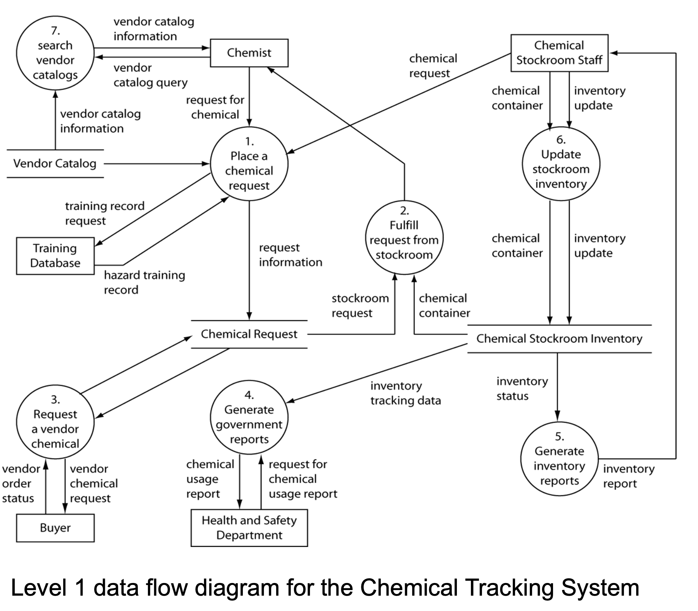
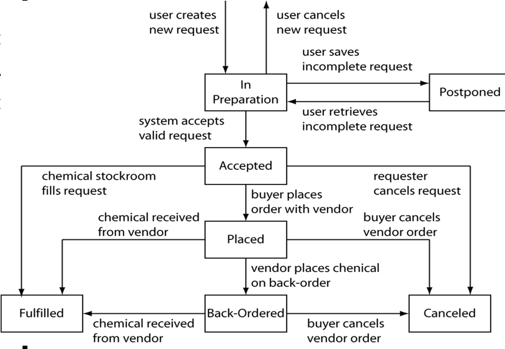
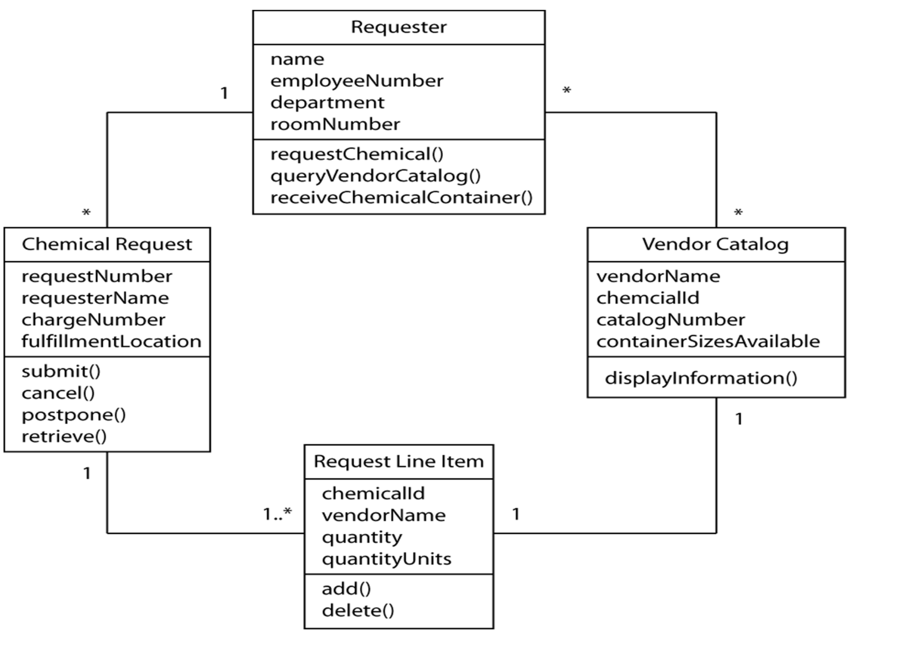
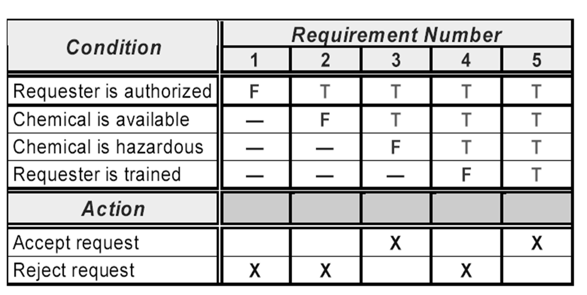
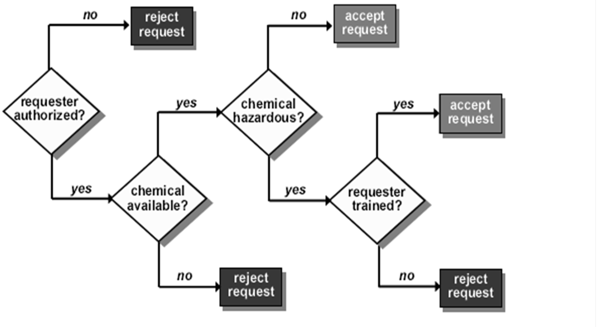

# Lecture 12: a picture is worth 1024 words

| Information depicted | Structured analysis | Unified modeling language |
| --------------- | --------------- | --------------- |
| System external interfaces | Context diagram | Use case diagram |
| Process flow steps | Data flow diagram/flowchart | Activity/Swimlane/Sequence diagram |
| Data or object interrelationships | Entity relationship diagram | Class/collaboration diagram |
| System states/ object statuses | State-transition diagram | State chart diagram |
| User interface architecture | Dialog map | N/A |

## Structured analysis models

### Data flow diagram

- A child of the context diagram
- Can be expanded to show multiple levels of detail
- Permits a top-down hierarchical decomposition of a system
- Suitable for analyzing process focused applications

- Basic components:
  1) Entities
  2) Operations
  3) Data flow
  4) Data base
- Syntax rules
  - All processes have both input and output
  - All processes are either connected to other process entities or database
  - All processes have a unique name and numbering
    - Subprocesses shall follow the numbering scheme of the parent process
  - Entities/DB may only connect to processes
  - Information continuity must be kept. **Information continuity** is the net I/O to the refinement must remain the same
  - The refinement per level should be between 3 and 7
- Data dictionary
  - Uses extended BNF notation
  - Has fundamental constructs to define data formats

### State-transition diagrams

- Models the discrete states a system can be in
- Transitions show only the permitted state changes
- Can also model possible statuses of an object in a system

### Flow charts

- Used to describe the flow of logic
- Alternatively, a **swim lane diagram** groups processes and decision visually in lanes

### Dialog maps

- Represents a user interface design at a high level of abstraction
- Shows dialog elements in the system and links between them without detailed screen design
- Helps find missing or incorrect transitions and requirement early
- Discovers navigation dead-ends
- Defines user back-out and cancellation routes
- Sport reuse opportunities or redundancies in UI design
- Can partition the UI into components
- Can be drawn hierarchically to control scope and complexity

## Object oriented analysis models

### Use case diagrams

See [Lecture 8](lecture-8_understanding-user-requirements.md)

### Class diagrams

- Identifies object classes that relate to the project domain
- Based on object oriented notations, such as UML
- Numbers on line indicate multiplicity relationships
- Can be augmented with sequence and collaboration diagrams

### Activity diagram

- Shows flow of control from activity to activity
- Models concurrency, branching, control flow and object flow
- Swim lane can be used to partition activity states

## Decision tables and decision trees

> Technique for representing what the system to do when complex logic and decision come into play

**Accept or reject logic**

- Is the requester authorized to request chemicals?
- Is the chemical available, either in the stockroom or from a vendor?
- Is the chemical on the list of hazardous chemicals?
- Is the requester trained on handling hazardous chemicals

**Decision table**

**Decision tree**

