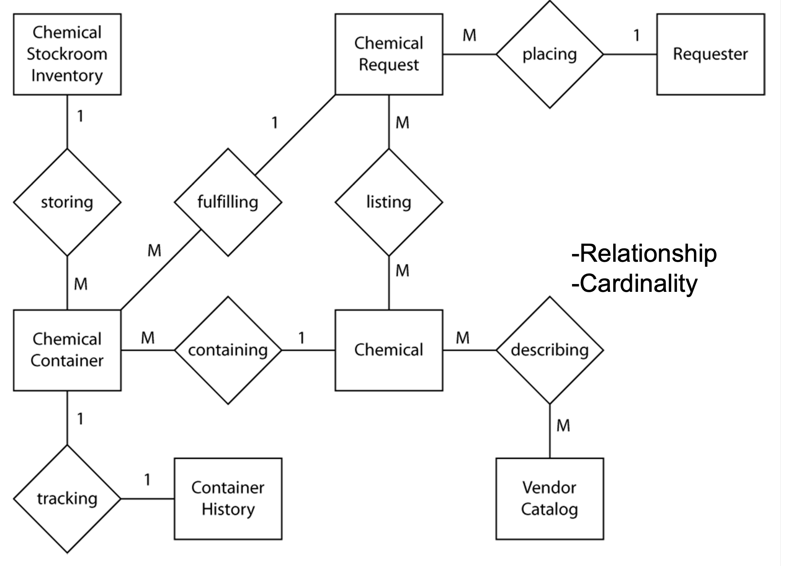

# Lecture 13: specifying data requirements

## Entity relationship diagram

- Depicts logical relationships among system's data elements
- Numbers on line show cardinalities
  - One-to-one (1:1)
  - One-to-many (1:M)
  - Many-to-many (N:M)
- As a design tool, useful for modeling a database's logical or physical architecture

## Data dictionary

- Use BNF extended notation
- Has the following constructs

| Symbol   | Meaning    |
|--------------- | --------------- |
| $\oplus$   | Sequence   |
| $\left[ \vert \right]$    | Selection   |
| $\{ \} $  | Repetition   |
| $\left( \right)$   | Optional   |
| $=$  | is composed of |

- Example definition for a name

$$
  \text{name} = \text{title} + \text{first-name} + (\text{middle-name}) + \text{last-name}
$$

$$
  \text{title} = \left[ \text{Mr} \vert \text{Miss} \vert \text{Mrs} \vert \dots \right]
$$

$$
  \text{first-name} = \{ legal-char \}_{1}^{24}
$$

$$
  \text{middle-name} = \{ legal-char \}_{1}^{10}
$$

$$
  \text{last-name} = \{ legal-char \}_{1}^{12}
$$

$$
  \text{legal-char} = \left[ \text{A-Z} \vert \text{a-z} \vert \text{-} \right]
$$

## Data analysis

- Accomplished with a CRUD matrix
  - Shows relationship between use cases and data objects
  - Can reveal potentially missing requirements

| Use case \ Entity | Order | Chemical | Requester | Vender Catalog |
| --------------- | --------------- | --------------- | --------------- | --------------- |
| Place order | C | R | R | R |
| Change order | U, D |  | R | R |
| Manage chemical inventory |  | C, U, D |  |  |
| Report on orders | R | R | R |  |
| Edit requesters | | | C, U | |

- There is no `DELETE` operation for requesters in the sample CRUD matrix for the chemical tracking system
- Could indicate a possibly missing requirement
