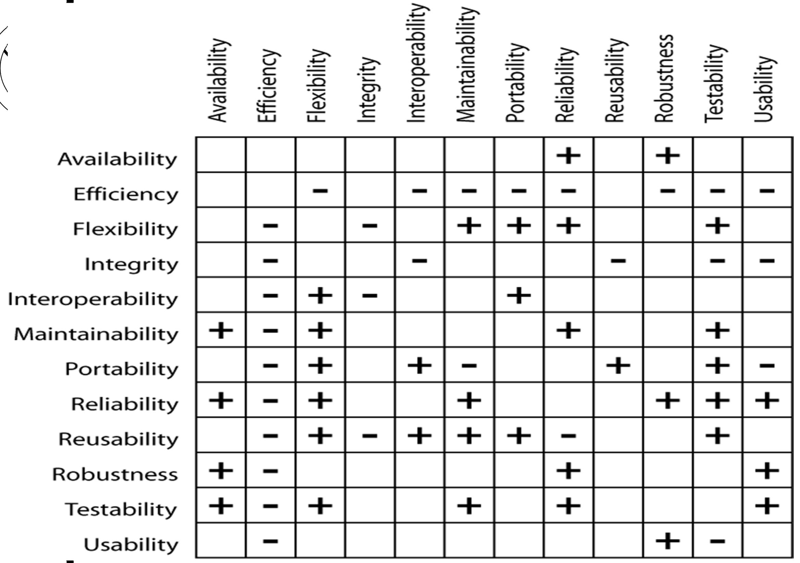

# Lecture 14: beyond functionality

## Quality distinguishes products

- Functional requirements (features) may only satisfy a customer
- Quality attributes
  - Make customer "enjoy" your product
  - Are critical to product usefulness
  - Are harder to elicit from customers

## Software quality attributes

- Characteristics of software that are visible to users or important to developers
- Need to be included in the SRS document
- Must be written in a quantifiable and verifiable manner
- Cannot by simultaneously optimized; need to consider trade-offs

| Quality attribute | Meaning |
|:-----------------:| ------- |
| Availability | Is it available when and where I need to use it? |
| Efficiency | How few system resources does it consume? |
| Flexibility | How easy is it to add new capabilities? |
| Installability | How easy is it to correctly install the product? |
| Integrity | Does it protect unauthorized access and/or data loss? |
| Interoperability | How easily does it interconnect with other systems? |
| Maintainability | How easy is it to correct defects or make changes? |
| Portability | Can it be made to work on other platforms? |
| Reliability | How long does it run before experiencing a failure? |
| Reusability | How easily can we resuse components in other systems? |
| Robustness | How well does it respond to unanticipated conditions? |
| Safety | How well does it protect against injury or damage? |
| Testability | Can I verify that it was implemented correctly? |
| Usability | How easy is it for people to learn or to use? |

### For the user

**Availability**

- Uptime or uptime and downtime
- Downtime can be scheduled or unscheduled
- Driven by safety or business needs
- Could be time-dependent

**Efficiency**

- Minimal consumption of resources
- Need to consider spikes and future growth

**Flexibility**

- Ease of adding new capabilities
- Essential for incremental/iterative development

**Integrity**

- Blocking unwanted access
- Enforcing privacy
- Preventing data loss

**Interoperability**

- Exchange of data with other systems
- File and message formats

**Reliability**

- Operation without failure
- Related to availability
- Trade off impact severity against development cost

**Robustness**

- Continued operation when faced with invalid inputs or unexpected conditions

**Usability**

- Can be *very* subjective
- Effort to provide inputs and use outputs
- Often specified in terms of task times

### For the developer

**Maintainability**

- Defect correction
- Feature enhancement
- Related to flexibility
- Understandable, simple design

**Portability**

- Preparing for variations in operating environments
- Hardware platform, operating system, database, GUI

**Reusability**

- Using components in other applications
- Modular, independent, well-documented, generic software

**Testability**

- Ease of looking for and finding defects
- Affects design guidelines for complexity

### Performance requirements

- Speed of features
  - Response time
  - Throughput
  - Capacity
  - Timing deadlines
- Can affect system safety

## Documenting quality attributes (quantifiable and verifiable)

**Interoperability**

> The system shall be able to import chemical structures directly from the ChemDraw and ChemiStruct tools

**Performance**

> 90% of category 1 database queries shall be completed in no more than 2 seconds on a 1.6 GHz Pentium 4 PC running Windows XP

**Usability**

> All functions on the File menu shall have keyboard equivalents defined that use the Control key pressed simultaneously with one other key. For commands that also appear on the Microsoft Word XP File menu, the keyboard equivalents shall be identical to those in Word.

**Robustness**

> All inputs shall have default values specified, to be used if the input data is not supplied or invalid.

**Maintainability**

> Function calls shall not be nested more than two levels deep. The ratio of comments to source statements shall be at least 0.5.

**Testability**

> The cyclomatic complexity of each module shall not exceed 20.

**Flexibility**

> A maintainer shall be able to add a new supported hardcopy output device in two hours or less

## Quality attribute relationships (trade-offs)

## Implementing non-functional requirements

| Quality attribute   | Implemented here    |
|--------------- | --------------- |
| Integrity, interoperability, robustness, usability, safety   | As functional requirements   |
| Availability, efficiency, flexibility, performance, reliability   | System architecture   |
| Interoperability, usability   | Design constraint   |
| Flexibility, maintainability, portability, reliability, reusability, testability, usability   | Design guideline   |
| Portability | Implementation constraint
