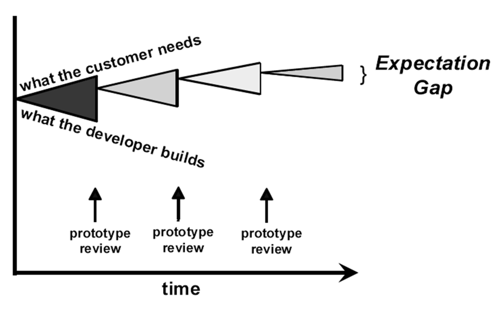

# Lecture 15: risk reduction through prototyping

## Why do prototyping?

**To answer some questions early in the development cycle**

- Clarify and complete requirements
- Explore design alternatives
- Evaluate technical feasibility
- Grow into the ultimate product

**To lower the expectation gap**

## Prototype types

**Horizontal prototypes**

- A behavioral mockup (the most common type)
- Broad, but not deep (functional, but slow, fragile and unreliable)
- Shows look and feel, flow of tasks

- Answers the following questions:
  - Does this program do the right thing for you?
  - Do you find any defects or omissions?
  - Which of several example interaction techniques do you prefer?
  - Do parts of the interface feel clumsy or inefficient

**Vertical prototypes**

- Proof of concept
- Narrow, but deep (limited set of features, but a complete implementation of them)
- Works like a real system for evaluation of
  - Architecture approach
  - Algorithm optimization
 
- Answers the following:
  - Are the proposed architecture, database schema, or algorithms feasible?

**Throwaway prototypes**

- Decide early about "discard" or "deliver"
- Throwaways are quick and dirty, poorly engineered and constructed
- Most user for user interfaces

**Evolutionary prototypes**

- Incremental product builds
  - Trial versions
  - Pilot releases
- Must be well-designed and carefully constructed
- User feedback comes from operation in actual working environment

## Combined approaches

**Horizontal + Throwaway**

- *Clarify and refine* uses cases and functional requirements
- Identify missing functionality
- Explore user interface approaches

**Horizontal + Evolutionary**

- Implement *core user cases*
- Implement additional use cases based on priority
- Implement and refine web sites
- Adapt system to rapidly changing needs

**Vertical + Throwaway**

- Demonstrate technical feasibility

**Vertical + Evolutionary**

- Implement and grow core client/server functionality and communication layers
- Implement and optimize core algorithms
- Test and tune performances

## Prototyping suggestions

- Decide whether prototype will evolve into the product or be thrown away
- Prototype the user interfaces of all interactive systems
- Use a combination of paper and electronic prototypes
- Use structured prototype evaluation scripts
- Watch the customer use the prototype
- Differentiate between "ease of learning" and "ease of use"

## Evaluation of a prototype

- Ask the user specific questions
  - Is this what you expected?
  - Is anything missing?
  - Are there errors that weren't addressed?
  - Is there anything unnecessary present?
  - Is navigation logical and complete?
  - Is anything too complex?
- Not just "What do you think?"

## Success factors

- Plan the effort
- Have a clear purpose, draw boundaries
- Be quick, not robust
- Don't prototype if you already understand
- Use plausible data
- Don't use prototypes as requirements specification

## Risks

- Customer will ask for delivery of a throwaway
  - Do it on paper
  - Use nonproduction tools
- Customer will develop a poor opinion of the product's performance or reliability
