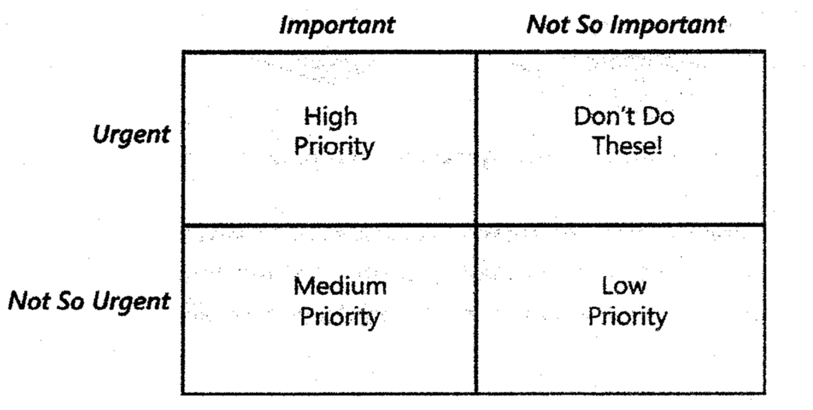

# Lecture 16: setting requirements priorities

## Why prioritize?

- Competition for limited resources
- Balance project scope against
  - Schedule
  - Budget
  - Staff
  - Quality
- Have multiple options early (to decide which way to go)

**Not prioritizing leads to**

- Refusal to set priorities (It's all equally important)
- Biased priorities (85% are marked high priority when that is not the case)
- Late-breaking "rapid de-scoping" in a panicked state
- Too many resources spent on low-priority, eventually deferred functions

## Prioritization techniques

### Questions to ask

- Is there another way to do this?
- What are the consequences of deleting this requirement?
- What is the business impact impact of delaying this requirement
- Why would a user be unhappy if this requirement were missing?
- What is the least-important requirement of all? (can be repeated to build a priority list)

### Comparison and rank ordering

**In or out**

- Stakeholders make a binary decision about a requirement

**Pairwise**

- Assign unique priority number to each requirement
- Make a pairwise comparison

**Three level scale**

**MoSCoW (Moscow)**

- For each requirement, decide if it is
  - **M(Must)**: the requirement must be satisfied
  - **S(Should)**: the requirement should be satisfied, but is not mandatory
  - **C(Could)**: the requirement will be implemented only permitting
  - **W(Won't)**: the requirement will not be implemented
- Gives a 4 level scale, but no rational
  - No 2 dimension as in the 3 level scale
  - Not highly recommended

### Prioritization based on value, cost, and risk

$$
  \text{Priority} = \frac{\text{value}}{\left( \text{cost} * \text{cost weight} \right) + \left( \text{risk} * \text{risk weight} \right)}

$$

**Estimating customer value of features**

- Estimate relative benefit and penalty for each feature
- Sum of benefit and penalty reveals relative value
- Calculate the percent of total value coming from each feature

| Feature | Benefit if present | Penalty if absent | Total value (Benefit + Penalty) | Value percent |
| --------------- | --------------- | --------------- | --------------- | --------------- |
| 1 |  |  |  |  |
| 2 |  | | | |
| 3 |  | | | |

**Estimating feature priority**

- Value, cost, and risk percentages must total 100%

| Feature | Value percentage | Cost percentage | Risk percentage | Priority |
| --------------- | --------------- | --------------- | --------------- | --------------- |
| 1 | A | L | X | $A/(L+X)$ |
| 2 | B | M | Y | $B/(M+Y)$ |
| 3 | C | N | Z | $C/(N+Z)$ |
| -- | 100% | 100% | 100% | -- |
