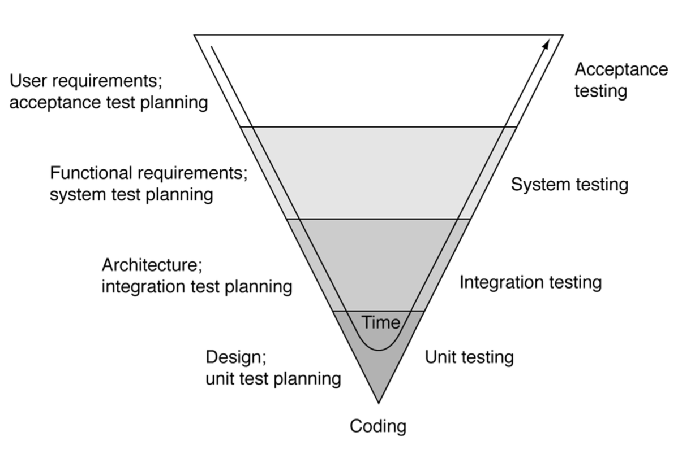
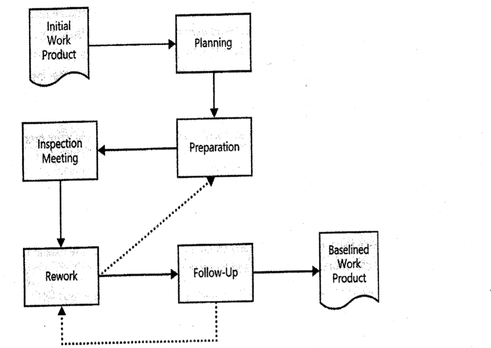
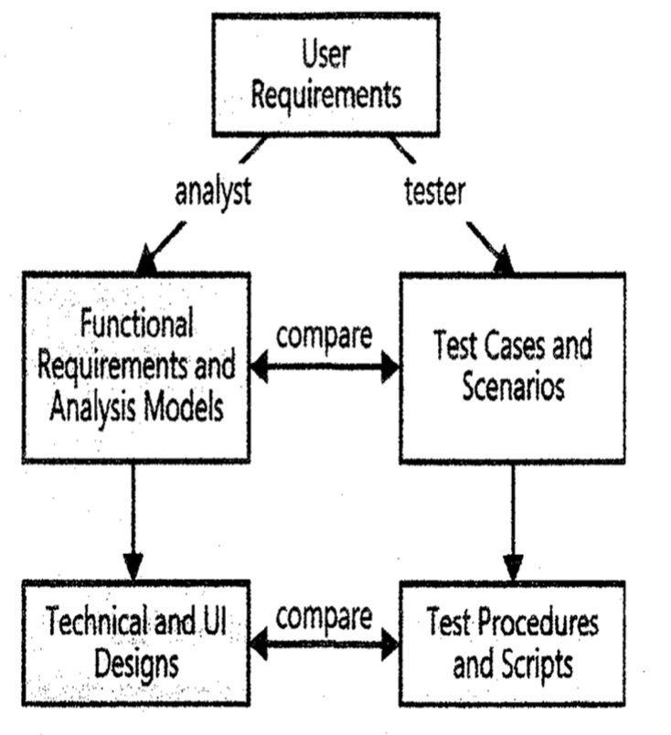

# Lecture 17: validating requirements

## Importance of validation

- Cost to correct requirements errors after significant design and coding effort
  - 100 times more expensive
  - Hours instead of minutes

## The V model

## Types of requirements validation

- SRS correctly describes capabilities that will satisfy user needs
- Software requirements were derived from system requirements, business rules
- Requirements are complete, correct, clear, unambiguous, feasible and necessary
- Requirements are consistent
- Requirements are sufficient for design and code

## Requirements reviews

- Review formally and informally, early and often
- Use checklists to find typical defects
- Ensure that all requirements are in scope
- Check for characteristics of excellent requirements
- Ensure that requirements can serve as basis for design and testing
- Check for error handling
- Make all requirements views consistent
- Ensure freedom from design and implementation details

### Who should review the requirements

- Sources of requirements
  - User representatives
  - Subject matter experts
- Victims of requirements
  - Developers
  - Testers
  - Project managers
  - Technical writers
- Representatives of related products
  - Hardware engineers
  - Other tech leads

### Reviewing methods

| Method   | Description    |
|--------------- | --------------- |
| Peer desk-check   | Examination by a single fellow analyst   |
| Pass around   | Examination by several fellow analysts   |
| Walthrough   | Presentation by author   |
| Inspection   | Formal multistep process   |

### Requirements inspections

**Inspection roles**

| Role   | Responsibilities    |
|--------------- | --------------- |
| Author   | passive answerer of questions   |
| Moderator   | Plans, coordinates, and facilitates inspection   |
| Reader   | Paraphrases   |
| Recorder   | Documents issues and defects   |
| Reviwers   | Review the document for issues and defects |

**Entry criteria**

- Document conforms to template
- Spelling, grammar, and layout checked
- Predecessor documents available
- Line numbered
- Open issues marked with `TBD`
- MOderator quick-check (three or fewer defects in ten minutes) is OK

**Planning**

- Author and moderator collaborate
- Inspection rate affects defect detection (don't go too fast)
- Adjustments factors:
  - Team's previous performance
  - Text density and complexity
  - Risk of undetected errors
  - Criticality of material
  - Experience of author

**Preparation**

- Author should share background info with inspectors
  - Understand the context
  - Realize objectives
- Each inspector should examine prior to the meeting using the check list

**Defect checklists**

- Use cases (clear, abstract, and complete)
- Requirements specification
  - Organized and complete
  - Correct
  - Quality
  - Traceable

**Meetings**

- Overview
  - Presentation by author
  - Background for inspectors
- Inspection
  - After independent examination by inspectors
  - Led by reader
  - Identification, not correction of defects
  - Decide to accept, revise, or re-inspect

**Rework and follow-up**

- Remove defects, improve quality
- Report resolution to moderator and inspectors
- Ensure closure of all issues

**Exit criteria**

- Issues addressed
- Changes correctly made
- Spelling and grammar OK
- `TBD`s resolved or targeted (date and person responsible)
- Document under configuration control

**Challenges**

- Large documents
  - Review incrementally
  - Focus on high-risk areas
  - Use parallel teams
- Large teams
  - Don't educate
  - Don't allow political position-protectors
  - Don't allow duplication of perspectives

## Testing requirements

- Start from use cases (same point as the requirements specification)
- Write functional (black-box) test cases
- Follow an action, condition, result pattern
- Business requirements can be hard to test directly -- judgment is needed to find related use cases

