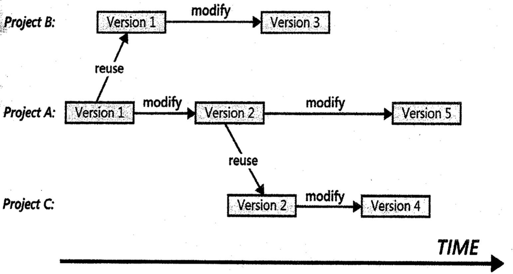

# Lecture 18: requirements reuse

- Reuse means taking advantage of work done
- If serious an organization must
  - Produce high quality requirements
  - Foster a culture of reuse
- But reuse is not free; it has costs and also risks

## Dimensions of reuse

**What can be reused**

- Individual requirement statement
- Requirement plus its attributes
- Requirement plus its attributes, context, and associated information such as data definitions, glossary definitions, acceptance tests, assumptions, constraints, and business rules
- A set of related requirements
- A set of requirements and their associated design elements
- A set of requirements and their associated design, code, and test elements

**What can be modified**

- None (keep as-is)
- Associated requirement attributes (priority, rationale, origin, and so on)
- Requirement statement itself
- Related information (tests, design constraints, data definitions, and so on)

**How to reuse**

- Copy and paste from another specification
- Copy from a library of reusable requirements
- Refer to an original source

**Reuse evolution**

> There are now 5 versions

## Types of requirements information to reuse

### Scope of reuse and potentially reusable assets

**Within a product or application**

- User requirements
- Specific functional requirements within use cases
- Performance requirements
- Usability requirements
- Business rules

**Across a product line**

- Business objectives
- Business rules
- Business process models
- Context diagrams
- Ecosystem maps
- User requirements
- Core product features
- Stakeholder profiles
- User class descriptions
- User personas
- Usability requirements
- Security requirements
- Compliance requirements
- Certification requirements
- Data models and definitions
- Acceptance tests
- Glossary

**Across an enterprise**

- Business rules
- Stakeholder profiles
- User class descriptions
- User personas
- Glossary
- Security requirements

**Across a business domain**

- Business process models
- Product features
- User requirements
- User class descriptions
- User personas
- Acceptance tests
- Glossary
- Data models and definitions
- Business rules
- Security requirements
- Compliance requirements

**Within an operating environment or platform**

- Constraints
- Interfaces
- Infrastructures of functionality of needed to support certain types of requirements (such as a report generator)

### Common reuse scenarios

- Software product lines: common features will be reused
- Re-engineered and replacement system

## Common opportunities of reuse

| Reuse opportunity   | Example    |
|--------------- | --------------- |
| Business processes   | Often business processes are common across organizations and need to be commonly supported by software. Many institutions maintain a set of business process descriptions that are reused across IT projects   |
| Distributed deployments   | Ofthen the same system is deployed multiple times with slight variations. This is fairly typical for retail stores and warehouses. A common set of requirements is reused for each separate deployment   |
| Interfaces and integration   | There is often a need to reuse requirements for interfaces and integration purposes. For example, in hospitals, most ancillary systems need interfaces to and from the admissions, discharge, and transfer systems. This also applies to financial interfaces to an enterprise resource planning system   |
| Security   | User authentication and security requirements are often the same across systems. For example, the systems might have a common requirement that all products must have a single sign-on user Active Directory for user authentication   |
| Common application features | Business applications often contain common functionality for which requirement -- and perhaps even full implementations -- can be reused. Possibilities include search operations, printing, file operations, user profiles, undo/redo, and text formatting |
| Similar products for multiple platforms | The same core set of requirements is used even though there might be some detailed requirement and/or user interface design differences based on the platform. Examples include applications that run on both Mac and Windows or on both iOS and Android |
| Standards, regulations, and legal compliance | Many organizations have developed a set of standards, often based on regulations, that are defined as a set of requirements. These are reused between projects. Examples are ADA standards for accessible design and HIPAA privacy rules for healthcare companies |

## Requirements patterns

> Pattern define a template with categories of information that a project may encounter

1) Guidance: basic details about a pattern, such as which it is applicable
2) Content: detailed explanation of the content that such a requirement ought to convey
3) Template: a requirement definition which placeholders where ever variable pieces of information need to go
4) Examples: one or more illustrative requirements of this type
5) Extra requirements: additional requirements that can define certain aspects of this topic
6) Considerations for development and testing: factors that developers and testers need to keep in mind when developing this requirement

## How to make requirements reusable

- Need to spend resources to make them reusable
- Must be written at the *right* level of abstraction and scope (generalization)

## Requirements reuse barriers

1) Missing or poor requirements
2) NIH (Not Invented Here) and NAH (Not Applicable Here) syndrome
3) Writing style
  - Not adapting standard notation
  - Inconsistent terminology
  - Too much details in design or implementation
4) Inconsistent organization
  - By project
  - By process flow
  - By business unit
  - By product feature, category, or component
5) Project type is too tightly coupled with a specific project and is difficult to reuse
6) Ownership: could be intellectual property of a particular customer

## Reuse success factors

> In order to make reuse a success, the follwing factors should be considered

1) Repository: searchable and well-organized
2) Quality of requirements is important and should improve over time
3) Interaction: show the links/traceability
4) Terminology should be consistent across projects
5) Organizational culture
  - Management should encourage
  - Produce high level reusable requirements
  - Effectively reuse the existing requirements
