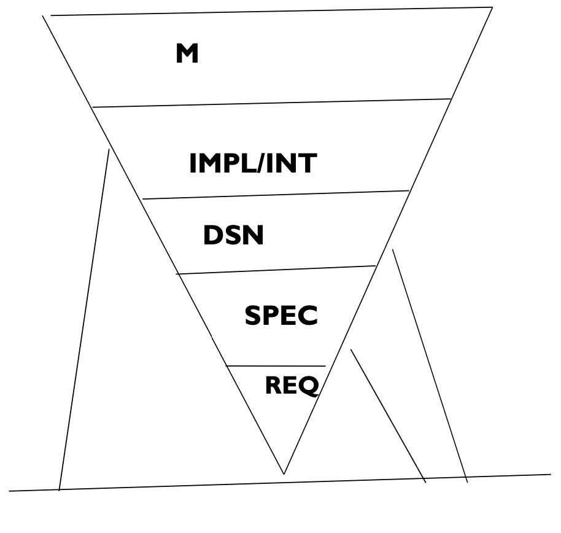
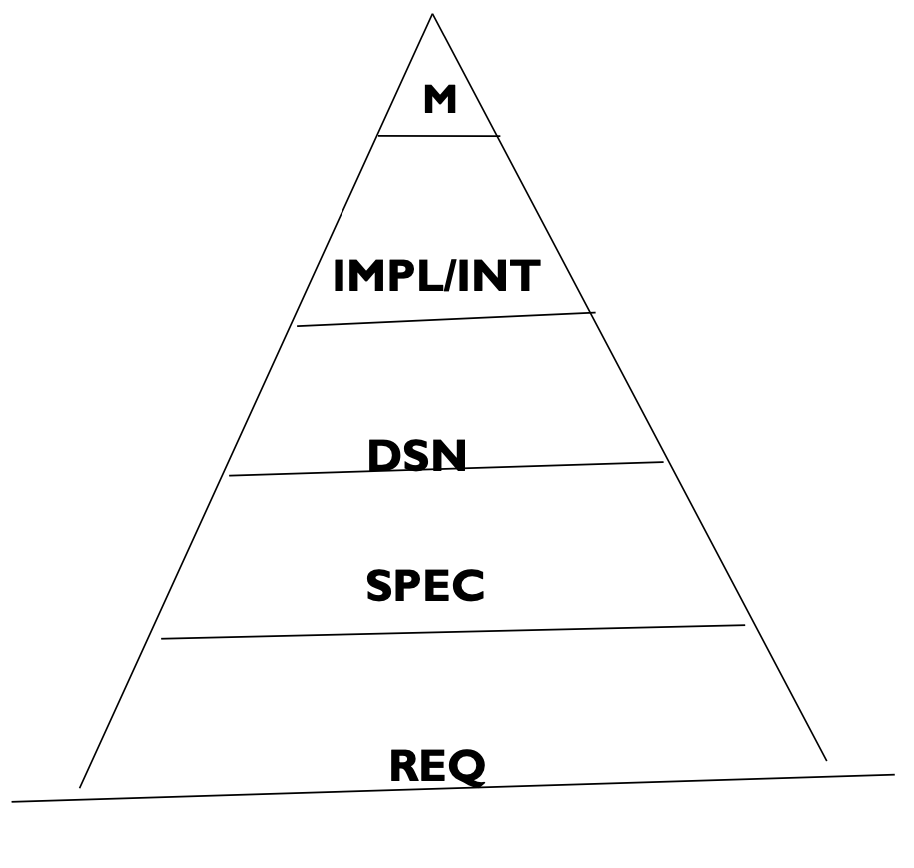

# Lecture 19: beyond requirements development

## From requirements to project plans

- Use requirements to size the project
- Base estimates on size
- Update plans and requirements change
- Priorities drive iterations
- Possible estimation metrics
  - Number of individual testable requirements
  - Function points and feature points and functions
  - Story points
  - Number, type, and complexity of GUI elements
  - Estimated lines of code needed to implement specific requirements
  - Count of object classes or other OO metrics
- Requirements scheduling requires the following
  - Estimated product size
  - Productivity of the development team
  - List of tasks needed to implement and verify a feature
  - Reasonably stable requirements
  - Experience for intangible factors and unique aspects

## From requirements to designs and code

- Don't go from requirements to code directly, especially in a complex project
- Designs will satisfy most product requirements
- Excellent designs are the result of iterations

## From requirements to tests

- Requirements should provide the foundation for *system testing*
- Each requirement should be verified and can be done with
  - Testing (execution of the software)
  - Inspection
  - Demonstration
  - Analysis (reasoning through the system)
- Each functional requirement should trace to at least one test case

## From requirements to success

- Ultimate success is to deliver a project that
  - Meets the customer's needs and expectations
  - On time and within budget
- Requirements are a necessary step on that path
  - A successful team had practice listing all requirements planned for a release
  - QA group executed the tests for the requirements

> Remember the pyramid

**Traditional approach**

**Software engineering approach**

