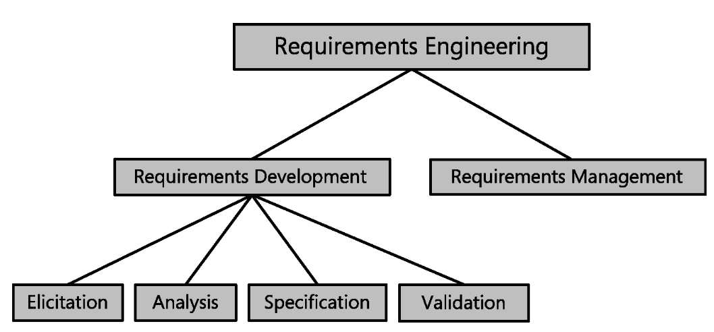

# Lecture 1: The Essential software requirement

## The #1 cause of software failure

> The single hardest part of building a software system is deciding precisely what to build. ... No other part of the work so cripples the resulting system if done wrong. No other part is more difficult to rectify later.

**Customer frustration**

- Product does not support an essential task
- Developer priorities not aligned with customer needs

**Developer frustration**

- Essential functionality missing in product implementation
- Changes to features already implemented exactly as asked for

## Difficulty of defining requirements

**1) Process involves a large number of stakeholders**

- Customers and users want a system that meets their needs
- Developers and testers want to build a correct system
- Managers want to be on time and within budget
- Support staff (sales, help desk, legal team)

**2) Shortcomings of requirements gathering**

- Informal gathering process
- Implied functionality
- Wrong or unspoken assumptions
- Inadequate requirements specification (can be incomplete, ambiguous, or conflicting)
- Changing requirements (decisions not recorded, undesirable changes creep in)

## Definitions of requirement

**Informal definitions**

- External *behavior* and *appearance* of the system
- **What** should be implemented
- A system *property* or *attribute*, possibly a *constraint*

**Formal definitions (IEEE)**

1) Condition or capability needed by a user to solve a problem or achieve an objective
2) Condition or capability that must be met by a system ... to satisfy a contract ...
3) A documented representation of a condition or capability as in 1) or 2)

## Types & levels of requirements

- **Functional** requirement: description of a behavior that a system will show under a specific condition
- Influenced by:
  - Business requirements (vision and scope)
  - User requirements (use cases)
  - System requirements (when multiple subsystems are involved)

- **Nonfunctional** requirement: description of a property or characteristic that a system must exhibit or restriction/constraint it must respect
- Describe the quality of the system (performance, security, robustness, etc.)
- Constraints limit choices by developers

**Requirements are not**

- Design or implementation details
  - Too early to decide
  - Limits designer creativity
- Project planning (done elsewhere)
- Testing information (but are used to determine test goals)

## Requirements engineering

### Development

**Elicitation**

- Identifying user classes
- Bringing out needs from representative users
- Understanding tasks and goals
- Understanding related business objectives

**Analysis**

- Distinguish task goals from:
  - Functional requirements
  - Nonfunctional requirements
  - Rules, suggestions, and extraneous information
- Allocate top-level requirements to architecture components
- Understand the importance of quality attributes
- Negotiate priorities

**Specification**

- Translate user needs into written specifications and models

**Validation**

- Review documented requirements
- Ensure common understanding between user and developer
- Correct problems **before** development starts

### Management

**Managing requirements involves:**

- Establishing *and* maintaining an agreement with the customer
- Following requirements development activities
- Maintaining a controlled baseline

**Management activities include:**

- Defining a baseline (snapshot of current agreement)
- Reviewing change proposals and evaluating impact before approval
- Incorporating changes in a controlled manner
- Keeping the project plan current
- Negotiating new commitments (cost and schedule)
- Tracing requirements to design, code, and test
  - Ensure everything needed is included
  - Prevent unnecessary features
- Tracking status and change activity
  - Know what is `proposed`, `in-work` and `finished`
  - Know the trends

## Critical role of requirements

> There are *always* requirements, even for internal projects

### Bad requirements

**Consequences**

- Rework: doing the design, implementation, and testing over (and over) again
- Cost: rework cost is more later in the project

**Causes and effects**

- Insufficient user involvement
  - Leads to late-breaking requirements
  - Delays project completion
- Creeping user requirements
  - Frequent changes too easily accepted
  - No adherence to vision and scope
  - Architecture stability decays
- Ambiguous requirements
  - Multiple interpretations
  - Differing expectations
  - Time wasted filling in details
- Gold plating: adding features intended to impress the customer
  - May add little value
  - Time and money detracted from actual needs
- Minimal specifications
  - Saved time writing requirements
  - More time spent in design and implementation
- Overlooked users
  - Unknown stakeholder needs not address until very late
  - Unhappy users claim system is unusable
- Inaccurate planning
  - Overly optimistic commitments made
  - Not able to be met

### Good requirements

- Fewer defects
- Less rework
- Faster development
- Better estimates
- Less chaos
- Higher satisfaction for user and developer

### Excellent requirements

- **Complete**: 
  - No missing details; gaps in knowledge are flagged
  - No missing features
  - Focused on user tasks not system functions
- **Correct**: from a credible user (preferably multiple)
- **Feasible**
  - Avoid impossible requirements
  - Questionable requirements are evaluated with incremental development and prototyping
- **Necessary**: ensure user has authority
- **Prioritized**: prepare for trade-offs; avoid problems later in project
- **Unambiguous**:
  - Ensure only one interpretation is possible
  - Define specialized terms and avoid software jargon
- **Verifiable**: correctness of untestable requirements depends on opinion, not objective evidence
- **Consistent**
  - No conflicts between functional and nonfunctional requirements
  - Origins recorded to resolve when needed
- **Modifiable**
  - Revised with change history
  - Each requirement is uniquely identifiable
- **Traceable**: requirements are linked to source code
