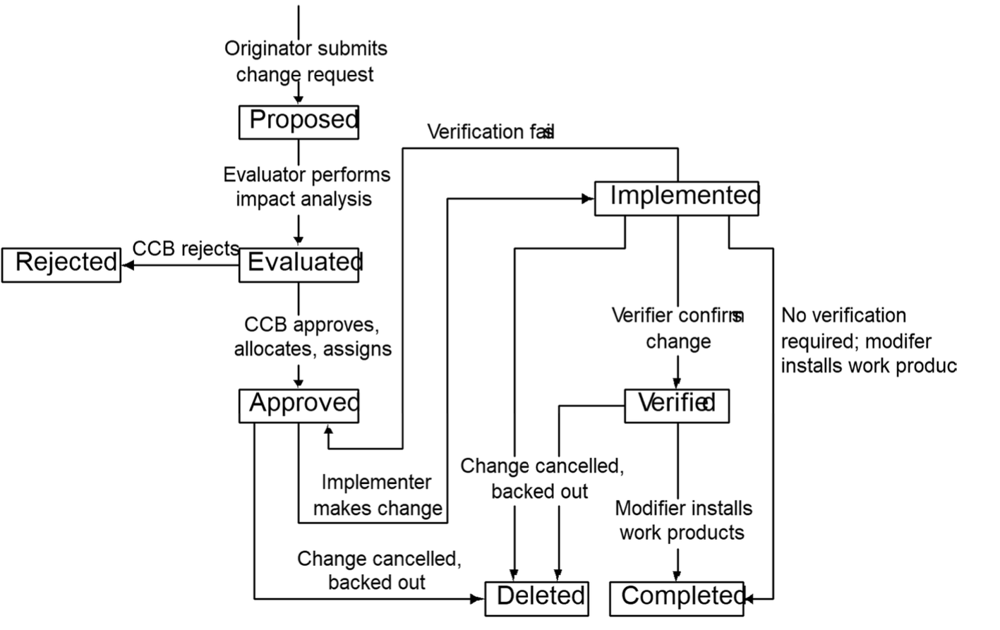

# Lecture 21: change happens

## Requirements change control

- Uncontrolled changes cause problems
  - Rework
  - Degraded quality
  - Unpredictable schedules
- Define a requirements change process
  - Propose, review, approve, and incorporate changes
  - Define state-transition diagram for allowed state changes
  - Include impact analysis
  - Support with a tool, but **a tool is not a process**
- All change requests must follow the process
  - Requirements changes may require renegotiating project commmitments

## Change control policy

- No out-of-process changes are considered
- No design or code on unapproved changes (except feasibility exploration)
- Request doesn't guarantee approval
- All change activity is visible to all stakeholders
- Originator's text not changed
- Impact analysis is always performed, no matter how small the change appears
- All incorporated changes are traceable to an approved request
- Rationale for approval or rejection is always recorded

## Change control process

- Clearly explained
- Simple
- Universally applied
- Effective
  - Passes the good
  - Filters the bad

### Process description

1) Introduction
  - 1.1) Purpose (what the intent of this process is)
  - 1.2) Scope (what changes it applies to)
  - 1.3) Definitions (special terms)
2) Roles and responsibilities (who does what)
3) Change request status
4) Entry criteria (request received through approved channel)
5) Tasks
  - 5.1) Evaluate
  - 5.2) Approve/reject
  - 5.3) Prioritize, assign date, allocate to release
  - 5.4) Notify owners of affected work products
6) Verification
  - 6.1) Peer review, traceability follow-through
  - 6.2) Installation
7) Exit criteria
  - 7.1) Status updated
  - 7.2) Work products installed
  - 7.3) Interested parties notified
  - 7.4) Traceability matrix updated
8) Status reporting
  - 8.1) Summaries
  - 8.2) Trends
9) Appendix: change request data

### Change request status and state transitions

## Change control board

- Review and approve all
  - Requirements changes
  - Proposed enhancements
  - Defect corrections
- Effective size, appropriate to project, one to several people
- Possible hierarchy, if project is very large
- Efficient procedures

### Composition

- Managers
- Requirements analysts
- Developers
- Testers / QA
- Marketers / users
- Documenters
- Technical support / help desk
- Configuration managers

### Charter

- Management's written authority for CCB
- Purpose
- Scope
- Procedures
- Decision making process
  - Quorum
  - Voting, consensus, consultation
  - Chair's authority
  - Ratification
- Communicating status
  - Database updated
  - Stakeholder notification

## Measuring change activity

- Number of changes
- Requirements change origin
- Percent growth
- Percent changed
- Average change cycles

## Impact analysis

- Change isn't free
- Even seemingly minor changes may unexpectedly require a lot of work
- A change often produces a large ripple effect
- Impact analysis
  - Attempts to understand the possible implications of the change
  - Identifies all the files, models and documents affected
  - Identifies the tasks required to implement the change
  - Estimates the effort needed to complete those tasks
- Steps
  1) Use a checklist
  2) Estimate the effort
  3) Determine task sequence, effect on current plans
  4) Examine critical path
  5) Estimate effect on schedule and cost
  6) Evaluate priority; consider benefits, penalties and risks
  7) Report to CCB
  8) Use an impact analysis report template
