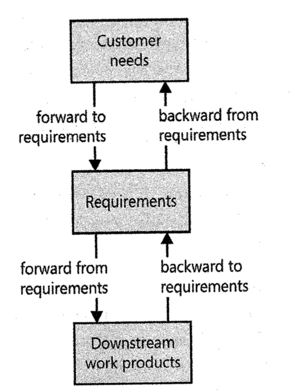
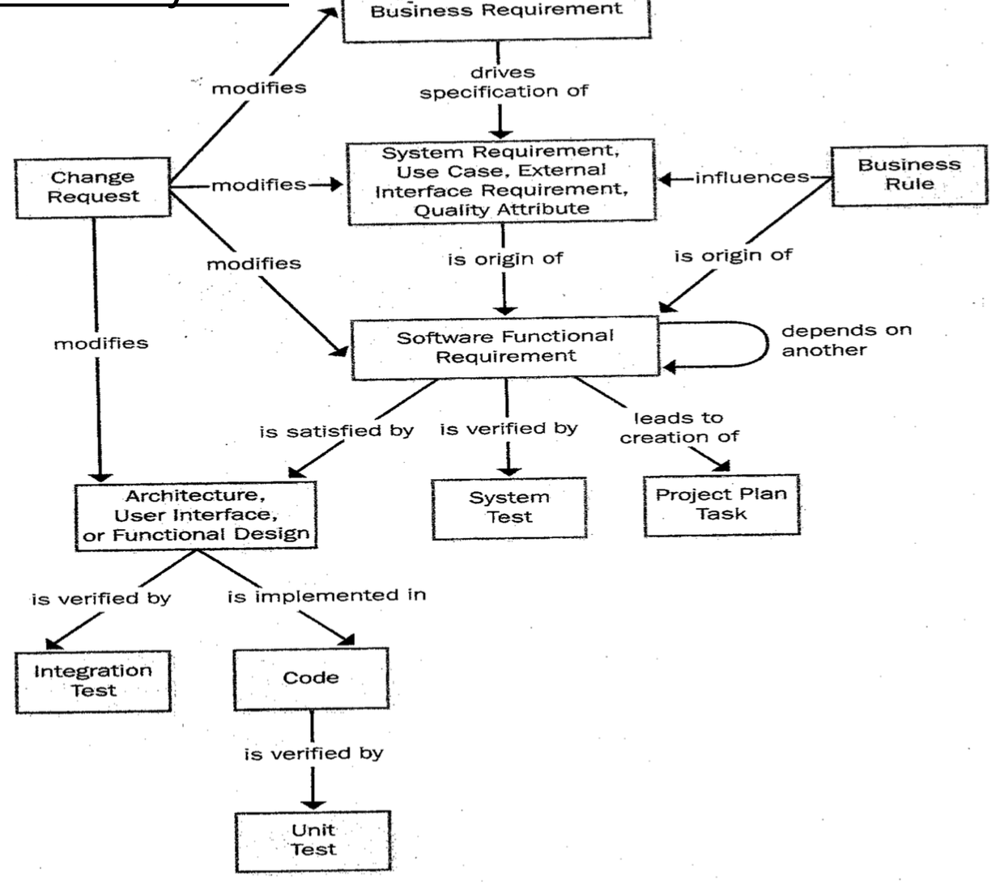

# Lecture 22: links in the requirements chain

## Motivation for tracing requirements

- Certification: to certify that all requirements were implemented
- Change control analysis: to allow for more accurate and complete impact analysis
- Maintenance: to allow making the changes correctly and completely during maintenance
- Project tracking: to have accurate record of implementation status
- Reengineering: to identify components that need to be replaced
- Reuse: to identify reusable components in requirements, design, code and test
- Risk reduction: reduces the risk if a team member leaves
- Testing: to identify the components in case of defects

### Four types of requirements tracing

### Possible traceability links

## Requirements traceability matrix

- Represents the links between the requirements and other system elements
- Cardinality of links can be
  - One-to-one (1:1)
  - One-to-many (1:M)
  - Many-to-many (M:N)

### Where traceability links come from

| Link source | Link target | Information source |
| --------------- | --------------- | --------------- |
| Product requirement | Software or hardware requirement | System engineer |
| User requirement | Functional requirement | Requirements analyst |
| Functional requirement | Functional requirement | Requirements analyst |
| Functional requirement | Test case | Test engineer |
| Functional requirement | Architecture element | Architect |
| Functional requirement | Software or hardware design element | Developer |
| Design element | Code | Developer |
| Business rule | Functional requirement | Requirements analyst |

### Benefits

1) No requirements are overlooked during design and implementation
2) You can see at a glance what work has been completed
3) If a test fails, it points to the code to search for the problem
4) A requirement change points to the affected design, code, and test elements

## Requirements traceability implementation

1) Select the link relationship to implement
2) Choose the type of traceability matrix
3) Identify the parts of the product for which to maintain the traceability info
4) Modify the process to remind the developer to update the links
5) Tag the components to identify them individually
6) Identify people *for supplying link info*, coordinate and manage the link activities
7) Educate the team about the concept and importance of links
8) Collect the traceability info from participants and implement as development continues
9) Audit the traceability matrix from time-to-time
