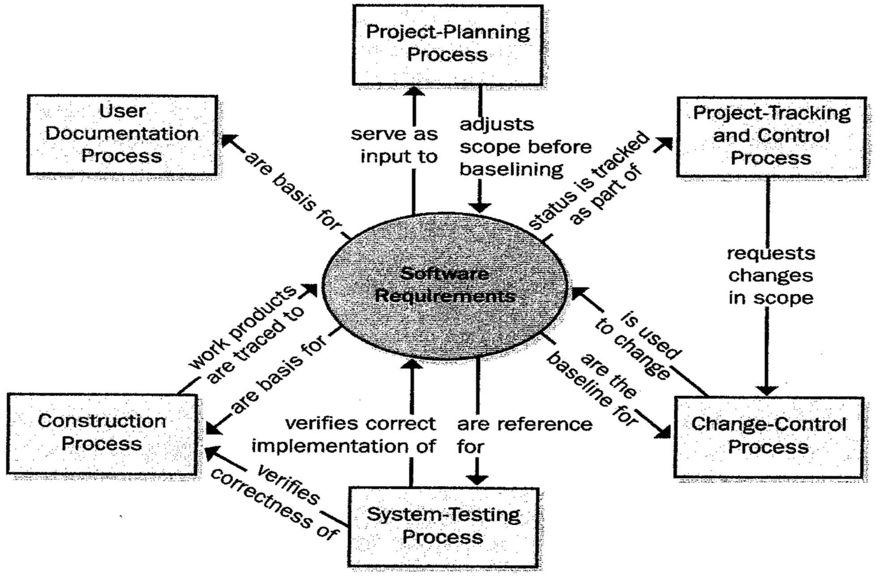
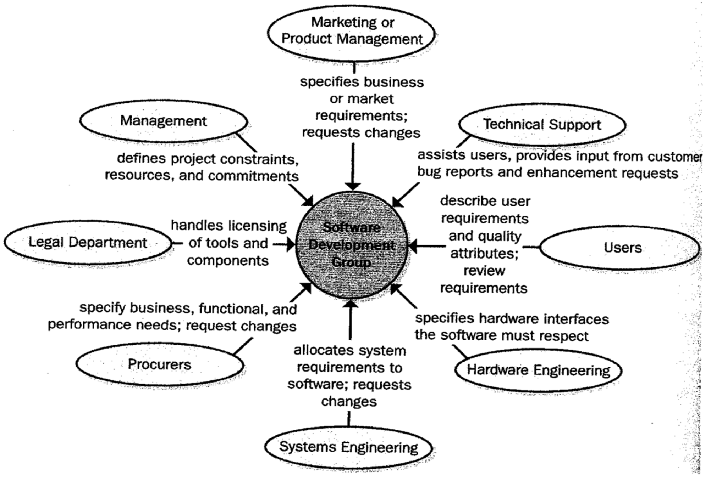
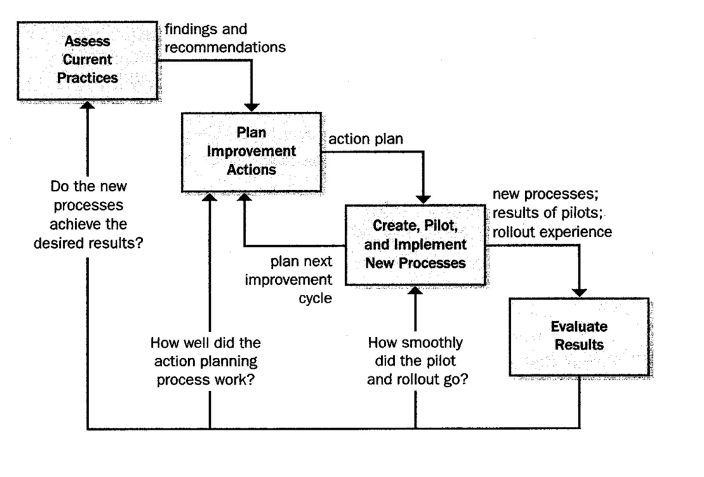

# Lecture 24: improving the requirements process

## Objectives in process improvement

1) Correct problems encountered on previous or current projects
2) Anticipating and preventing problems in future projects
3) Adopt practices that are more efficient

## Requirements in relation to other project processes

- **Planning**: foundation of project planning
- **Tracking and control**: monitoring the status of each requirement
- **Change control**: after base-lining, all changes are controlled
- **System testing**: system testing validates the requirements
- **Construction**: foundation for design and implementation
- **User documentation**: provides input to the user documentation

## Requirements and various stakeholder groups

## Fundamentals of process improvement

- Process improvement should be evolutionary, continuous, and cyclical
  - Don't expect to improve all processes at once
- Need an incentive to improve processes
  - Missed deadline
  - Overtime/waste of efforts
  - Dissatisfaction
  - High maintenance
  - Bad reputation
- Make a roadmap to define a pathway for a specific goal
- Treat as a "mini" project
  - Requires plans and resources to execute

## Process improvement cycle

1) Assess current practices
2) Create an action plan to target and track specific areas of improvement
3) Create, pilot and implement a new process
4) Evaluate whether newly implemented processes is giving the desired result

## Requirements engineering process assets

| Process asset   | Definition    |
|--------------- | --------------- |
| Checklist   | a list of activities, deliverables, or other items to be noted and verified   |
| Example   | a representative of a work product   |
| Plan   | outline on how an objective is to be accomplished and what is needed   |
| Policy   | guiding principle setting the management expectation   |
| Procedure | a step-by-step description of sequence of tasks to accomplish and activity |
| Process | definition of set activities to be performed for some purpose |
| Template | a pattern for producing a complete work

### Development process assets

> Development process identifies all steps needed to develop the requirements

- Allocation procedure to place high-level requirements into specific design subsystems
- Prioritization procedure to specify priorities
- Vision and scope template
- Use case template
- SRS template
- SRS and use case defect checklists

### Management process assets

> Management process defines actions to deal with changes

- Change control process to propose, communicate, evaluate, and resolve additions or modifications
- Status tracking procedure to track the status of requirements
- CCB charter to define composition, function and operating procedures for the CCB
- Change impact analysis checklists and templates
- Traceability procedures
