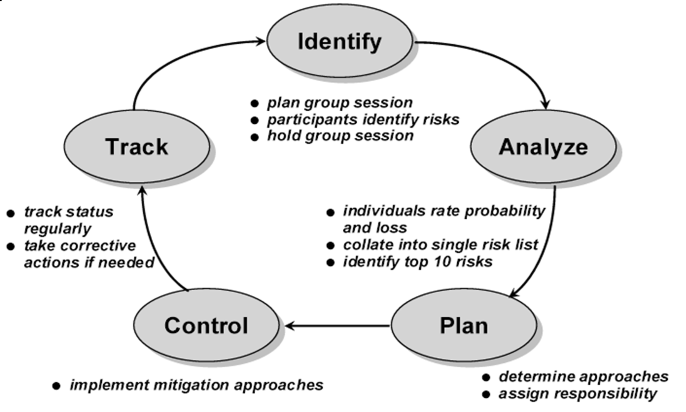

# Lecture 25: software requirements and risk management

## Fundamentals of software risk management

- Risk assessment: identifying, analyzing, and prioritizing areas of risk
- Risk avoidance and control: planning, resolution, and monitoring or risk areas

### An approach for risk management

### Documenting risks

- State risks and a condition or consequence
- Quantify relative impact of each risk
- Identify mitigation approaches for each risk
- Assign responsibilities and due dates
- Record risks in a risk list

## Requirements related risks

### Elicitation

- Lack of clear understanding in vision and scope
- Too tight of a schedule spent on requirements development
- Completeness and correctness of requirements specification
- Requirements for highly innovative products
- Defining nonfunctional requirements (easy to neglect)
- Customer agreement on product requirements
- Unstated requirements (implicit expectation of customer)
- Existing product used as a baseline (requires reverse engineering)
- Solution presented as needs (user proposed solution can masks actual user needs)

### Analysis

- Prioritization: ensure every requirement is prioritized and allocated to a release
- Technically difficult features: evaluate the feasibility/difficult of each requirement
- Unfamiliar technologies, methods, languages, tools or hardware (need time to learn)

### Specification

- Requirements understanding: make sure stakeholders have same understanding of requirements
- Time pressure: to proceed without completing TBD areas
- Ambiguous terminology: create a glossary of terms
- Design included in requirements can inhibit creation of optimal design

### Validation

- Unvalidated requirements: include time and resource to do this activity, otherwise pressure may cause incomplete validation
- Inspection proficiency: need qualified inspectors

### Management

- Changing requirements: reduce scope creep, reduce change modifications
- Requirements change process: risk related to the way changes to requirements are handled
- Unimplemented requirements: requirements traceability matrix can help to not to overlook any unimplemented requirements
- Expanding project scope: poorly defined requirements or vaguely specified will consume time and efforts
