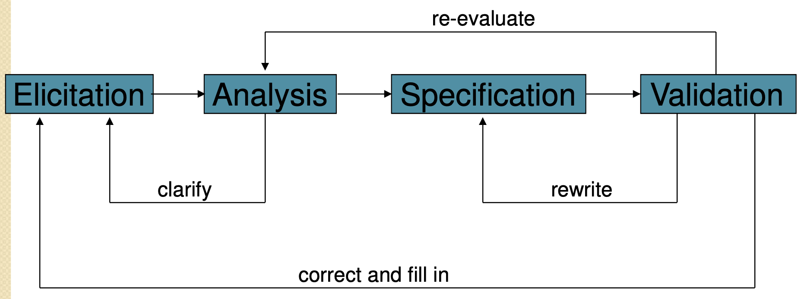

# Good practices for requirements engineering

## Elicitation

**Process outline**

- Define a requirements development Process
  - Outline the steps
  - Determine activities
- Write a vision and scope document
  - Define project objectives
  - Set boundaries
  - Focus on the project

**User classes**

- Roles
- Goals
- Features used
- Frequency of use
- Knowledge and skill levels
- Location and attitude

**Commitments**

- Long-term
  - Identify a product champion to be a representative of the user group
  - Representative speaks for and decides on behalf of the user group
- Short-term
  - Gather focus groups from user classes
  - Describe functionality and quality needs

**Use cases and events**

- Use cases
  - Tasks to be accomplished
  - Goals and purposes
  - User and system interactions
- Events
  - Describe external signals and data
  - Categorize as temporary or a business event

**Workshops and observation**

- Workshops
  - Collaboration between analysts and users
  - Discuss and draft documents
- Observation
  - Current tasks establish context for new system
  - Data flow can be captured

**Problems reports and reuse opportunities**

- Examine problem reports
  - Difficulties with old systems reveal needs for new one
  - Enhancements that are explicitly requested
- Reuse opportunities
  - Look for similarities to previous projects or existing solutions

## Analysis

**Draw context diagram**

- Show environment and system boundaries
- Show interfaces into and out of the system

**Create prototypes**

- User interfaces: get feedback on a tangible entity
- Technical: explore feasibility of potential problem areas

**Prioritize**

- Allocate requirements to releases
- Adjust to change in resources, needs, goals, or market conditions

**Model**

- Use abstract and flexible representations
- Use rigorous notations to reveal problems
- Identify interfaces to other systems
- Identify requirements to other subsystems

## Specification

**Create documentation**

- Make sure it is consistent
- Make it accessible
- Make it reviewable

**Adopt a SRS template**

- Such as IEEE 830
- Specifies format so focus is on requirements

**Identify sources**

- Justify presence of requirements
- Support future clarification

**Label requirements**

- Each should have a unique identifier
- Helps with traceability and management

**Record business rules**

- Keep separate from SRS
- Exist outside the scope of a single project

**Specify quality attributes**

- Performance, reliability, usability, etc.
- Can affect customer/user satisfaction

## Validation

**Inspect documents**

- Formal examinations by people with different perspectives and expertise
- Informal reviews of drafts in progress

**Define test cases**

- Describe expected behavior
- Review with customer/user
- Trace to specification
- Define acceptance criteria

## Management

**Define a change control process**

- Address change proposals
- Evaluate impact on cost and schedule
- Approve or reject changes

**Establish a change control board**

- Small, competent, and empowered group
- Follows the defined change control process

**Perform impact analysis**

- Scope of change (other artifacts affected)
- Effort and cost

**Establish a baseline and use version control**

- Distinguish between release baselines
- Distinguish between previous and current versions

**Maintain change history**

- Know the what, when, who, and why of changes

**Track change status** 

- Know every requirement's condition
- Helps categorize change status of requirements

**Measure volatility**

- Know the rate of change
- Identify problems

**Use a tool**

- Automates management tasks
- Helps eliminate drudgery of tasks

**Create a traceability matrix**

- Connect requirements, code, and tests
- Ensure no requirements are missed
- Prevent extraneous features from appearing

