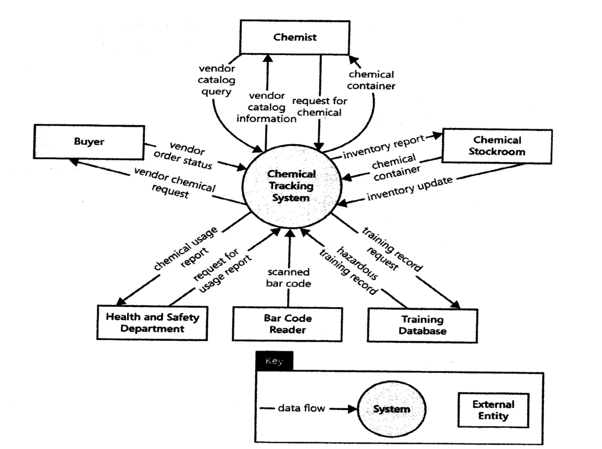
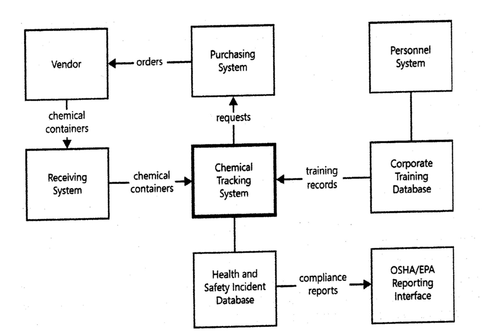
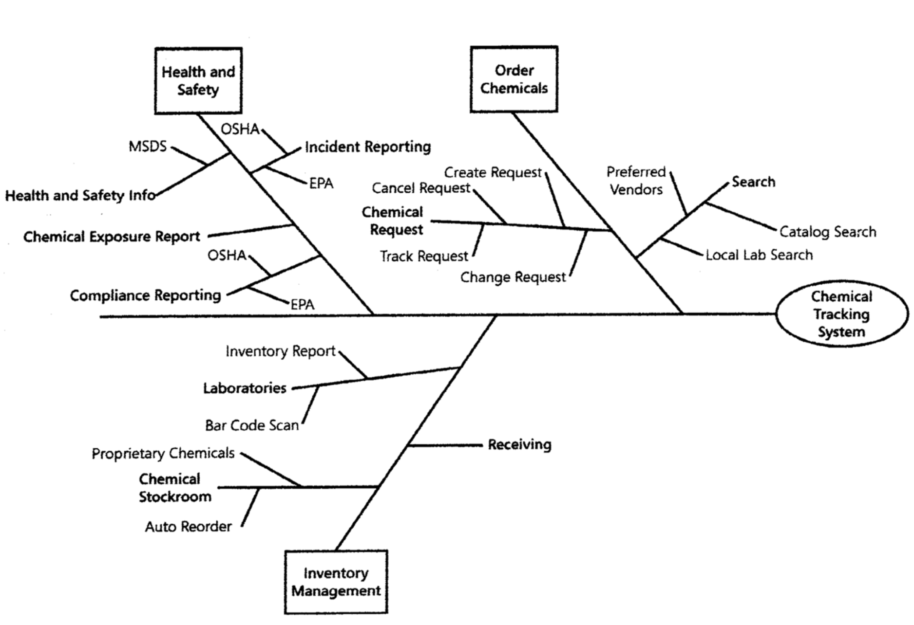

# Lecture 5: Establishing the business requirement

## Business requirements

- Top level abstraction
  - All other requirements are subordinate
  - Not included if they don't address a business objective
- Project participants shouldn't work against each other
- All stakeholders need the same understanding of business objectives

**Defining vision and scope**

- Project visions
  - Ultimate *long-term* goal
  - Changes slowly
- Project scope
  - *Short-term* objective
  - Covers 1 release of the project
  - Adapts to constraints 

**Requirements will conflict**

- Customer wants simplicity
- User wants convenience and features
- Developer wants high-tech excitement
- Manager wants predictability and profit
- Sponsor must resolve conflicts between stakeholders but not all can be pleased

**Business requirements and use cases**

- Business requirements determine:
  - How many use cases are included
  - How extensively each use case is implemented
  - The priority of each use case

## Vision and scope document

- Always a *single document* even when multiple systems are involved
- Always owned by the *project sponsor*
- Input comes from stakeholders and subject matter experts

**1) Business requirements**

1) Background (decision to build product)
2) Business opportunity
3) Business objectives
4) Success metrics
5) Vision statement
6) Business risks
7) Business assumptions and dependencies

**2) Scope and limitations**

1) Major features
2) Scope and initial release
3) Scope and future releases
4) Limitations and exclusions

**3) Business context**

1) Stakeholder profiles (values, attitudes and features of interest)
2) Project priorities (constraints, drivers, degrees of freedom)
3) Deployment considerations (location, times, performance, reliability)

## Scope representation techniques

**Context diagrams**

**Ecosystem maps**

**Feature trees**

## Keeping scope in focus

- Prevent scope creep
- Accommodate evolving needs
- Decisions for proposed requirements:
  1) In scope -> keep it
  2) Out of scope -> discard it
  3) Out of scope, but *really* good idea -> change scope
