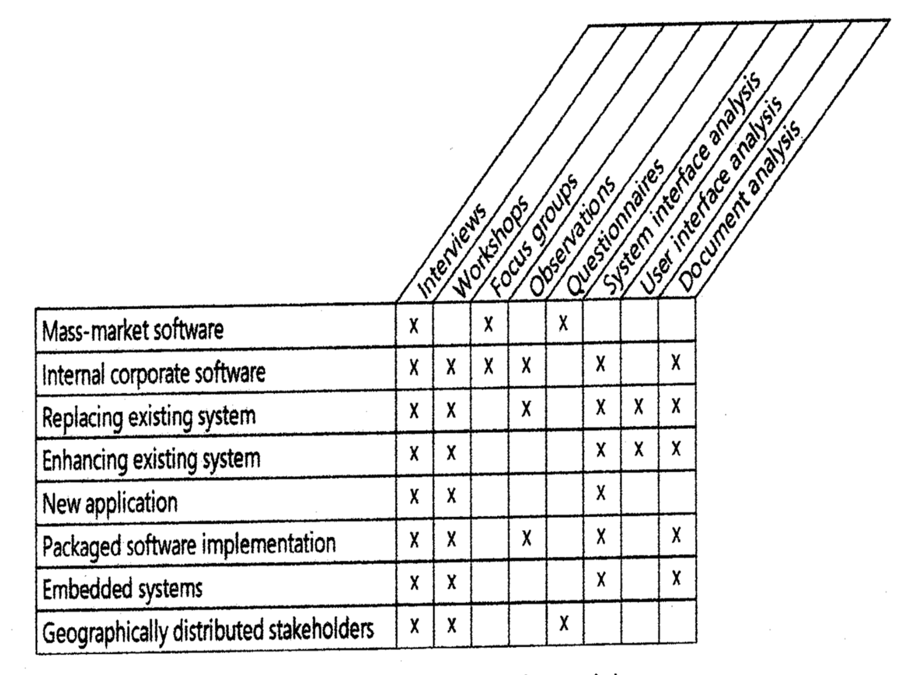

# Lecture 7: Requirements elicitation

## What is elicitation?

- The process of identifying needs and constraints of stakeholders
- Includes activities to discover, extract, and define requirements
- Discovers business, user, functional, and non-functional requirements
- Most challenging part of software engineering
  - Critical to outcome of product
  - Error-prone execution makes correction expensive (time & money)
  - Communication intensive

## Elicitation techniques

**Interview**

- The traditional approach to communicating with a user or small group
- Can be structured where questions are pre-determined beforehand
- Or non-structured where questions are open

**Workshops**

- Encourages stakeholder collaboration in defining requirements
- Are facilitated sessions with multiple stakeholders and formal roles
  - Facilitator: leads the process
    - Keeps to the agenda
    - Stay within scope (leave other requirements for another day)
    - Draw out non-participants
    - Use parking lots for later considerations
  - Scribe: write things down
    - Don't forget random but important things
    - Write things down so people know they aren't being ignored
- Ground rules for sessions
  1) Start and end on time
  2) Don't recap for late comers
  3) Return from breaks promptly
  4) One conversation at a time
  5) Everyone contributes
  6) Focus on issues, not individuals
  7) Stick to an agenda
  8) Limit time on each topic

**Focus groups**

- A representative group of users
  - Convene into facilitated meetings
  - Generate input and ideas on product functionality and quality requirements
- Normally **do not** have decision making authority for requirements

**Observations**

- Can generate requirements by observing someone complete a task
- Can be time consuming or disruptive to the user
- Reserved for important or high-risk tasks
- Can be a silent observation or an interactive session

**Questionnaires**

- A way to survey a large group of users
- Helps understand needs across geographical boundaries
- Can include open ended and close answer questions
- Well written questions are the key to a successful questionnaire

**System interfaces analysis**

- Reveal functional requirements regarding data exchange and services between systems
- Context diagrams and ecosystem maps are a good place to start
- Can also find validation criteria for data being exchanged

**User interface analysis**

- Requires an existing UI to be available
- Technique involves examining it to discover user and functional requirements

**Document analysis**

- Refers to examining any existing documentation
- Can be business processes, decision rationals, forms, user manuals, etc.

## Planning elicitation

- Plan the elicitation objectives
- Estimate schedules and resources
- Know the expected products or elicitation efforts
- Identify elicitation risks

## Preparing for elicitation

**Prepare session scope and agenda**

- Decide on scope based on how much time is available
- Align elicitation scope with overall project scope
- Itemize agenda with topics to be covered and time allotted to each objective

**Prepare resources**

- Schedule physical resources needed
- Includes room reservations, projectors, tele-conferencing needs

**Prepare questions**

- The key to a successful elicitation session
- Usually are open-ended (how and why questions)

**Prepare "straw man" or "draft" models**

- Serves as a starting point
- Easier to revise a draft than make it from scratch

## Performing elicitation activities

**Educate the stakeholders**

- Explain the approach/technique being used
- Explain how information will be captured and reviewed later

**Take good notes**

- Assign a scribe who does not play an active role
- Notes should include the following
  - Attendee list and invitees not present
  - Decisions made
  - Actions to be taken
  - Division of tasks
  - Outstanding issues
  - High points of key discussion

**Exploit the physical space**

- Use whiteboards, sticky notes and markers
- A room with 4 walls can be a space to
  - Draw diagrams
  - Create lists of ideas and issues

## Follow up after elicitation

**Organizing and sharing the notes**

- Review and updates notes immediately after elicitation session ends (memory is still fresh)
- Keep the original raw notes
- Share notes with participants for review
- Consider sharing notes with those who did not participate

**Document open issues**

- Examine any item that needs further explanation
- See if any knowledge gaps remain
- Examine the "parking lot"

## Classifying user input

- Business requirement: financial or marketplace benefits
- User requirements: use cases and scenarios
- Business rule: policies, law and regulations, and formulas to be followed
- Functional requirements: observable behavior of the system
- Quality attributes: speed, ease of use, robust/reliable, secure, efficiency (all must be quantified)
- External interfaces: signals, messages, files, devices, UI standards
- Constraints: sizes, algorithms, platforms, languages
- Data definitions: formats, types, ranges, defaults
- Solution ideas: valid constraint or other ideas

## Know when you are done

- Users can't think of more use cases
- New use cases don't reveal more functional requirements
- Users repeat themselves
- All new requirements are out of scope
- Proposed capabilities are "sometime in the future"

## Avoid incorrect or missing requirements

- Avoid fuzzy terms like *process* or *manage*
- Watch for reviewers having different interpretations
- Use cases **must** have an actor
- Trace system requirements, use cases, event lists, and business rules to functional requirements
- Check boundary conditions
- Use multiple representations (text, graphical, table)
- Use decision tables or trees for complex logic

## Additional considerations

- Imagine doing the user's tasks to find requirements
- Play apprentice to the master user
- Ask about exceptions
- Ask about annoying features or tedious tasks
- Walk through worker's logic behind decisions
- Interview enough users; don't let a few dominate
