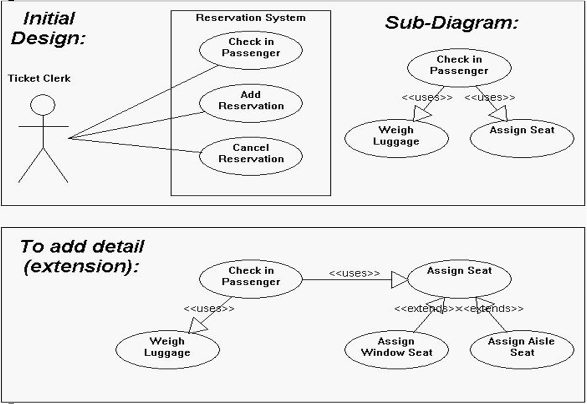
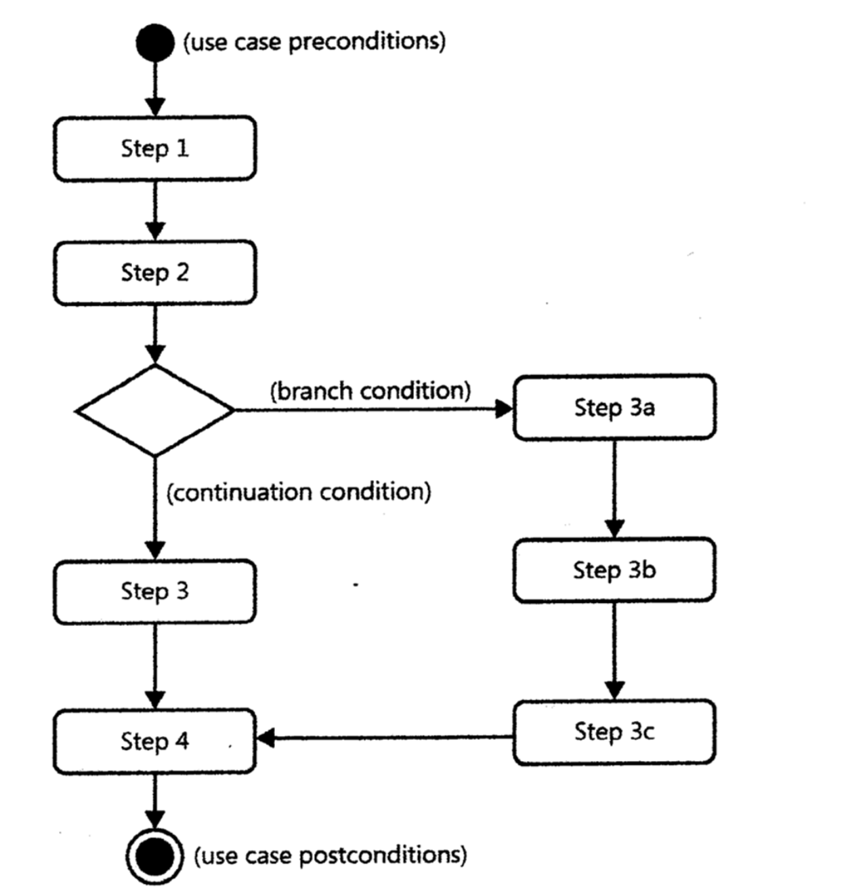
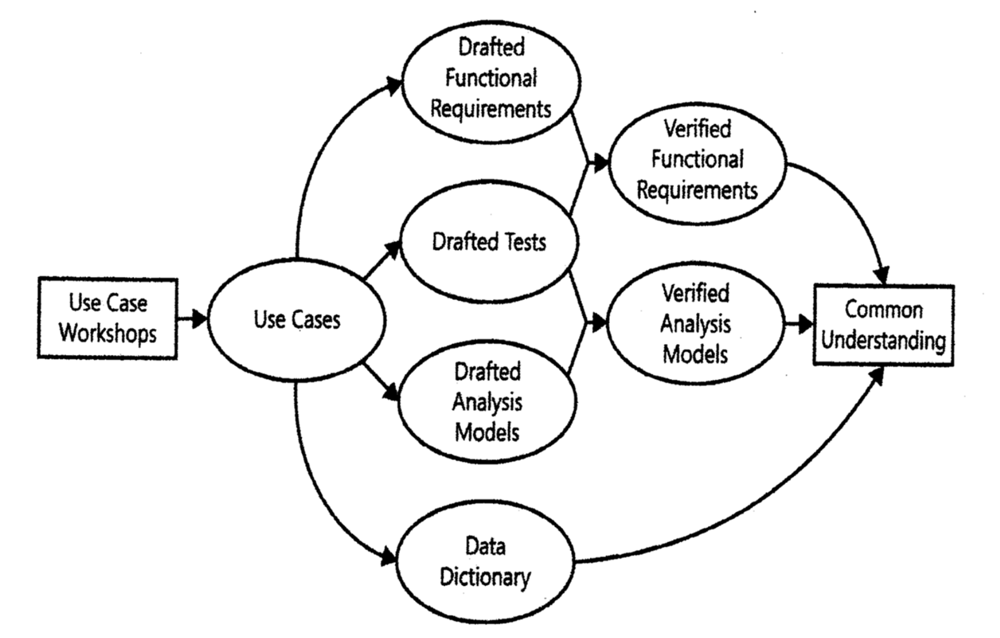

# Lecture 8: understanding user requirements

## Use cases

**Definition**

- Describe a sequence of interactions between a software system and external actors to achieve a common goal/purpose
  - Multiple scenarios can exist for a use case
  - Use cases are named in the format `[verb] + [object]`
- Come from the object-oriented world
  - Extended for general system analysis and UI design

**Use case diagrams**

- Provides a high-level representation of user requirements
  - Actors are represented as stick figures *outside* of the system boundary
  - System boundary is a box enclosing all use cases
  - Use cases are drawn as bubbles labeled with their names
- Relationships between use cases and actors are shown as connections
  - The primary actor of a use case has a connection that pierces the system boundary to the particular use case
  - A use case can "extend" to another use case to be completed in sequence
  - A use case can "include" another use case as a subtask for its completion
  - Some diagrams use "uses" instead of "include", but it means the same thing

**Use case descriptions**

| Field   | Content    |
|--------------- | --------------- |
| Name   | The goal of the use case, preferably in the form of a short, active verb phrase   |
| Description   | An expanded version of the title, describing the goal and context of the use case   |
| Primary actor   | The person or softare/hardware system that interacts with your system to achieve the goal of the use case   |
| Precondition   | Describes the state of the system before the first event of the use case   |
| Postcondition | Describes the state of the system after all events of the use case have taken place |
| Main scenario (normal flow) | The flow of events, from preconditions to postconditions, where nothing goes wrong |
| Extensions (alternative flow) | Describes all other scenarios for the use case, including exceptions and errors |
| Includes | Subtasks to be performed | 

**Activity diagrams**

- Used to visually show the flow of a use case

**Use case example: ATM withdrawal**

- **Name**: Withdraw cash
- **Actor**: Account owner
- **Description**: The account owner withdraws a specific amount of cash from the specified account
- **Preconditions**:
  1) The account owner is logged into the ATM
  2) The account owner has at least 1 account with a positive balance
  3) The ATM contains cash
- **Postconditions**:
  1) The requested amount of cash has been dispensed
  2) The account balance is reduced by the withdrawn amount plus any fees
  3) The ATM cash balance is reduced by the withdrawn amount
- **Priority**: high
- **Normal flow**:
  1) Account owner selects the withdraw option
  2) System displays user's accounts
  3) Account owner selects desired account
  4) System asks user to choose amount to withdraw from a list
  5) Account owner chooses amount to withdraw
  6) System dispense cash
  7) Account owner removes cash from dispenser
- **Alternative flow**: At step 4, the account owner can enter a *custom amount* and join a step 6
- **Exceptions**:
  1) Amount is not a multiple of $20.00 (step 4)
  2) Amount exceeds $400 (step 4)
  3) Amount exceeds account balance (step 4)
  4) Amount exceeds cash available in ATM (step 4)

## Use cases and business rules

- Are closely related to each other
- Business rules can dictate user cases
  - Can constrain which roles can perform all or part of a use case
  - Admin flow may differ from a regular user's flow
- Use cases can reveal some unstated business rule

**Identifying use cases**

Actors first

1) Identify the actors first
2) Layout business process supported by the system
3) Define activities where actors and system interact

Scenario driven

1) Create a specific scenario to illustrate each business process
2) Generalize the scenarios and identify the actors

Business process derived

1) Identify the tasks required to complete the process

External events

1) Identify the external events the system must respond to
2) Relate the events to the actors

CRUD analysis

1) Identify data entities that require use cases to create, read, update or delete it

Context diagrams

1) Examine the system's context diagram
2) Determine what external entities want to achieve with the help of the system

**Use case traps to avoid**

- Use cases are **not** about user goals
- Specifying too many use cases
- Specifying use cases that are too complex
- Including design details in use cases
- Including data definitions in use cases
- Describing use cases that users do not understand
- Failing to consider alternative or exception flows
- Prematurely detailing low priority use cases
- Undefined or inconsistent system boundary

**Validating use cases**

- Is the goal (measurable value) of the use case clear?
- Is it clear which actor benefits from the use case?
- Do the preconditions and postconditions properly frame the use case?
- Could any common action sequences be split out?
- Is the use case a standalone activity, which could be chained with others?
- Are all known exceptions documented?
- Are the steps complete, correct, unambiguous, consistent, verifiable, feasible?

**Use cases and functional requirements**

- Use case take the actor's viewpoint and show external behavior and appearance
- Developers implement the system's viewpoint with internal behavior, algorithms and storage
- Use cases in SRS 
  - Use cases included with the functional requirements
  - Document includes a write up of the use cases

**User stories**

- An alternative way to specify a user requirement
- Focuses on the what a user wants and what benefit(s) there are to gain
- Does **not** describe the step-by-step process to complete the task, but can be flushed out if needed

## User requirements using use cases

**Appropriate use case application**

- Use cases work well with:
  - End user applications
  - Websites
  - Devices with which users must interact
  - Services provided by one system to another
- Use cases aren't valuable for
  - Batch processes
  - Computationally intensive systems
  - Data warehouse projects

**What use cases are and are not**

- Use cases describe
  - User's goals
  - User's view of the system
  - A set of task-related activities
- Use cases do **not** describe
  - User interface designs
  - Technology solutions
  - Application architecture
  - Performance goals

**Scenarios and use cases**

- Scenarios:
  - One path through a use case
  - A story about a specific instance of use case execution
- Each use case typically includes multiple scenarios (like success and failure)

## Anatomy of a use case

**Actors**

Actors are entities outside the system that interact with it for the purpose of completing an event

- Could be human, hardware, or another software system
- Create an actor catalog from
  - Expanding a user class into multiple discrete actors
  - Condensing multiple user classes into a single roles
- The *primary* actor derives value from the use case and is typically the initiator
- Secondary actors may be needed to complete the use case

**Discovering use cases**

- Discovery methods
  - **Top-down**: identify actors -> identify business process for each actor -> name use cases -> add details
  - **Bottom-up**: express process in terms of specific scenario -> generalize -> identify actors
  - **External events**: identify events -> relate to actors and use cases -> relate to system notifying actor of state changes
  - **Role playing**: a day-in-the life study
- Naming use cases
  - Should reflect the user's goals from their perspective
  - Describes a valuable transaction
  - Be general enough to cover multiple scenarios
  - Should be in `[verb] + [object]` form with strong verbs and specific nouns

**Pre and postconditions**

- Preconditions
  - Describes the state of the system must be in when the use case is triggered
  - **Not** the trigger itself
  - **Not** the user's intention
  - Use cases do not test for preconditions, but the system must
- Postconditions
  - State the system is in at the *successful* conclusion of a use case
  - Physical outcome, such as something being printed
  - Data or internal changes, such as an order being placed

**Flow**

- Tips for writing flows
  - Describe both actor and system behavior
  - Use the active voice and present tense
  - Use actor names in steps
  - Limit normal flow to about 10 steps
  - Write steps at a common level of abstraction
  - Stay independent of technology
  - Stick to the user-visible experience
- The normal flow
  - Each step should move the actor closer to the goal
  - An action step can be another use case
  - First step should be the trigger action
- Alternative flows
  - Other paths by which actor can reach their goal
  - Postconditions are still satisfied
  - Represent lower priority or less common flows
  - Show the step the alternative flow branches off and where it rejoins the normal flow
- Exceptions
  - Conditions that prevent the use case from completing properly
  - Recovery *might* be possible
  - Show the step the exception takes place
  - Describe how the exception is handled
