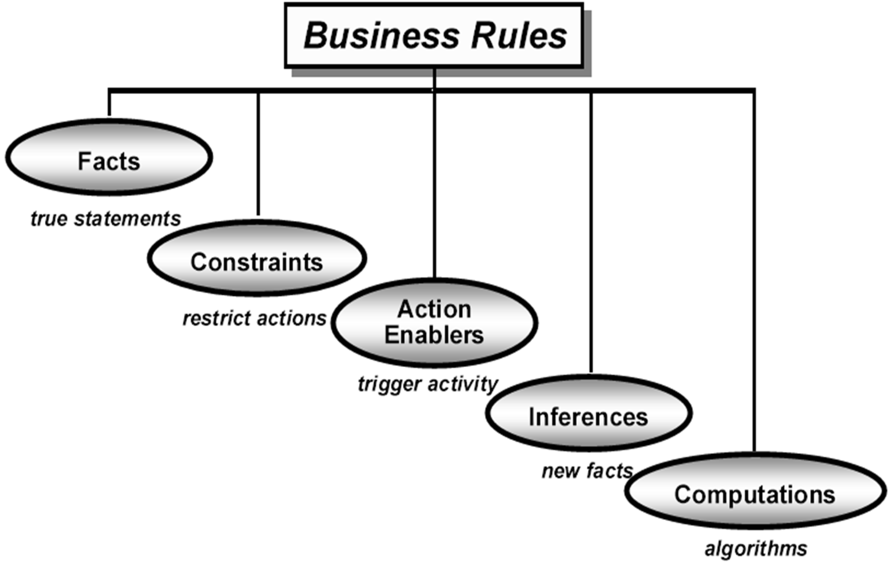

# Lecture 9: business rules

> A *business rule* is a statement that defines or constrains some aspect of the business.
> It is intended to assert business structure or to control or influence the behavior of the business.
> (The Business Rules Group)

## Classifying business rules

**Facts**

- Simple truths
- Associations and relationships often appear in data models

**Constraints**

- Restrictions on the system or its users
- Typically include words like "must", "must not", "may not", "only", and "if"

**Action enablers**

- Conditions that trigger activities

**Inferences**

- Facts derived from other conditions

**Computations**

- Formulas, algorithms, tables

## Discovering business rules

- Ask about the rationale for a process
- Write atomic business rules
  - No "ors" on the left of an if/then clause
  - No "ands" on the right
  - Makes rules easy to change, apply, understand, and combine
- Decompose non-atomic rules into atomic ones
  - Non-atomic: "If the day is Sunday or a holiday, then banks are closed and mail is not delivered"
  - Atomic
    1) If the day is Sunday, then banks are closed
    2) If the day is a holiday, then banks are closed
    3) If the day is Sunday, then mail is not delivered
    4) If the day is a holiday, then mail is not delivered

## Documenting business rules

- Maintain an enterprise wide catalog
  - Give a unique ID for easy reference
  - Provide its definition
  - Declare the type of rule it is
  - Specify a probability of change (static/dynamic)
  - Track the source (company policy, public law, agency regulation)
