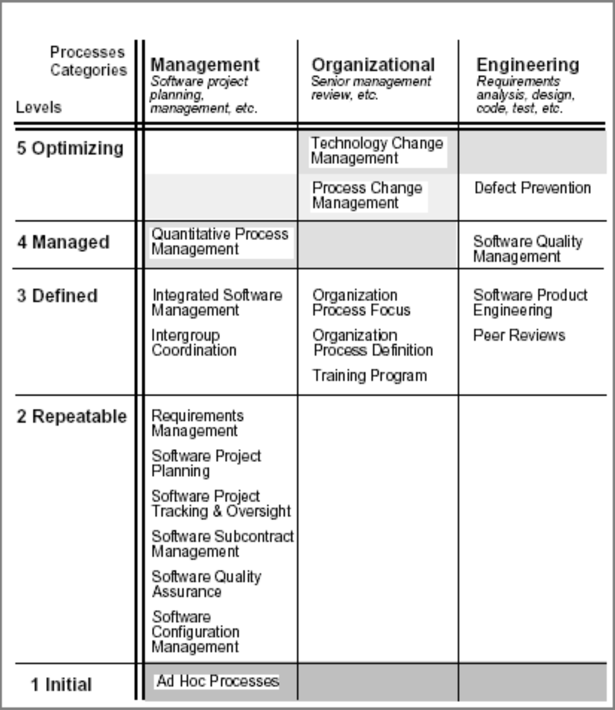

# Lecture 12: CMMI

## Introduction to CMM and CMMI

### CMM

**What is CMM?**

- Stands for *C*apability *M*aturity *M*odel
  - Used to determine organization's current state of process maturity
  - Grading scheme determines compliance with CMM
  - Defines required activities at different levels of process maturity
- Measures effectiveness of company's software engineering practices and establishes the following maturity levels
  1) Initial
  2) Repeatable
  3) Defined
  4) Managed
  5) Optimized
- CMM is used for
  - Software process improvement
  - Software process assessment
  - Software capability evaluation

**Components of CMM**

- Maturity levels
  - A well-defined evolutionary plateau toward achieving a mature software process
  - Maturity levels provide the top-level structure of the CMM
- Process capability
  - Describes the range of expected results achievable by following a software process
  - Provides a means of predicting the most likely outcome for the next software project
- Process areas

### CMMI

**What is CMMI?**

- Stands for *C*apability *M*aturity *M*odel *I*ntegration
  - Formed to sort out issues when using multiple CMMs
  - Includes a framework with integrated CMMI models, appraisal methods, and supporting products
- Provides guidance to use when developing processes
  - Not processes or process descriptions themselves
  - Actual processes differ from organization to organization and may not map one-to-one from CMMI process areas

**Purpose of CMMI**

- Provide guidance for improving an organization's process
  - Appraise organizational maturity and process area capability
  - Establish priorities for improvement
  - Implement improvements
- The process is a leverage point for *sustained improvement*

## CMMI architecture

### CMMI for services

- Improve consistency and payoff for service organizations
- Includes service deployment practices not covered in the current CMMI model
- Extends CMMI framework to cover the provision of services
- A service is a product that is intangible and non-storable

### CMMI for acquisition

- Improve consistency and payoff for acquisition organizations
- Extends the CMMI framework to cover the acquisition of products and services
- Acquisition is defined as the process of obtaining (goods and services) through contract

### Selecting a CMMI model

**Representations**

- Continuous
  - Allows selection of order of improvement
  - Enables comparisons across and among organizations
    - Process areas basis
    - Equivalent staging
- Staged
  - Follow a proven sequence of improvement
  - Provides a predefined and proven path of successive levels
  - Permits comparison across and among organizations using **maturity levels**

**Bodies of knowledge**

- System engineering
  - Covers development of total systems (may or may not include software)
  - Focus of transforming customer needs into product solutions
  - Supports product solutions throughout life of the product
- Software engineering
  - Covers development of software systems
  - Apply systematic, disciplined, and quantifiable to development and maintenance of software products
- Integrated product and process development
  - Systematic approach that achieves a timely collaboration of relevant stakeholders
  - Processes to support this approach are integrated with other processes in the organization

**Process area components**

- Required
  - Describe what an organization *must achieve* to satisfy a process area (specific and generic goals)
  - Achievement must be visibly implemented in organization's processes
  - Goal satisfaction used in appraisals for determining if process area has been achieved or satisfied
- Expected
  - Describe what an organization *may implement* to achieve a required component
  - Guide those who implement improvements or perform appraisals
- Informative
  - Provide details to get started with approaching required and expected components

## CMMI models

**Levels**

- Describe the evolutionary path recommended for an organization that wants to improve the process
- CMMI support two improvement paths
  1) Incrementally improve process areas 
  2) Improve a set of related processes by addressing successive sets of process areas
- The two levels correspond to the two CMMI representations
  - Continuous goes with capability levels
  - Staged goes with maturity levels

**Capability levels**

- Level 0: incomplete
  - Process that is not performed or partially performed
  - One or more specific goal is not satisfied and no generic goal exists
- Level 1: performed
  - Accomplishes the needed work to product work products
  - Specific goals of process areas are satisfied
- Level 2: managed
  - A performed process that is planned and executed
  - Is monitored, controlled, reviewed, and evaluated for compliance
- Level 3: defined
  - A managed process tailored from organization's set of standard processes
  - Has a maintained description and contributes related experience to organizational process assets

**Maturity levels**

- Level 1: initial
  - Process is ad-hoc and chaotic
  - Organization does not provide a stable environment for process support
  - Success depends on competence and heroics of people, not use of processes
- Level 2: managed
  - Existing practices are retained during crises
  - Status of work products are visible to management at defined points
  - Commitments are established are revised as needed
- Level 3: defined
  - Process is well understood and characterized
  - Can establish consistency across the organization
- Level 4: quantitatively managed
  - Project establish quantitative objectives for quality and process performance
  - Objectives are based on customer needs
  - Performance is understood in statistical terms
- Level 5: optimizing
  - Continual improvement to process based on quantitative understanding
  - Use of quantitative approach to understand variation and the cause of process outcomes

**Process areas**

- Cluster of related practices in that area
- When implemented correctly, a set of goals are satisfied
- Process areas in the continuous representation
  - A bar graph of target capability level vs process area
- Process areas in the staged representation
  - Groups of process areas chosen for improvement to reach next maturity level

**Equivalent staging**

- A way to compare results from using one representation with the other
- Enables organizations using the continuous representation to see the associated maturity level rating
  - To achieve maturity level 2, all process areas assigned to maturity level 2 must reach capability level 2 or 3
  - To achieve maturity level 3, all process areas assigned to maturity levels 2 and 3 must reach capability level 3
  - To achieve maturity level 4, all process areas assigned to maturity levels 2, 3 and 4 must reach capability level 3
  - To achieve maturity level 5, all process areas must reach capability level 3

## Using CMMI models

**Interpreting CMMI models**

- CMMI describes best practices of an organization
  - Best practices can help organizations improve their process
  - May be tempting for new enterprises to adopt best practices immediately, but are more useful with an existing process
- Map your process to CMMI process areas
  - Enables tracking of compliance to CMMI model
  - Easily makes areas of improvement visible

**Using appraisals**

- Appraisals measure progress and earn a maturity level or capability level
- CMMI guides identification and prioritization of findings
- With guidance from CMMI practices, organization can create improvement plans
- Appraisal principles for CMMI are the same as principles used in appraisals for other process improvement models
