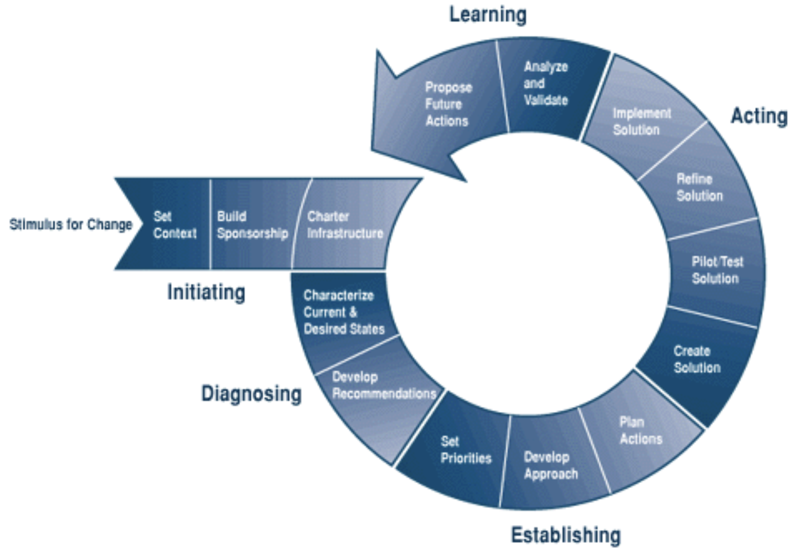

# The IDEAL model

## The software improvement model

- An organizational model for initiating, planning, and implementing improvement plans
- Named for the five phases it describes
  1) Initiating
  2) Diagnosing
  3) Establishing
  4) Acting
  5) Learning
- Forms an infrastructure to guide organizations to have an effective software process improvement program

## Model phases

**The initiating phase**

- Stimulus for change
- Set context
- Build sponsorship
- Charter infrastructure

**The diagnosing phase**

- Characterize current and desired status
- Develop recommendations

**The establishing phase**

- Set priorities
- Develop approach
- Plan actions

**The acting phase**

- Create solution
- Pilot/test solution
- Refine solution
- Implement solution

**The learning phase**

- Analyze and validate
- Propose future actions

## Necessary activities to implement CMMI

- Identify current practices
- Find problems and solutions
- Implement a pilot solution
- Evaluate
- Implement all
- Assessment
- Learn and iterate
