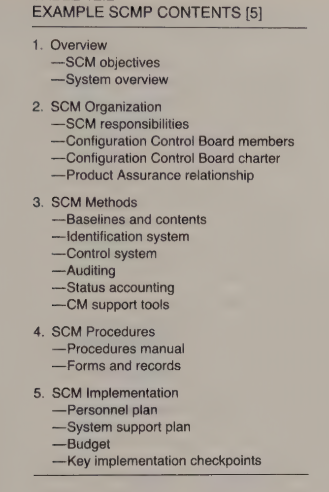

# Lecture 17: software configuration management (part 2)

## The software configuration management plan

- To establish a software configuration management system, one needs a software configuration management plan
- A software configuration management plan includes objectives, responsibilities, and approaches and methods to be used

## Software configuration management questions

**For the requirements phase**

- Where is the official requirements statement?
- What changes have been made, and have they been approved?
- How much change activity has their been, and what is the impact on design and/or development?
- How many requirements changes have been made *without changes* in the contract scope?

**For the design phase**

- Where is this particular requirement covered by the design?
- What is the particular requirements that this design element satisfies?
- What is the current approved specification for this interface?
- Has the format for this data item been specified, where, by whom, and who is using it?
- What is the design impact of this requirements change?
- What tools and methods were used to develop this design?

**For implementation**

- How has this particular function been allocated to the various implementation areas, and why?
- What is the design logic for this particular code element?
- How is the design affected by this code change?
- What is the implementation impact of this requirements change?
- What compiler version was used to produce this code

**For the testing phase**

- Where are the tests that verify this functional requirement?
- Where is the test data for use with these tests?
- Where is the documentation that explains the results to be expected from these tests?
- Has this test bucket been updated to reflect the functional content of the latest release of system build
- What tests have been run on this program version, and what were the results?
- What test tools and support facilities were used for these tests?

## SCM support functions

- A *protected baseline* for operational concept, specification, design, implementation, test, and tools
- A *protected file* with a description of all changes and revisions
- Means for each engineer to read any *unlocked element* in the baseline
- A *private workspace* where charged-out designs or implementations can be modified
- *Templates* to assist in the preparation of new design, implementation, or test descriptions
- A *procedure* for making approved charge-outs that permits engineers to obtain any available baseline for their private workspace and lock out the SCM copy function to prevent anyone else from making simultaneous changes
- A *charge-in procedure*
- A procedure for making *approved deletions* of defunct elements
- A way to collect, format, and produce *consolidated system documents* containing key element descriptions for any baseline
- A way to check that all elements and relevant descriptions have been *carried over between baselines*
- A *centralized data dictionary* containing the official record of all named items and their formats
- A *where-used* record of every use of every interface and data item in the system

## The requirements phase

- Ensure the user's needs are properly understood before designing and implementing a system to meet them
- Requirements also provide part of the basis for system and acceptance testing

**Requirements changes**

- Early designs will likely be changes many times
- Requirements not fully specified at the beginning of a project must gradually evolve
  - Change is constant and a means are needed to control it
  - Establish a baseline for a design foundation, a basis for change negotiations, and as a reference point for acceptance testing

**Requirements baselines and change control**

- Control changes to baselines as described in [part 1](lecture-9_software-configuration-management-part-1.md)
- Each change is submitted in a design request form
- Change requests are reviewed, approved, and tracked with the same discipline as code changes
  - All requirements changes are handled this way, no matter who submits them
  - Without change discipline, baseline integrity for the entire project is exposed
- Establish a project naming conventions, like software configuration identification, to uniquely identify every project development item
  - SCI definitions are kept under configuration control and expanded as more is learned about the product and its structure

**External specifications**

- Develop detailed specifications for each program component
- Specifications may all be produced at once, but some component specifications evolve in concert with development

## Design control

- Change control board (CCB) controls design changes
- SCM maintains complete records of every change and its rationale
- Software configuration identification connects design elements back to the specifications
- A good design requires a clear problem statement
- Design is a template against which implementers produce the code
- Permanent design reference is required for later repair or product extension
- A permanent record of design changes records why they were made and how they were implemented
- SCM checks self consistency of the modules and interface descriptions in each design baseline
- Design continues until the smallest structural elements are defined and specified
- Detailed design phase starts with module specifications

## The implementation phase

- A fully control design allows implementation to start on a solid foundation
- As implementation proceeds, design problems will be found and design changes will be needed
- When such changes are made, the design documentation must be updated

## Operational data

- Most large scale software system require large amounts of specialized data
- It is essential that SCM provisions be made to handle this data

## The test phase

- Once a newly developed program is put in a baseline, all further changes must be controlled
- Major concerns are problem incidents, temporary patches, permanent bug fixes, and enhancements
- Precise and complete records must be maintained of
  - Every test run
  - Data and tests used
  - Configurations on which they were run
  - The results

## SCM for tools

- Maintaining baseline control over the complete set of software tools is often overlooked
- One approach is to maintain a standard tool set and establish a tool baseline whenever any change is made
- Include a notation of the tool baseline used in production
- Summary of this data should also be retained with the module revision history

## Configuration accounting

- Software configuration status accounting maintains a continuous record of the status of all baselined items
- Acts as a useful management tool, and provides valuable insurance against disaster
- Information required for software configuration status accounting
  - Time at which each baseline was established
  - When each software configuration item and change was included in the baseline
  - A description of each configuration item
  - Status of each software related engineering change
  - Descriptions of each software change
  - Status of each software change
  - Documentation status of each baseline
  - Changes planned for each identified future baseline

## The software configuration audit

- Should be periodically performed to ensure SCM practices and procedures are rigorously followed
- Can be performed directly by SCM staff or by some independent assurance function
- Generally advisable to SCM conduct frequent self-audits with an independent party occasionally performing spot checks
