# Lecture 18: defining the software process

- Software development is exceedingly complex and there are multiple ways to perform various tasks
- A defined process will help software professionals through these choices in an orderly way
- An established software process can help with understanding
  - What they should do
  - What they can expect from their co-workers
  - What they are expected to provide in return
- Software projects have their differences and software processes have their differences too
  - Absence of a universal software process means a process meeting the unique needs of the project is needed
  - Process used for a given project must consider
    - Experience level of the members
    - Current product status
    - Available tools and facilities

## Process standards

- Reasons for process standardization
  - Helps reduce the problems of training, review, and tool support
  - Each project's experience can contribute to overall process improvement
  - Provide the basis for process and quality measurements
  - It is impractical to produce new process for every project
- Conflicting needs for customization and standardization can be solved with establishing a process architecture
  - Consists of a set of unit or kernel process steps
  - Has rules for describing and relating them
- Customization is achieved by appropriate interconnections of standard process elements into a tailored process model

## Definitions

| Term   | Definition    |
|--------------- | --------------- |
| Software engineering   | The disciplined application of engineering, scientific, and mathematical principles, methods and tools to the economical production of quality software   |
| Software process   | The set of activities, methods, and practices that are used in the production and evolution of software   |
| Software engineering process   | The total set of software engineering activities needed to transform a user's requirements into software   |
| Software process architecture   | A framework within which project-specific software processes are defined   |
| Software process model  | One specific embodiment of a software process architecture |

## Levels of software process models

### Universal process models

- The waterfall model

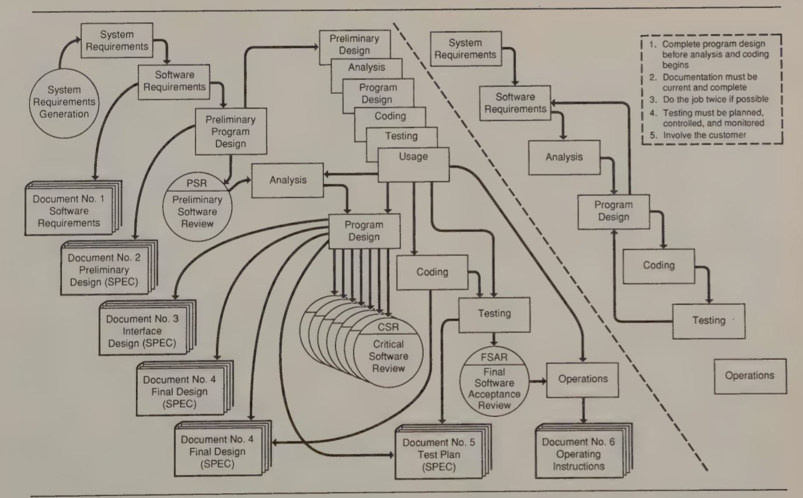

- The spiral model

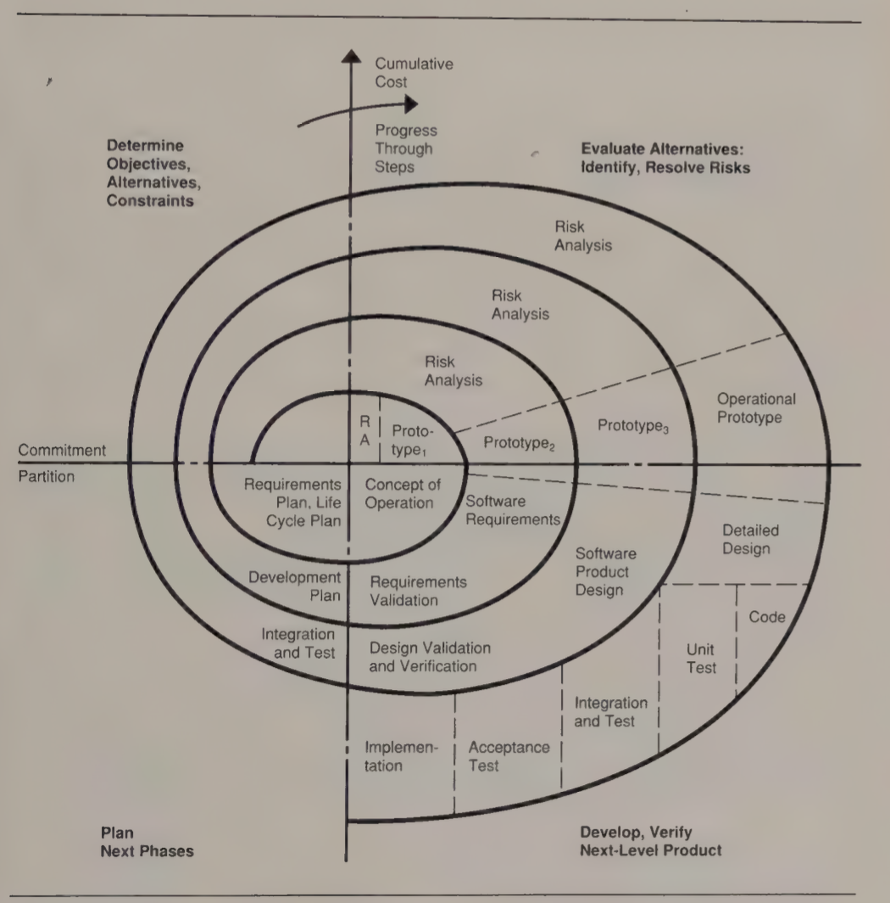

- Real software development does *not* conform to either of these models
- They represent general work flow and provide overview understanding
- Cannot easily be decomposed into finer levels of detail

### Atomic process models

- Opposite extreme of universal models, atomic process models can be very detailed
- Needed by anyone who wants to
  - Automate a specific process activity
  - Use a standardized method of procedure to guide execution of a task
- Requires precise data definitions, algorithmic specifications, information flows, and user procedures
- Amount of detail required is determined by their use
- Atomic process definitions are often embodied in process standards and conventions

### Worldly process models

- Most direct interest to practicing software engineering
- Guides the sequence of tasks and defines prerequisites and results
- Generally look like a procedure when reduces to operational form
- Specifies who does what and when
- Where appropriate, reference A-level that specifies standard task definitions or tool usage
- Each task defines the anticipated results, the appropriate measures, and the key checkpoints

### Examples of process models

**At the U level**

- Policies establish a high-level framework and a set of principles that guide overall behavior of an organization
- Helpful where unprecedented circumstances arise and no precedents have been established

> All work will be subjected to an inspection before it is incorporated in a baseline

**At the W level**

- Procedures are established to implement the policies
- Refers to any available atomic-level standards that define precisely how to perform a task

> A procedure might define the points in which quality assurance reviews are to be conducted and how the resulting issues are to be handled

**At the A level**

- Serve as the basis for directing the work and for software quality assurance review

> A code inspection standard would specify what code is to be reviewed, when, the methods to be used, the reports to be produced, and the acceptable performance limits

### Prescriptive and descriptive use of models

- Process models can be used to either
  - Describe what is done
  - Characterize what is supposed to be done
- In descriptive cases, models provide useful information about the process and its behavior
- In prescriptive cases, the approach is to define how the process should be conducted and suggest where appropriate policies, procedures, and standards could help guide the work

## A software process architecture

- Most organizations already have policies, procedures, and standards in place
  - They are already intuitively following U- W- and A- level models
  - They do this both prescriptively and descriptively
- To be fully effective
  - Process models should be explicit
  - Should relate to each other
- An architectural framework
  - Defines basic elements
  - How to relate these elements
  - How they are decomposed into further detail

## Critical software process issues

- Software processes are defined to help improve the way work is done
- Thinking about the software process in an orderly way can help
  - Anticipate problems
  - Devise ways to either prevent or resolve them
- Some major software process issues concern
  - Quality
  - Product technology
  - Complexity
  - Requirements instability (Unknown, Unstable, and Misunderstood requirements)

## A preliminary process architecture

- Process architecture permits organizations to 
  - Represent and manipulate the process and the U-level
  - Selectively refine it to the W- and A-levels

**Basic unit cell**

- The basic element of the process architecture
- Cells define a task to accomplish and are uniquely identifiable
- Cells have required entry conditions specified for task initiation (including inputs)
- Standard tasks, procedures, methods, and responsibilities, and required measurements are also defined
- Exit conditions define the result produced, their level of validation, and any other post-task conditions
- Feedback refers to any data provided to or received from other stages in the process

**Single-cell development process**

- Shows a full development cycle in one cell
- Shows what kind of information is required for every process cell

**The U-level development process**

- More refined U-level model of the development process
- Development cycle is broken into basic cells of the waterfall model

### Standard process elements

- Software processes look very much the same from the U-level
- This is due to their descriptions using broad terms (design, implementation, and test)
- When activities are broken down into more detail, significant difference emerge
- Variation at the W-level allows for standardized software activities across different projects
  - Possible to establish some basic process cells
  - Interconnect them in various ways to meet project-unique needs
- Detailed structure of standard cells are further defined as A-level models as needed

### Implementation cells

**Basic implementation cell** $C_{0}$

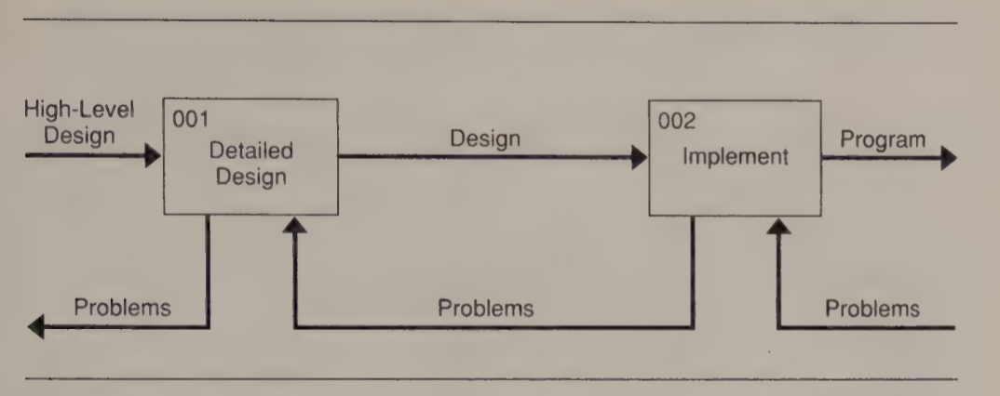

**Quick kernel**

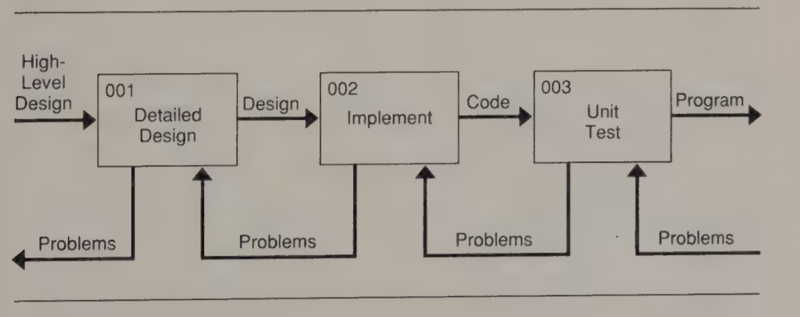

**Inspection operator**

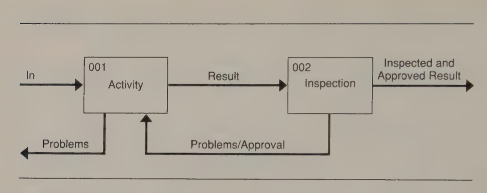

**Refined implementation cell** $C_{1}$

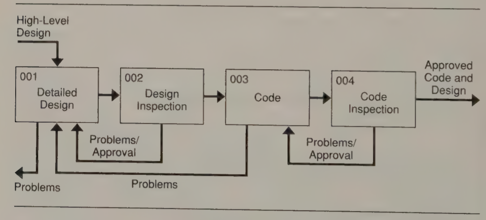

**Unit implementation kernel**

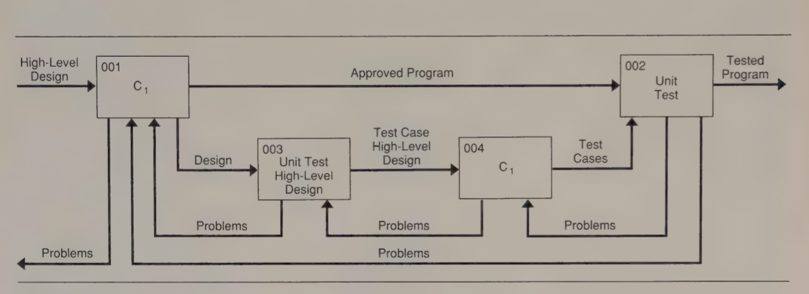

### The cell specification

- Once general flow of a process is known, it is important to define each process cell
- ETVX paradigm characterizes entry, task, verification, and exit conditions
- ETX paradigm leaves out verification characterization
- Process specifications should include
  - Explicit responsibilities for task performance
  - Should refer to the applicable standards and procedures
- A defined process can provide guidance and set standards for management view and QA audit

## Larger process models

- Once basic process cell have been defined, larger models can be constructed
- Larger models come from connecting basic cells in various ways
- Consciously design the development and maintenance process to address anticipated issues and problems

### Product technology unknowns

- Advance software systems often introduce significant technical unknowns
- Hardware engineers use breadboards to test technical concepts and experiment with alternative approaches
- It is also appropriate for software engineers to "breadboard" critical, complex, or unusually demanding functions

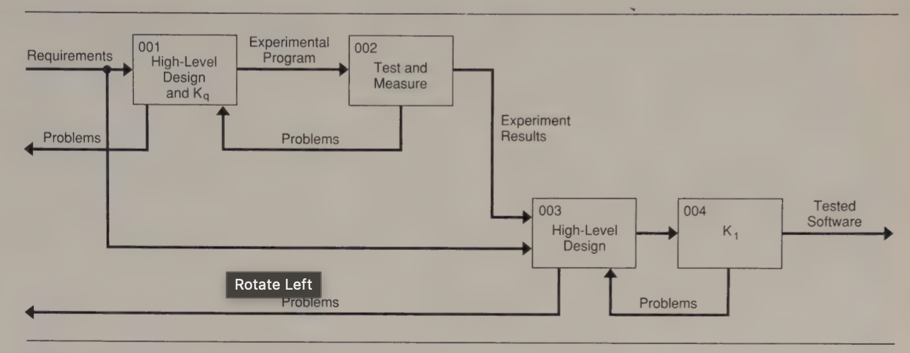

### The problem of complexity

- Process kernels described focus on small tasks that can be completed by 1 or 2 programmers
- Kernels provide useful guidance for small tasks, but can provide insight into larger projects
- Multiple modules are typically involved and many professionals' work must be coordinated

**Integration cycle**

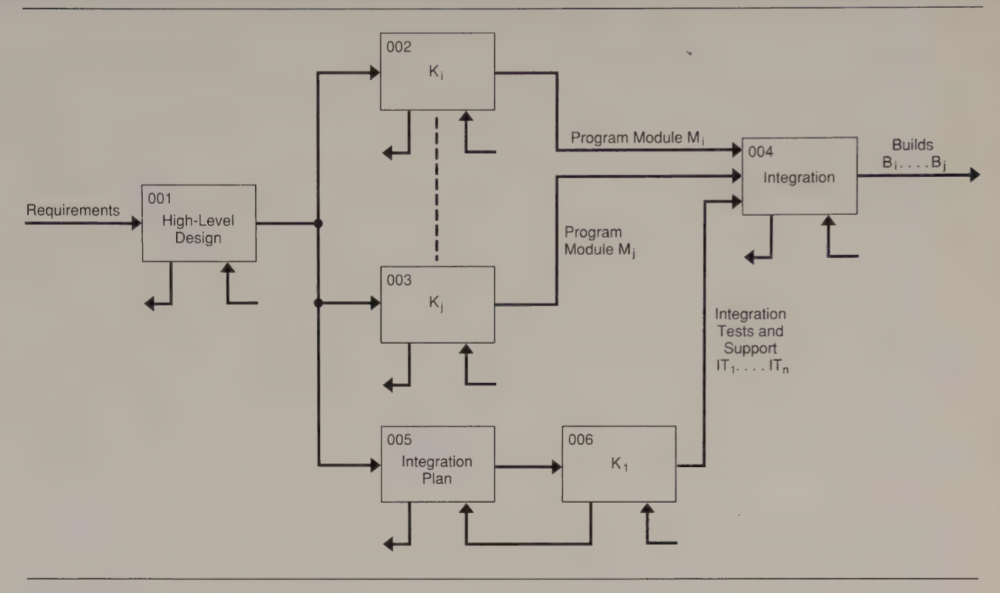

**Integration cell**

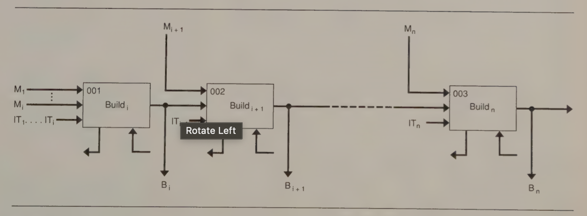

**Build cell**

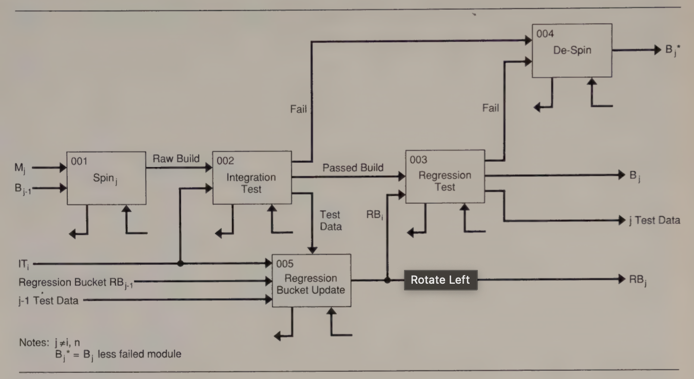

### Requirements instability

- Process cells assumed the software requirements were known, stable and understood
- Since this is rarely the case, compensating process provisions are needed
- The appropriate provisions depend on which instability is involved

| Cell identifier | Known | Stable | Understood |
| --------------- | --------------- | --------------- | --------------- |
| $KSU'$ | Y | Y | N |
| $KS'U$ | Y | N | Y |
| $K'SU$ | N | Y | Y |

**Requirements not understood**

**Requirements unstable**

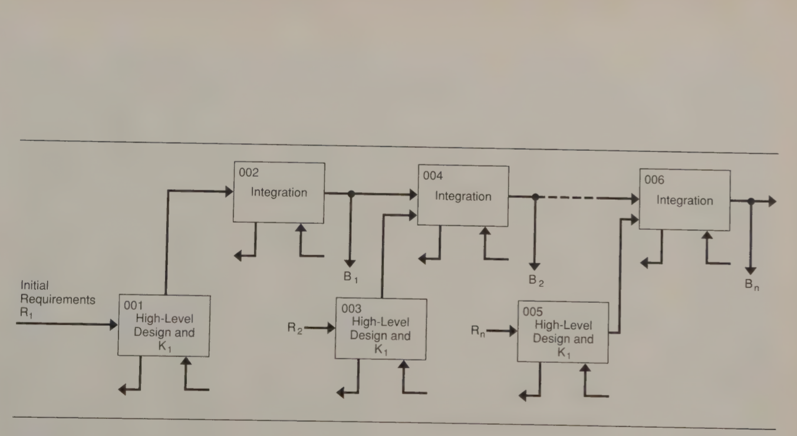

**Requirements unknown**

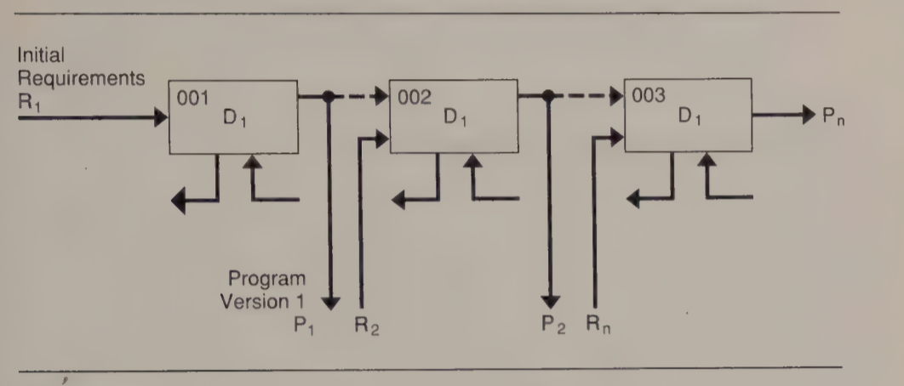

### Prototype process models

- Prototype programs can be built to learn about potential customer reactions
- Demonstrate one or more facets of system behavior
- Can be used to try to reduce requirements uncertainty

**Use of prototyping**

- Prototyping methods can be used at any of the process levels
- In large system, some module require prototyping and others can be developed directly

**Prototyping issues**

- Product development through prototyping is
  - Substantially faster
  - Less expensive
- Prototype objectives must be clearly established before starting to build it
- Prototyping process must be defined in advance

## Detailed process models

- Process models will not help to produce programs if they cannot be reduced to the level of programming
- This is the A-level process, where task definitions should be appropriate to knowledge and skills of the professionals

**Regression test planning**

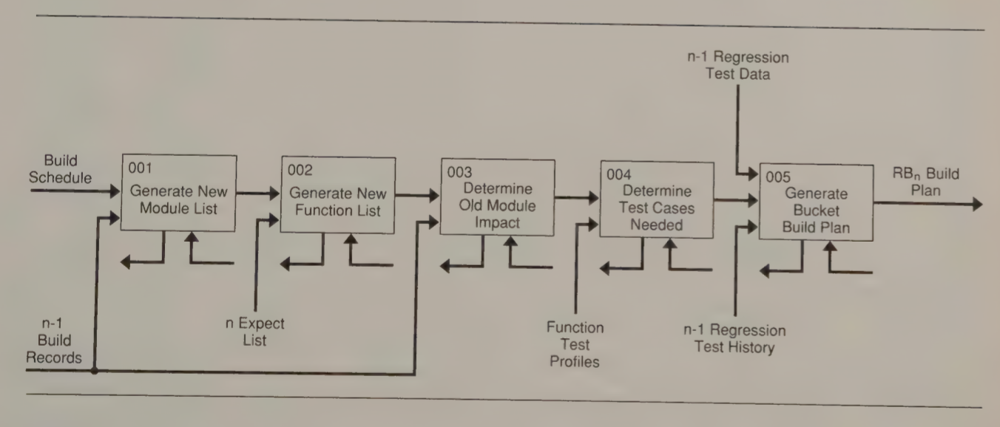

**Regression test refinement**

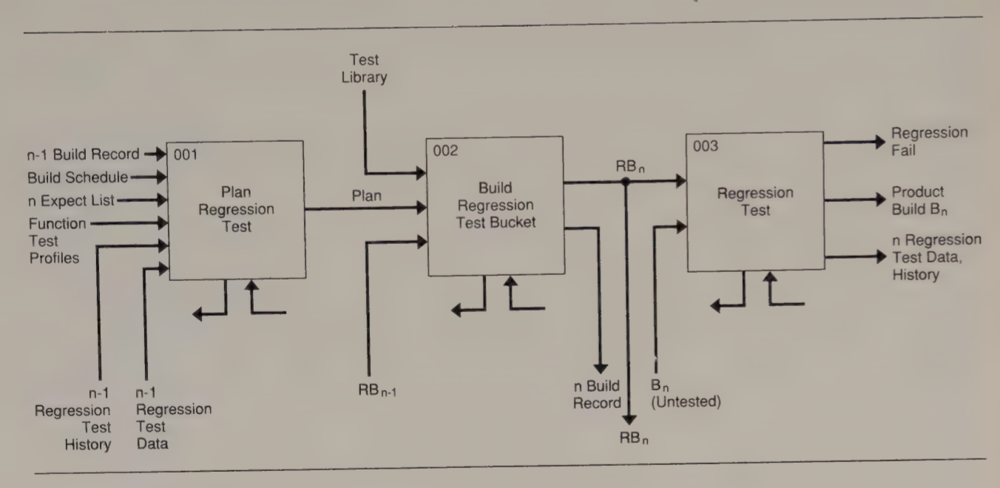

## Entity process models

- Previous process models are similar to state models of a software system
- In simpler terms, the process is either in
  - An idle state before the entry criteria for the first cell are met
  - A state represented by one of the succeeding cells
- After final output from the last cell is produced, the model returns to an idle state
- Complex implementation tasks render the state models less realistic
- Basing process models on entities allows
  - One to deal with entities and the actions performed on them
  - Treat entities as real objects that exist and has an extended lifetime
- Examples of entities
  - The deliverable code 
  - User installation and operation manuals
  - Requirements documents
  - Design
  - Test cases and procedures
- Entity process models are often more accurate than task-based models for complex and dynamic processes
- Each entity cycles through a set of states during the software process
  1) Identify process entities and their states
  2) Define triggers that cause transitions between these states
  3) Complete the process model without resource constraints (unconstrained model)
  4) Impose appropriate limitations to produce a final constrained process model
- Entity process models are useful in characterizing activities at the U- and W- level
  - Must be transformed into a task structure to actually guide the work or its automation
  - The more accurate high-level representation is useful for planning and tracking purposes

## Process model views

- The 3 views of process models are *different views* rather than alternatives
- Each presents an essential perspective of the process
- If any view is not addressed, an important facet of software management will likely be overlooked

**State view**

- Discussed in-depth with states representing
  - Stages of the process
  - Stages of the product

**Organizational view**

- A view of the development process that defines the responsibilities for each activity

**Control view**

- Relates to measurement and control

## Establishing and using a process definition

- Software organizations should establish a process architecture and process models tailored to particular needs
- Tailoring as done as follows
  1) Define a standard process as a foundation
  2) Establish ETX specifications for the standard process model
  3) Make provisions to gather and track resulting process measurements
  4) Establish checkpoints and standards for SQA review
  5) Incorporate specific measurements and reporting provisions
  6) Instruct development personnel on the use and value of the process architecture, standard process models, and when, why, and how they should be tailored
- Project should start with the standard process model and take the following steps
  1) Identify the unique project issue, problems, and success criteria
  2) Document the adjustments required to the standard process to produce a basic overall project process
  3) For each system component, repeat these definitions
  4) Once each program module has been identified, consider the process definition for it as well and make any necessary adjustments

## Basic process guidelines

- Establish objectives for each project's process
- Define the basic process architecture and make sure
  - It meets the needs of the projects
  - Enforce overall as a process framework
- Remember that each project, component, and module is unique and its process should be uniquely determined
- Establish process definition standards
- Change the process model dynamically as the problems change
- Require that all deviations for the standard process be documented, reviewed, and approved
