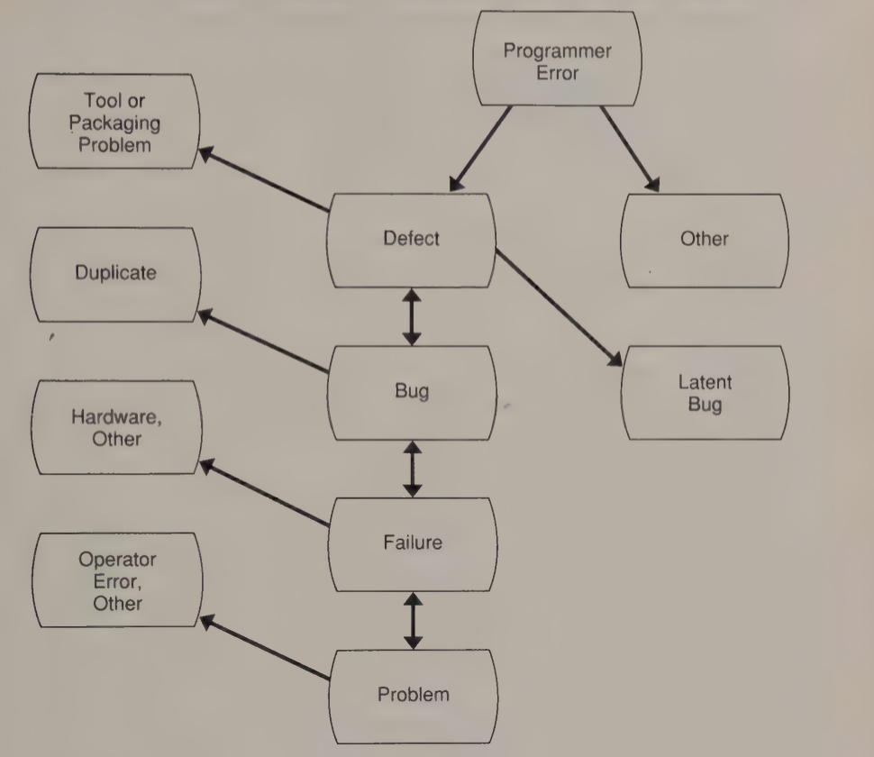
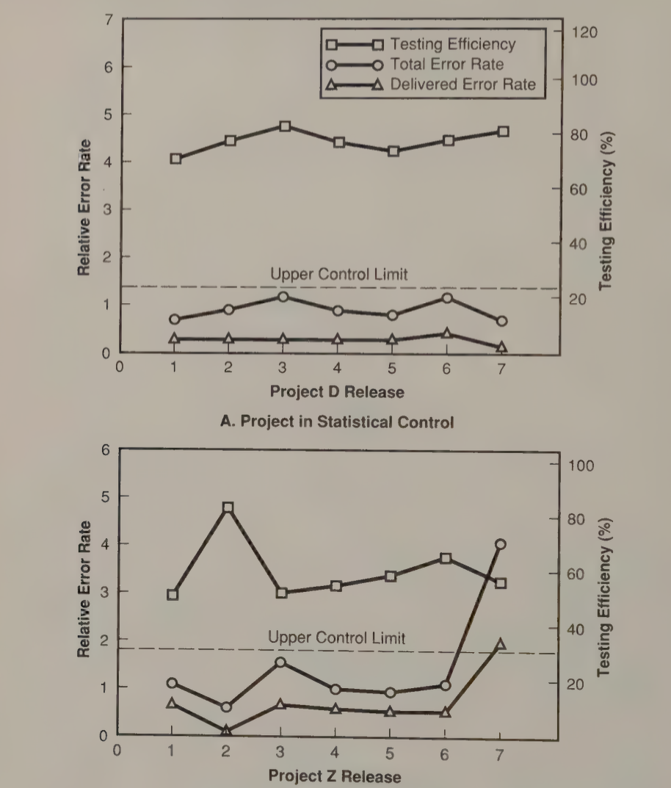

# Lecture 20: data gathering and analysis

- Helps to improve the software engineering process
- Increasingly demanding software projects require us to understand
  - What we are doing
  - How to improve our effectiveness
- Data gathering is expensive and time-consuming
  - Affects the busiest people and can even be seen as threatening
  - There is considerable confusion of what data to gather and how to use it

## The principles of data gathering

- Data is gathered in accordance with specific objectives and a plan
- Choice of data gathered is based on a model or hypothesis about the process being examined
- The data gathering process must consider the impact of gathering data on the entire organization
- The data gathering plan must have management support

### Four basic reasons for collecting software data

1) Understanding: as part of a research of development study, data can be gathered to learn about some item or process
2) Evaluation: the data can be used to study some product (or activity) to see if it meets acceptance criteria
3) Control: the data can be used to control some activity
4) Prediction: the data can be used to develop rate or trend indicators

### Data gathering models

- To measure the software process successfully
  - Start by knowing the expected results
  - Poorly understood processes make it hard to be precise about the data needed
- After study and evaluation
  - Assumptions can be made about key process events and their relationships
  - Data is gathered to verify these assumptions
- Measures are related to the conceptual model
  - Variations are examined
  - Changes are made to the process or model to bring them closer to agreement

### The impact of data gathering on the organization

- The effects of measurement on the people: performance changes when people know they are being observed
- The effects of people on the measurements: need to motivate people to gather the needed data in a timely manner

### Management support

- Date gathering must be viewed as an investment
  - Because it is so expensive
  - Often considerable delay before benefits are apparent
- Requires senior management support to keep the needed resources in place
- Project managers become more willing to support the work once useful results have been produced

## The data gathering process

- Data gathering is often seen as an expensive waste of time
- Project managers do *not* see the direct value and are hesitant to long-term efforts that affect immediate priorities
- Data gathering must start
  - With management support
  - Thoroughly planned and carefully validated

### Managing the data gathering process

| Stage | Associated activities | Relative cost |
| --------------- | --------------- | --------------- |
| Overhead to tasks | Forms, meetings, training, interviews, cost of using tools | 3-7% |
| Data processing | Collecting/validating forms, archiving/entering data, data management and reporting | 10-12% |
| Analysis of information | Designing experiments, evaluating experiments, defingin analysis tools | Up to 25% |

- Reasons it is so expensive to gather and analyze software data
  - This is manual work for the people
  - They are inexperienced at data gathering
- Efforts of data gathering are time-consuming
- Increasing experience and improved tooling can reduce those costs
- The data gathering process needs to be carefully planned and managed
  - Must precisely defined to ensure the right information is obtained
  - Must be validated to ensure that it accurately represents the process
  - Data must be retained by someone who owns and maintains the process database
- Data gathering problems
  - Data is not correct
  - Data is not timely
  - Data not measured or indexed properly
  - Too much data needed
  - Needed data does not exist

### The data gathering plan

- Should be produced by the SEPG with the help of projects and the participation of some professionals who will gather the data
  - What data is needed, by whom, and for what purpose?
  - What are the data specifications?
  - Who will gather the data?
  - Who will support data gathering?
  - How will the data be gathered?
  - How will the data be validated?
  - How will the data be managed?

### Data validation

- Software data is highly error-prone
  - Data must be gather automatically or extensively validated
- People trained on definitions and data gathering methods can get by with periodic spot checks
- People who perform validation must be able to explain
  - The data definitions
  - The data gathering methods
  - The program's objectives

## Software measures

### Data characteristics

**Desired characteristics**

- Measures should be robust
- Measures should suggest a norm
- Measures should relate to specific product or process properties
- Measures should suggest an improvement strategy
- Should be a natural result of the process
- Should be simple
- Should be both predictable and trackable

**Data classifications**

- Objective or subjective
- Absolute or relative
- Explicit or derived
- Dynamic or static
- Predictive or explanatory

> To control and improve the way the work is done, use an increasing number of objective, absolute, explicit, and dynamic measures

### Software size measures

- Size measures are important because the amount of effort to do most tasks is directly related to the size of the program involved
- There is no generally accepted measure of program size
- There is no simple measures of software size because it is not a simple subject

**Lines of code**

- Probably the most practical measurement for program size
  - Risk that unthinking use can motivate maximizing the LOC counts
  - Use size measures as a guide, not for evaluating people of the organization
- Alternative ways to count lines of code
  - Executable lines
  - Executable lines + data definitions
  - Executable lines + data definitions + comments
  - Executable lines + data definitions + comments + JCL
  - Physical lines on an input screen
  - Logical delimiters, such as semicolons

**Normalized LOC measures**

- High level languages do not recognize the increased functional content of the source lines of code
- Can be compensated by using factors to generate equivalent assembly language
- To truly be representative
  - Factors must reflect both source and assembly being used
  - Must represent particular program functions involved

**Error data**

| Category | Item measured | Causes |
| --------------- | --------------- | --------------- |
| Errors | Human actions | Programmer mistakes |
| Defects | Program properties | Errors |
| Bugs | Program malfunctions | Program defects |
| Failures | System malfunctions | Bug and other malfunctions |
| Problems | Human perceptions  | Failure, human errors, human misconceptions |

**The process of problem analysis**

- Software error management is one of distinguishing between causes and effects
- Since the intent is both to correct and prevent errors, we must work up this chain of possible measurable events

**Classes of defect measures**

- Software defects is one key process measurement
- Defects can categorized as follows
  - Severity, symptoms
  - Where found, when found, how found
  - Where causes, when caused, how caused
  - Where fixed, when fixed, how fixed
- Types of design errors
  - Communication error
  - Forgotten cases or steps
  - Timing problems
  - Initialization error
  - Inadequate checking
  - Extreme conditions neglected
  - Sequencing error
  - Misunderstanding of problem specifications
- Types of coding errors
  - Misunderstanding of design
  - Initialization error
  - Inadequate or forgotten checking
  - Case selection error
  - Inconsistent use of variables or data
  - Sequencing error
  - Loop control error
  - Language usage problems
  - Incorrect subroutine usage
  - Other

### Productivity data

- How much effort is spent in each task?
- For each product element, what effort was devoted to each process task?
- What is the relative cost of defect removal (by tests, inspections, and error category)?
- How effective are various methods and technologies in improving the productivity of each tasks?
- What is the resource history by major process taks, and how should the planning factors be adjusted for subsequent projects?

**Organizational productivity**

- Productivity measures are prone to misuse
- Still desirable to have some measure of how the organization is performing over time
- Unfortunately, only simple measures of lines of code and effort expended are available

**Sensitivity of productivity measures**

- Software productivity numbers vary because
  - Organizations have differing definitions of lines of code
  - They specify labor expended differently
- Productivity data can be highly misleading unless all parameters are strictly defined and controlled

## Data analysis

- Data can be used to support software development and maintenance
- As data is gathered and used, organizations find more ways to apply it

### Error data analysis

- About half of the mistakes can be avoided with better programming tools and techniques
- An important benefit of gathering and analyzing data is the focus it provides on the areas with the greatest likelihood of causing problems

### Test data analysis

- Many different analysis can be made of test data
  - Look at defect data rather than examining the error causes for programming defects
  - Explore the relationship between test coverage and number of defects detected and remaining
- Test data is easy to obtained, so it is one of the best places to start gathering and analyzing the software process

### Analysis of inspection rates

- Errors found per thousand LOC decline with increasing inspection rates
- Code with a large number of errors is harder to review, but only slows down to at most 400 LOC/hour
- This rough upper limit applied to `FORTRAN` programs
- Inspection preparation time and review should be roughly equal

### Inspection data analysis

- Data on design and code inspections can be analyzed with statistical techniques
- Requires construction of statistical control charts

### Constructing statistical control charts

- Confidence interval
  - 68% within average plus or minus 1 standard deviations
  - 95% within average plus or minus 2 standard deviations
- Standard deviations
  - $\sqrt{\mu_{v^{2}} - \mu_{v}^{2}}$
- Upper control limit: average + 2 standard deviations
- Lower control limit: average - 2 standard deviations (0 if negative)

### Using control charts

- UCL and LCL help to identify unusual conditions and control them
- Must screen out values that probably due to purely random variation and examine the rest

### Statistical analysis of test data

## Other consideration

- Easy to draw erroneous conclusions from poorly conducted measurements
  - Listen to what the data says rather than using it to reinforce preconceived opinions
  - Provide resources to validate and analyze data
  - Ensure process data is not used to evaluate people
  - Simply gathering data changes the process
- Do not attempt to start too much at one time
- Seek the views of data collectors
- Provide initial results to people that the data concerns
- Start with a comprehensive plan
- Debates on data definitions and formats can be endless
