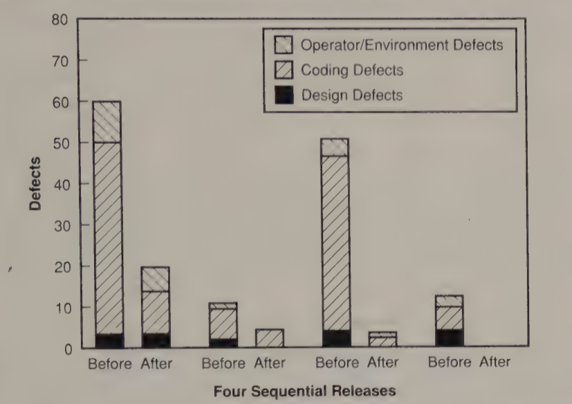
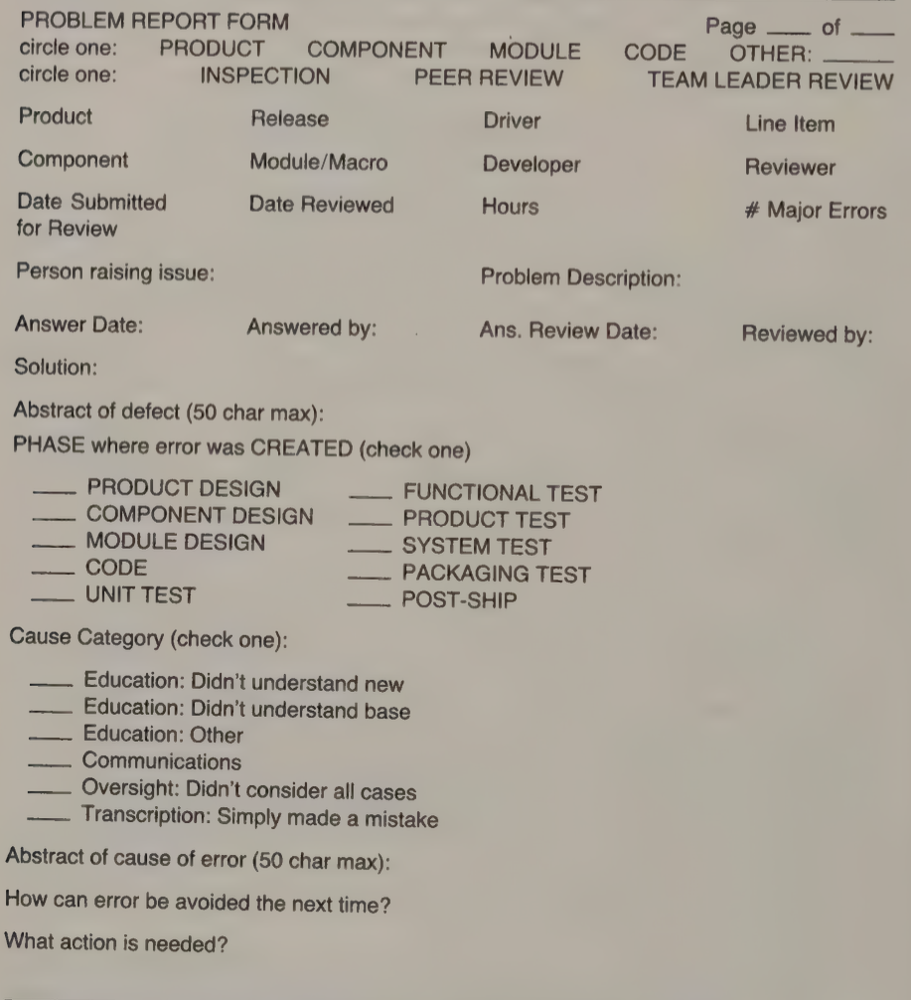
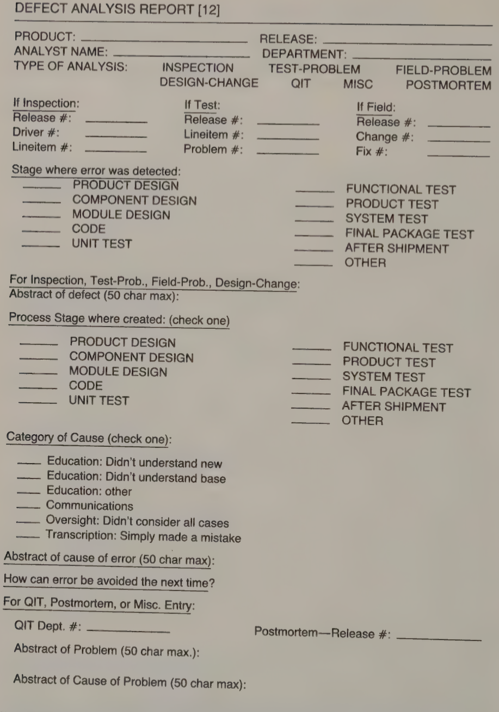
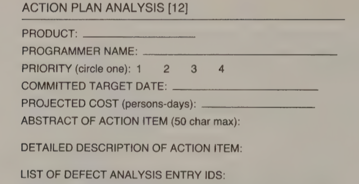
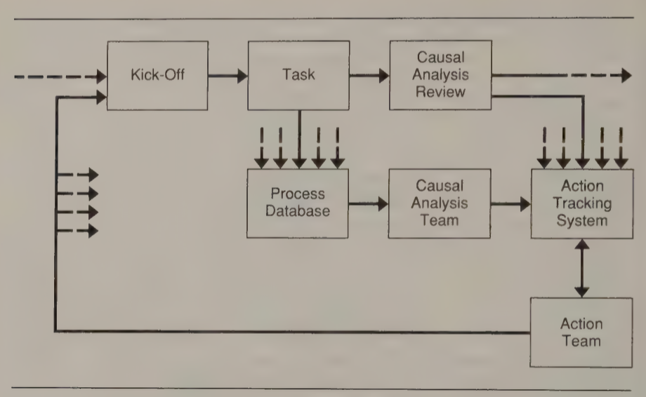
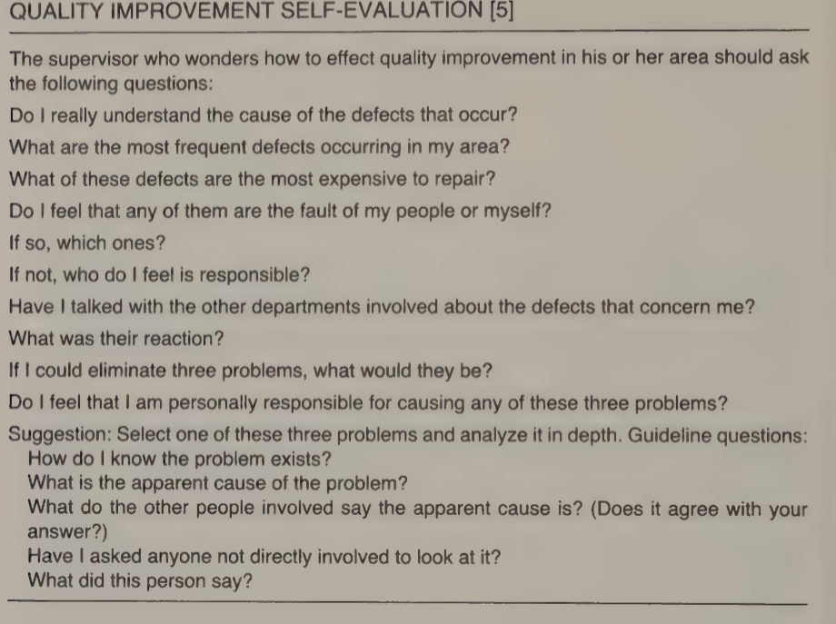

# Lecture 22: defect prevention

## Not a new idea

- Many approaches to defect prevention
  - Formal specification
  - Improved designed techniques
  - Prototyping
- Such innovations will continue to improve our ability to produce quality software
  - Concepts of error cause analysis and defect prevention seem too simple to discuss
  - Not easy to implement because of the precise process discipline required by everyone in the software organization
  - Makes it an essential element of the optimizing process
- Statistical quality control in Japanese industry shortly after WW2
  - With different details, same principles can work for software engineering

### Why defect prevention is crucial to the software process

- Finding and fixing errors accounts for much of the cost of software development and maintenance
- As much as half or more of the typical development bill is spent in detecting and removing errors
  - Worse, fixing defects is more error-prone then original software creation
  - With a low-quality process, errors rates will continue to escalate
- HPs experience with defect prevention
  - More than 1/3 of errors caused by poor understanding of users' interface requirements
  - Extensive prototyping and design review sharply reduces defects found after release

 

### When errors are life-threatening

- Best way to look at defect prevention: consider how you would act if a single error could threaten your life
- Think about software problems as if they were highly critical

## Principles of software defect prevention

- Objective: make sure that errors (once identified and addressed) do not occur again
  - Cannot be done by 1 or 2 people
  - Cannot be done sporadically
  - Everyone must participate by faithfully executing the process (as if their lives depended on it)
- As with any other skill, it takes time to learn, but if everyone participates, it can transform an organization

### Steps

- Must start with a clear management commitment to quality
- Commitment must be explicit and all members of the organization must know that quality comes first
- Until management delays or redirects a project to meet quality goals, people will not really believe it
  - Point must be reemphasized
  - Urge software engineers to propose quality improvement actions (even if schedule is potentially delayed)

### Reporting

**Data gathered at the time a defect is found**

| Piece   | Description    |
|--------------- | --------------- |
| Defect entry number   | A unique entry identification number   |
| Product   | Product name   |
| Release   | Release identifier   |
| Driver   | Driver identifier (a small subset of the release)   |
| Line item | Functional item being developed |
| Stage detected in | Process stage where error was detected |
| Stage created in | Process stage where error was created |
| QIT* department | For QIT suggestions, the QIT department number |
| Problem report number | For miscellaneous problem suggestions, the probelm number |
| Create date | Date the defect was entered into the system |
| Analyst | Programmer who should be contacted for questions |
| Type of analysis | Inspection, test problem, field problem, QIT, miscellaneous |
| Checkpoint data | current entry status (attentioned, screend, being investgated, closed) |

**Data gathered at the time a defect is closed**

| Piece   | Description    |
|--------------- | --------------- |
| Close data   | Close/reason codes, answer text, programmer identification, and data   |
| Category of cause   | Communications breakdown, oversight, or mistake   |
| Defect/problem abstract   | A short description of the defect   |
| Defect cause abstract   | A short description of defect cause   |
| Assigned actions | Action numbers assigned to prevent this defect |
| Problem description | A full description of the problem and actions |
| Log of activities | A track record of all activities checkpointed against this defect |

**Problem report form**

### Error cause categories

- Previously emphasized *how to fix* and *how to find* defects effectively
- Causes one to think about defect categories in terms of *symptoms or repair actions*
- Need to understand what causes the problems
  1) Technological
  2) Organizational
  3) Historical
  4) Group dynamic
  5) Individual
  6) Other causes and inexplicable causes

### Cause analysis

- Should be conducted as early as possible after a defect is found
  - May require delay to assemble the people required to do an effective job
  - A modest backlog is required for each analysis session
- Many software defects generally stem from a relatively few causes
  - Grouping makes cause analysis sessions much more effective

**Cause analysis meeting**

- Similar, in many ways, to inspections
- A leader and recorder include the involve programmers and some of their peers
- Meeting should include 5-8 professionals at most and should *not* include managers
- Result of the meeting
  - A report on each defect
  - A report on the meeting itself
- A summary cross index should be prepared of the defect report numbers with the action recommendation numbers

**Defect analysis report**

**Causal analysis meeting agenda**

1) Compare release goals, team goals, and actual results
2) Causal analysis
  1) Evaluate all errors. That is, read through each error, discussing the defect and the cause. Make sure that all team members understand why the error occurred.
  2) Create an action list after all errors have been discussed by quickly reviewing the errors and placing their preventive actions in a list. Several defects may contribute to the same action, and several actions may be required for a given defect.
3) Process stage evaluation (when all causal analysis complete, do the following)
  1) Ask the following questions
    - What was done by this team that worked well and should be recommended or pointed out to the next team going through this stage?
    - What could be done to improve the process?
    - What tools could help detect the errors while still in this stage?
  2) Create additional action items based on discussions in the process evaluation part of the session.

**Action plan analysis**

### The action team

- With understanding problem causes and how they might be fixed
  - Initiate actual preventative actions
  - Involves managers to assign responsibilities and track implementation progress
- Action team meeting starts with
  - Initial review of the recommendations
  - A decision on the priority of items to be addressed
- Since there many be more items than can be reasonably be handled at one time, most important areas are addressed first
- As success with initial actions is achieved, more items can be handled

### Tracking action progress

- Every action must be logged and tracked and its status periodically reported
  - Follow-up reports
  - Aging statistics
  - Open item lists
  - Priority hot lists
- Every delay in prevention action permits more errors to be made
- Once prevention action is approved, it should be executed with all possible speed

### Prevention feedback

- Most important single action of any defect prevention program is the awareness effort
- Ensures all software professionals are aware of the major error categories and actions they can take to prevent or detect them as early as possible
- Awareness effort should involve
  - Training programs for new tools and methods
  - Special seminars on the most recent prevention experiences and plans

## Process changes for defect prevention

- Process changes required to incorporate defect prevention are shown below

- Process levels to consider
  - Actual work of developing software
  - Process model that provides the framework for project analysis and control
  - To change the software development and maintenance process

## Defect prevention considerations

### Where to start

- No magic answer, but evidence suggests: software modification

### Role of tools and technology

- Causal analysis provides an informed way to select parts of the software process for automation
  - Requires a precise definition of the tasks to be automated
  - When done in the context of a structured and quantified process, resulting tools are more likely to be effective in assisting professionals to do their jobs

### Costs and benefits of defect prevention

- Most organizations do worry
- A reasonable concern, but only makes sense when considering the cost of *not* preventing them

### Management's Role

- Software managers should answer these questions
- Unless satisfied with the result, should proceed to implement the actions discussed in the chapter
