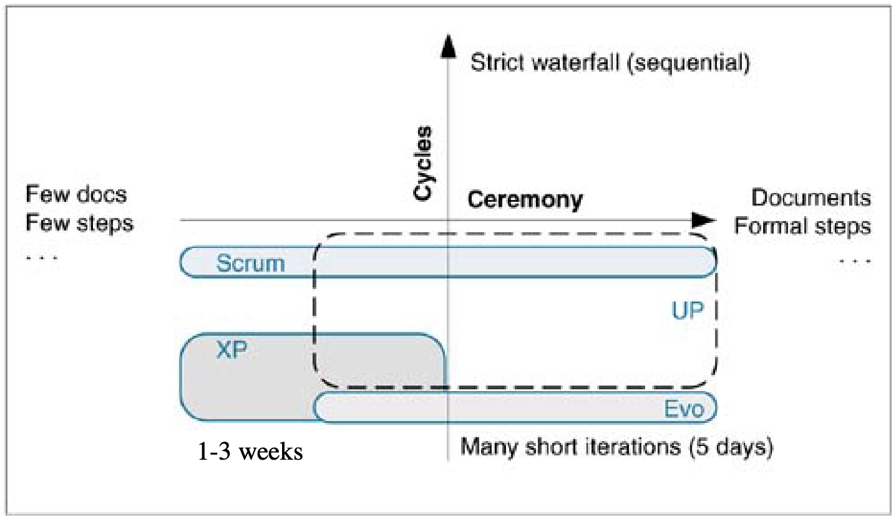
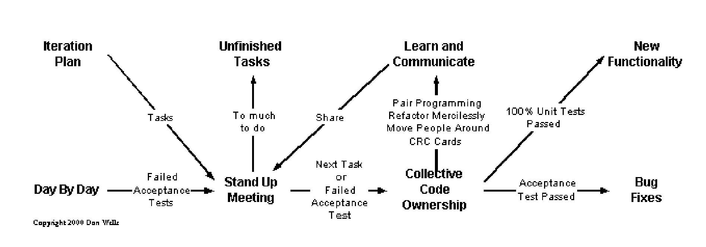

# Lecture 2: Agile Processes and Extreme Programming

## Agile Processes

### Iterative & evolutionary

**Iterative development**

- Approach building software in which the overall lifecycle is composed of several iterations in sequence
- Each iteration is a *self-contained* mini-project
- The goal is an **iteration release**: a stable, integrated, and tested partially completed system

**Risk-driven and client-driven**

- **Risk-driven**: choose the *riskiest, most difficult* elements for early iterations
- **Client-driven**: client chooses the features based on what is most important to them

**Time boxing**

- A fixed time period for each iteration
- Either strongly advised or required in modern iterative development methods

**Evolutionary and adaptive development**

- Requirements, plans, estimates, and solutions evolve over the course of iterations
- Not frozen in a major up-front specification effort before development begins
- Methods follow the pattern of *unpredictable discovery* and *change in new product development*
- Elements **adapt** in response to feedback (prior work, client feedback, tests, etc.)

**Evolutionary and adaptive planning**

- Detailed schedules are **not** created
- Schedules do not extend beyond a relative short time horizon
- Aims to align the level of detail and commitment with quality of information

### Delivery

**Incremental delivery**

- Repeatedly delivering a system into production
- Each delivery expands the capabilities of the system
- Should occur between 3 and 12 months

**Evolutionary delivery**

- Delivers system incrementally, but aims to capture feedback regarding the installed product
- Feedback is used to guide the next iteration

### Agile development

> The application of **timeboxed iterative and evolutionary planning and development** to promote **evolutionary delivery** and encourage a *rapid and flexible* response to change

**Agile manifesto**

- Individuals and interactions > processes and tools
- Working software > comprehensive documentation
- Customer collaboration > contract negotiation
- Responding to change > following a plan

There is value in the items on the right, but we value the items on the left more.

**Agile principles**

1) **Customer satisfaction** by early and continuous delivery of valuable software
2) **Welcome changing requirements**
3) **Deliver working software** frequently (from a couple weeks to a couple months)
4) Business people and developers **work together daily**
5) Build projects around **motivated individuals**; support them and trust them to get the job done
6) Convey information with **face-to-face** conversations
7) **Working software** is the primary measure of progress
8) Promote **sustainable development** that can be maintained indefinitely
9) Continuous attention to **technical excellence and good design**
10) **Simplicity** is essential
11) **Self organizing** teams reveal the best architectures, requirements and designs
12) Regularly **reflect** on how to become more effective and adjust behavior accordingly

**Development methods**

- Scrum
- XP
- Evo
- Crystal
- Agile Modeling
- (Agile) Unified Process (Agile UP)
- Dynamic Solutions Delivery Model (DSDM)
- Feature-Driven Development (FDD)
- Lean Development
- ...

## Extreme Programming

### Values

- Emphasizes collaboration, quick & early software creation, and skillful development practices
- Founded on communication, simplicity, feedback, and courage

### Core practices

1) Planning game
2) Small, frequent releases
3) System metaphors
4) Simple design
5) Testing
6) Frequent refactoring
7) Pair Programming
8) Team code ownership
9) Continuous integration
10) Sustainable pace
11) Whole team together
12) Coding standards

### Classification

- On the cycle and ceremony scale, XP is low ceremony and short cycle

- XP has a known applicability
  - Works best on small teams (10 developers or less)
  - Does **not** work for safety-critical systems
- More recently applied to larger teams and projects
- Achieves customer satisfaction with
  - Rapid creation of valuable software
  - Skillful and sustainable development practices
  - Flexible response to change
- Iterations are typically 1-3 weeks long
- XP provides explicit methods for programmers to confidently respond to change
  - Practices like test-driven development, refactoring, pair programming, and continuous integration
  - Some of these are truly adopted by developers and are staples of good programming techniques

### Lifecycle

**1) Exploration**

- Some story cards (features) are written down
- Rough estimates are made

**2) Planning**

- Customer and developers complete story cards and rough estimates
- Customer chooses what to do for the next release

**3) Iterations to release**

- Customer pick the stories to be implemented
- Developers break down stories into tasks
- Review of total required task effort and adjustments are made
- XP discourages overtime and overwork
  - Sign of dysfunctional project, increasingly unhappy people, and dropping productivity and quality

**4) Productionizing**

- Developers implement stories
  - Within agreed upon timeboxed period
  - Collaboration with customers on tests and details are continuous

**5) Maintenance**

- If not finished, return to step 3 for the next iteration

### Methods

**Work products**

- **Story cards**: brief feature requests (not use cases) with the intent of getting details from the customer (2-10 days)
- **CRC cards**: brief descriptions of class responsibilities and collaborations
- **Task lists**: list of tasks for each story card within this iteration
- **Visible graph**: content to communicate progress (e.g. tests defined vs. tests passing)

**Roles**

- **Customer**: writes stories and acceptance tests; picks stories for next iteration
- **Programmer**: writes, tests, designs, and refactors code; identifies tasks and estimates effort
- **Tester**: helps customer write and develop tests
- **Coach**: process oriented, intervenes and teaches when necessary
- **Tracker**: collects metrics and communicates progress; gives feedback on poor estimates
- **Consultant**: technical consulting and coaching

**Stories and story cards**

- A handwritten note on an index card
  - Many written during the planning game
  - Few selected for the next iteration
- Story cards record user stories
  - A desired feature
  - A needed fix
  - A nonfunctional requirement
- Stories are usually 1-21 days of work
- Stories are **not** use cases; they represent a feature
- XP prefers a *feature-driven* approach to describing requirements
- Stories do not detail a user story, but jot a summary something to discuss with the customer
  - Customer should be readily available to discuss the story
- Granularity for estimation varies
  - Some stories are within day units
  - Some stories are within week units

**Embrace change**

- Access to onsite customer or proxy is essential
- Customer on call for questions
- Overarching attitude is to embrace, rather than fight, change and to be able to move quickly in response to change

**Task list**

- Convene around a whiteboard to break down stories into tasks
- Alternatively, generate tasks individually and then compare

**Volunteering**

- Tasks are not assigned, but people choose tasks
- Once chosen, the task is assigned an effort estimate (should be 1-2 days)
- Leads to a higher degree of commitment and satisfaction in self accepted responsibilities

**Light modeling**

- Programming early is encouraged and up-front design work is avoided
- More than 20 minutes of design work before programming is considered **excessive**

**Minimal documentation**

- Writing down requirements, design, or management documents is discouraged to getting to code quickly
- Small paper index cards and verbal communication are preferred
- An *onsite customer* compensates for the lack of documentation
- XP is not against documentation, but believes the time spent documenting is better spent coding

**Measurement & tracking**

- Metrics 
  - Daily measurement of progress and quality (measure at least one thing)
  - Exact metrics not mandated, but can be something like tasks completed or success rate of tests
- Visible graphs
  - Collected metrics are posted on a wall for all to see
  - Easily seen, easily communicated
- Tracking
  - Regular metrics are collected by the tracker
  - Done with a walk-about to all the programmers
  - Something like test metrics can be collected automatically

**Common project room**

- XP projects are run from a project common room
- Pair programming tables are available and walls are cleared for whiteboarding room
- People may have private offices, but production software development is a **team sport**
- As in scrum, a daily stand-up meeting is held

### Adoption strategies

**Recommended**

1) Pick **the worst** project or problem
2) Apply XP until solved
3) Repeat

**Casual adoption**

- Start with the whole team working in a common room
- Test first development
- Acceptance tests written/owned by customers
- Planning game
- Pair programming
