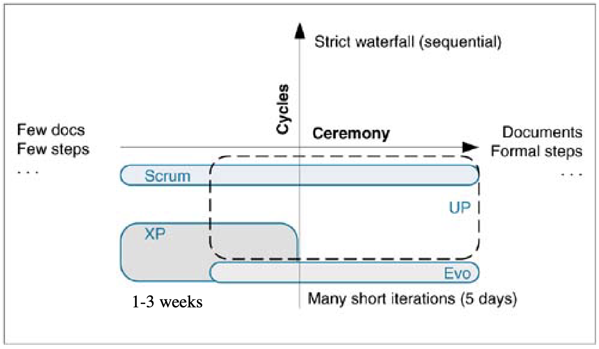

# Lecture 3: Scrum Processes

## Scrum overview

- Scrum captures key adaptive and agile qualities
- Scrum strongly promotes
  - Self-directed teams
  - Daily team measurement
  - Avoidance of prescriptive processes
- Scrum iterations are
  - client-driven and planned adaptively
  - Frozen once started
  - Usually 30 days long
  - End with a demo to external stakeholders

### Classification

- Scrum is flexible on the ceremony scale
- Founders would say "as little ceremony as possible"
- Whole team (not just managers) decide how much ceremony is needed
- Scrums applicability is quite broad
  - Applied across all domains of software applications
  - Used in life-critical systems and more casual systems
- Scrum teams should be 7 or less people
  - Multiple teams can work on a single project
  - Scales via the "scrum of scrums"
  - Teams hold a daily stand-up and team representatives also meet daily

## Scrum life cycle

**Methodology**

- Emphasizes project management values and practices
- Can be easily combined with other methods
- Focuses on the empirical rather than a defined process

**Stages**

1) Planning: establish project vision and secure funding
2) Staging: identify more requirements and prioritize enough to start
3) Development: implement system that is ready for release at the end of the 30 day sprint
4) Release: operational deployment

## Word products

**Requirements**

- Product backlog: all items that need to be done for the product (features, enhancements, defects, etc.)
- Release backlog: subset of the product backlog that will be done in the next release

**Project management**

- Backlog graph: an estimate of work remaining vs. days
- Sprint backlog: tasks for the iteration (granularity of 4-16 hours)

## Roles

**Customer/Product owner**

- Responsible for creating and prioritizing the product backlog
- Chooses the goals of the next sprint
- Reviews system at end of sprint with external stakeholders

**Development team**

- Work on the sprint backlog
- No explicit title other than "team member"

**Scrum master**

- Part manager; part developer
- Knows and reinforces project vision and iteration goals
- Ensures scrum is being followed
- Mediates between management and scrum team
- Listens to progress and removes impediments
- Conducts daily scrum meetings
- Conducts the sprint review (demo)

**Others**

- Everyone else can observe
- May not speak during an iteration

## Practices

**Pre-game planning and staging**

- Create initial list of features and recorded in the product backlog
- Designate a product owner to mediate requests
- Identify an inaugural release backlog

**Sprint planning**

- One meeting with external stakeholders to *refine and re-prioritize* product backlog and *choose goals* for next sprint
- One internal meeting to *break down* goals into tasks (4-16 hours)
- Meetings must be repeated if estimation efforts exceeds resources

**Sprint**

- Work organized into 30 calendar day iterations
- Each iteration is called a **sprint**

**Self-directed teams**

- Iteration is **not guided** by management or the scrum master
- Team is responsible to find their own way and solver their problems
- Management exclusively provides required resources and removes blocks

**Scrum meeting**

- Daily stand-up meeting at the same time and same place
- Discussion limited to the following
  1) What did you do since last meeting?
  2) What will you do between now and next meeting?
  3) What blocks are in your way?
  4) Any tasks to add to the sprint backlog (missed tasks, not requirements)?
  5) Have you learned or decided anything new that affects the team?
- If other discussions are needed, secondary meetings (immediately after) are scheduled
- Meeting should be 15-20 minutes long and include 7-10 people

**Don't add to iteration**

- Work is not added to an iteration that has started
- Uninterrupted focus should be maintained
- If work is added, something should be removed
- Management and product owner can re-prioritize the *product backlog*

**Scrum master firewall**

- Scrum master ensures work is not interrupted by external parties
- Deals with political and external management issues
- Ensures scrum is followed
  - Remove reported blocks
  - Provide resources
  - Make decisions when requested
- Take initiative to address incomplete work

**Decisions in 1 hour**

- Reported (to scrum master) blocks are ideally resolved immediately, or within 1 hour
- Bad decisions are better than no decisions (they can always be reversed)

**Blocks gone in 1 day**

- Blocks reported during scrum meeting should be resolved before the next meeting

**Chickens and pigs**

- Chickens are observers in the scrum meetings
- Pigs are the scrum team members
- Chickens may speak on survival points or business relevance of team's work

**Teams of seven**

- One team should have a max of 7 members
- Large projects should have multiple teams

**Common room**

- Team should (ideally) work in a common room
- Private space is available for other activities

**Daily build**

- At least 1 daily integration and regression test across all checked-in code 
- XP practice of continuous integration is better

**Sprint review**

- Review meeting to demo the product
- Stakeholders are informed of system functions, designs, strengths, efforts, and potential problems
- Feedback and brainstorming on future direction is encouraged, but **no commitments** are made
- Power point presentation are *forbidden*

## Values

**Scrum master**

- Scrum master reinforces the project vision
- Scrum master is the servant of the developers
- Ineffective scrum masters should be replaced
  - Not removing blocks promptly
  - Not acting as a firewall
  - Not providing resources

**Openness**

- Product backlog is accessible
- Scrum meetings make overall and individual status and commitments visible
- Work trends and velocity are visible through the backlog graph

**Respect**

- Team responsibility over scapegoating
- Team members are respected for different strengths and weaknesses, not iteration failures
- Attitude of solving individual problems through group exploration of solutions

**Courage**

- Management plans and guides adaptively
- Management trusts individuals and the team to get the job done
- Team takes responsibility for self-direction and self-management

