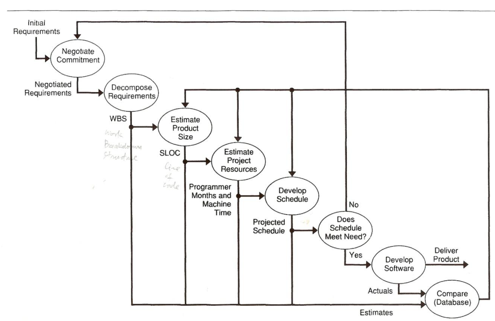

# Lecture 8: the project plan

- A project plans defines *the work* and *how* to do it
  - Defines each major task
  - Estimates time and resources required
  - Provides a framework for management review and control
- Properly documented project plans become a benchmark to compare with actual performance

## project planning principles

**1) Requirements are initially vague and incomplete**

- Quality program can only be built from accurate and precise understanding of user's needs
- Must map the route from vague and incorrect requirements to accurate and precise ones

**2) Conceptual design is used as a basis for planning**

- Must be produced with care because it
  - Defines a breakdown of the product into units
  - Specifies the allocation of functions to these units
  - Describes the relationship between these units
- Poor conceptual planning
  - Fails to provide a framework for planning and implementing work
  - Is almost impossible to recover from

**3) Subsequent requirements refinement**

- Refine schedules
- Refine resource projections
- Refine size estimates

**4) Sufficiently clear requirements**

- Develop a detailed design an implementation strategy
- Incorporate this into the plan

**5) Project becomes sufficiently well understood**

- Implementation details are established
- Plan refinements document theses details

**6) Plan as an asset**

- Provides a framework for negotiating time and resources to do a job

**Planning considerations**

- Rarely are initial resource estimates and schedules acceptable
- Best to reach early agreement on essential functions and defer the rest for later
- Quality products are the result of harmonious teamwork between users and software engineers

**The planning cycle**

1) Cycle starts with initial requirements
2) Respond to *every* demand for a commitment by
  - Assure the requirement is understood
  - Explain a plan to meet that requirement must be created
  - Assert that no commitment can be made without said plan
3) Break down work into key elements called a work breakdown structure (WBS)
  - Implies the conceptual design has been developed
4) Estimate the size of each product element
5) Project the required resources
6) Schedule is produced

## Project plan contents

**Goals and objectives**

- Established during the requirements phase
- Offers a negotiating period between software engineers and users
  - Agree on what is to be done
  - Establish on how success is measured
  - How much time and resources are needed

**Work breakdown structure**

- Starts with an estimate on the size of the product to be produced
- Estimation begins with a detailed breakdown of the product into work elements
- Breakdown generally consists of 2 parts
  1) The product structure
  2) The software process
- Work breakdown structure provides the framework for relating them

## Size measures

- Should be easy to use early in the project and readily available once work is completed
- Early estimates can be compared with actual measures to provide more accurate estimates

**Line-of-code estimates**

- Typically count all source instructions and exclude comments
- Often done by automated tools
- Although difficult to estimate lines of code from high level requirements, this does facilitate a learning process to improve estimating
- Finer product structural detail can provide more accurate subsequent estimates
- Most important advantage is that lines of code directly relates to the product being built

**Function points**

- Initial application requirements are examined
- Can determine the number and complexity of
  - Various inputs and outputs
  - Calculations made
  - Databases required
- Can assign a point value to each of these counts
- Points are summed up to provide an overall function point rating for the product
- Prior experiences can help convert the point value into an reasonably good estimate on development resources required

## Estimating

- With a size measure acquired, an estimating procedure should be followed
- An accurate one is the Wideband Delphi Technique from the Rand corporation
  1) Group of experts is given the program specification and an estimation form
  2) Meet to discuss the product and any estimation issues
  3) Estimation form is completed anonymously
  4) Estimates are given to a coordinator to tabulate and redistribute results
  5) Only the expert's estimate is identifiable while the rest are anonymous
  6) Meet to discuss results and revise estimates as they feel appropriate
  7) Cycle continues until the estimates converge to an acceptable range

**Estimating inaccuracies**

- All software estimates are *inaccurate*
- Inaccuracies must be compensated for since: poor estimate -> inappropriate resource plan -> understaffed project
- Software size estimates almost invariably erred in being too low
- Low estimates are the result of
  - Last-minute crisis
  - Late delivery
  - Poor quality
- Two main types of inaccuracies
  1) Normal statistical variations
  2) Estimating bias caused by the project stage
- Both types can be compensated for, at least to some degree
  1) Normal variations are addressed by using multiple estimators
  2) Estimation bias is addressed by filling in knowledge gaps in requirements

**Estimating contingencies**

- Programmers estimate code required for a function invariably too low
- Tends to be the result of their optimism being a relatively predictable function of project status
  - Code may grow at the end of each project phase
  - Amount should be added as an estimating contingency at the end of the indicated phase
- Software size estimates should include a contingency, but the amount to use is debatable
- Contingencies inflate resource estimates, add to schedules, and increase costs
- Resistance to contingency usage is very high by everyone
- Until product can be partitioned into modules of a few hundred line-of-codes, substantial contingencies are required

## Productivity factors

- Once estimate of code to be implemented is obtained, it can be converted to the number of programming months required
- Some programmers can estimate their work on their own, but most require an orderly procedure
- This involves productivity factors for the number of lines, on average, a programmer can write per month
- Organizations can gather their own data and compare it to some of these factors

**Organization productivity data**

- Use factors that relate to the specific organization
- Do not use more than the available data warrants
- Productivity factors are averaged data from several past projects done by people with differing ability
- Wise to account for more than a few significant variables
- Each organization must gather its own data to use as a *baseline* for productivity calculations
- Adjustments can be made to account for significant variations
- Organizations can developer the own productivity factors by
  1) Examining a number of recently produced programs
  2) Count their lines of code is an consistent and defined manner
  3) Calculate the programmer months required to do the job

**Developing productivity data**

- Software organization have some records of work completed
- Developing productivity data requires knowing what is available
- The following approach should produce the needed data
  1) Identify a number of similar-sized recently completed programs
  2) Get data on the size, in lines of code, of each project
  3) For modified program, note the percent of code modified and only count new or changed lines of code
  4) Obtain a count of programmer months expended for each project

**Using productivity data**

- With basic data in hand, base productivity numbers can be derived
- Data can be adjusted to account for various sizes and classes of programs
- Examining published productivity figures can help identify which ones apply to your organization
- Making a resource estimate becomes simple once size estimate and productivity factors are available

## Scheduling

- Once total resource needs are calculated, project schedule can be developed
  - Spread resources over planned product development phases
- Best done with comparing organization's historical experience with similar projects
- With no experience, publicly available factors should be used for guidance
- With a project resource distribution
  - A staffing plan is based on overall project schedule objectives
  - A preliminary schedule for each phase is established
  - A preliminary plan is reviewed to ensure reasonableness

## Project tracking

- Requires the ability to determine project status
- Schedule should include check points to permit periodic tracking

## The development plan

- Full development plan sent to management for review
- Plans include
  - Project purpose and scope
  - Project goals and activities
  - Organization and responsibilities
  - Management and technical records
  - Work definition and flow
  - Development environment
  - Software development methodology
  - Configuration management
  - Verification and validation
  - Quality assurance provisions

## Planning models

- Software cost models can help make product plans, but should be used with care
- Models not calibrated to organizational experience can be off by 500% or more
- Models should *augment* the estimation process, not replace it
- No model can fully reflect
  - Product characteristics
  - Development environment
  - Personnel considerations
- Size and resource estimates should be spread over the planned schedule
- Organizations without prior experience can benefit from modeling techniques
  - Can be used to check estimates for errors
  - Help assess risks
- Under **no circumstances** should a model be used to produce final estimates

## Final considerations

- Good software cost estimating requires the establishment of an estimating group
- Group ensures cost estimates and actual performance data is retained in a database
  - Available data is analyzed to establish productivity factors and contingency
  - Development groups are competently assisting in preparing and documenting their plans
- Supported development teams can
  - Capitalize on their planning experience
  - Progressively improve estimating accuracy
- Estimation accuracy is rarely improved without the support of an orderly planning process
