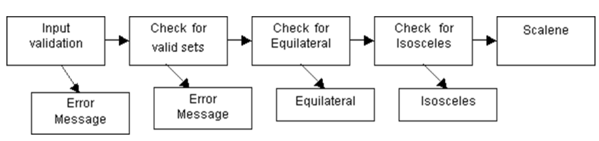

# Lecture 3: testing activities

## A well-known testing example (Weinberg-Myers Triangle Problem)

- Given 3 inputs for the sides of a triangle, computer tells if the values entered are
  - Scalene
  - Isosceles
  - Equilateral
  - Not a triangle

### Flowchart approach



### Heuristic approach

| Tests | Inputs | Expected results |
| ----- | ------ | ---------------- |
| Any element of the input is negative | (-1, 1, 1), (1, -1, 1), (1, 1, -1) | Error message |
| Any element of the input is zero | (0, 1, 1), (1, 0, 1), (1, 1, 0), (1, 0, 0), (0, 1, 0), (0, 0, 1), (0, 0, 0) | Error message |
| Any element of the input is greater than 9 | (10, 1, 1), (1, 11, 1), (1, 1, 12), (15, 15, 15) | Error message |
| Any element of the input is an alphabetic letter | (T, 1, 1), (1, T, 1), (1, 5, T) | Error message |
| Any eleemnt of the input is a character symbol | (:, 1, 3), (5, ., 8), (2, 4, /) | Error message |
| There are less then 3 elements in the input set | (1, 2) | Error message |
| There are more then 3 elements in the input set | (2, 4, 5, 8) | Error message |
| Any element of the input set is a combination of any of the invalid inputs | (1A, 3, 4), (4, \W", 8), (2, 4, :) | Error message |
| The sum of two numbers equals the third in any of three permutations (a+b=c, a+c=b, b+c=a) | (2, 4, 6), (4, 9, 5), (8, 4, 4) | Error message |
| The sum of two numbers is less than the third in any  of three permutations (a+b<c, a+c<b, b+c<a) | (3, 3, 8), (2, 5, 1), (7, 3, 3) | Error message |
| If all three digits of a valid input are the same | (5, 5, 5) | Equilateral |
| If any two digits of a valid input are the same | (3, 3, 4), (7, 8, 7), (5, 6, 6) | Isosceles |
| If each of the digits of a valid input are different | (3, 4, 5), (3, 5, 4), (5, 4, 3) | Scalene |

## Test framework approach

### Python example

```
```python
import unittest


class TestStringMethods(unittest.TestCase):

  def test_upper(self):
    self.assertEqual('foo'.upper(), 'FOO')

  def test_isupper(self):
    self.assertTrue('FOO'.isupper())
    self.assertFalse('Foo'.isupper())

  def test_split(self):
    s = 'hello world'
    self.assertEqual(s.split(), ['hello', 'world'])
    # check that s.split fails when the separator is not a string
    with self.assertRaises(TypeError):
      s.split(2)


if __name__ = "__main__":
  unittest.main()
```


```bash
$ python mytestcases.py

...
Ran 3 tests in 0.000s

OK
```

### PyUnit

- The python unit testing framework
  - Sometimes referred to as "PyUnit"
  - A python language version of JUnit by Kent Beck and Erich Gama
  - JUnit is, in turn, a Java version of Kent's Smalltalk testing framework
  - Each is the de facto unit testing framework for its respective language
- The `unittest` module supports
  - Test automation
  - Sharing of setup and shutdown code for tests
  - Aggregation of tests into collections
  - Independence of the tests from the reporting framework
- The `unittest` module supports important concepts
  - Test fixtures: represents the preparation needed to perform one or more tests and any associated cleanup actions such as
    - Creating a temporary or proxy database
    - Directories
    - Starting a server process
  - Test case: the smallest unit of testing that checks for a specific response to a particular set of inputs
  - Test suite: a collection of test cases, test suites, or both used to aggregate tests that should be executed together
  - Test runner: a component that orchestrates execution of tests and provides the outcome to the user
    - Can be graphical
    - Can be textual
    - Can return a special value to indicate the results of executing the tests
