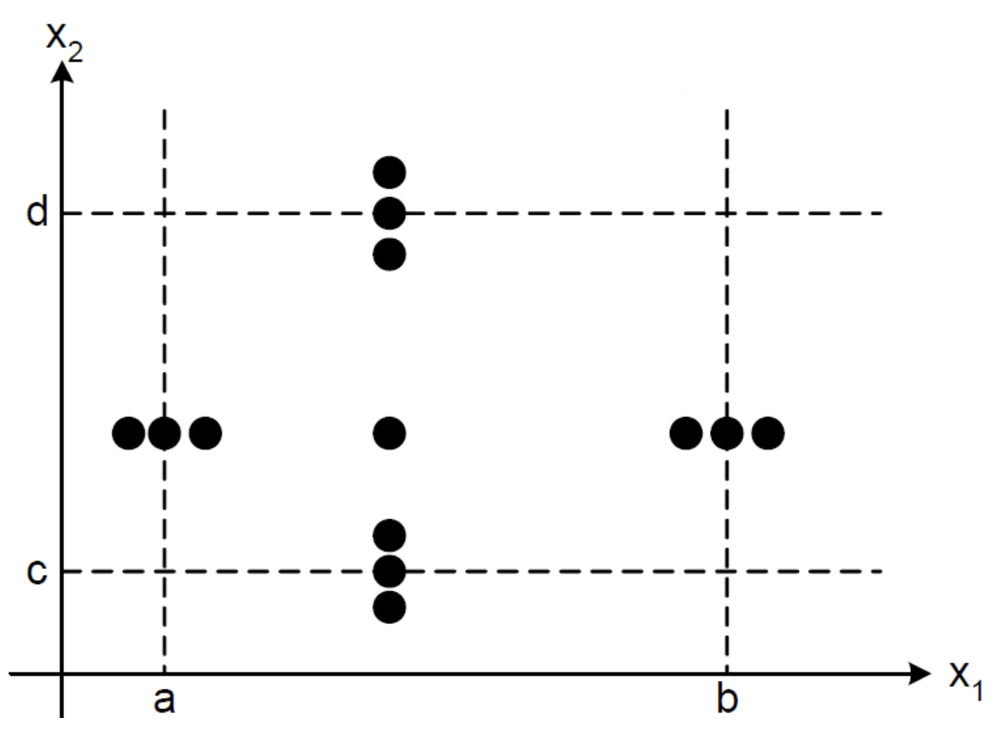

# Lecture 4: boundary value testing

## Coming up with "enough" test cases

- Is there a way to come up with enough test cases?
  - Should be generalized, systematic, or holistic
  - Would be nice if it offered some sense of confidence
- Research claims yes

### Boundary value testing

- Full name: specification-based, unit, boundary value testing
- In terms of source code, it is specification-based instead of code-based
- In terms of levels, it is a unit testing for the given problem

**What is it?**

- Test cases of generated using the extremes of the input domain

**Case study**

> Suppose you have two variables as the input domain of a Function $F(x_{1}, x_{2})$. We are also given that $a \le x_{1} \le b$ and $c \le x_{2} \le d$

## Forms of boundary value testing

### Normal boundary value test cases

**Selection mechanism**

- Do *not* include the outside boundaries
  - All test cases fall inside the boundaries
  - Selected dots in the graph above reflect this
- Selection of a typical value is easy
  - Value of $x_{1}$ is between `a` and `b`
  - Value of $x_{2}$ is between `c` and `d`
- Selection of other dots on the graph above require careful observation
  - Hold $x_{1}$ as normal and vary $x_{2}$ at the boundary and just inside the boundary yield 4 additional dots
  - Hold $x_{2}$ as normal and vary $x_{1}$ at the boundary and just inside the boundary gives 4 more tests
  - This test case selection is known as normal boundary value testing

**Single fault reliability theory**

- Justifies holding 1 variable at its normal value and varying the other
- Claims that failures are rarely the result of the simultaneous occurrence of 2 or more faults

### Robust normal boundary value test cases

**Outside the boundaries**

- Adds more tests and deserves a new name
  - Some literature omits "normal" from the name
  - Shortening the name may mistakenly represent it as a new approach
  - Should be though of as an extension to normal boundary value testing
- Wait a minute
  - Single fault reliability theory is hard to believe in
  - What about a fault triggered by some specific $\left(x_{1}, x_{2}\right)$ combination
  - Robust normal boundary testing is insufficient to address this scenario

### Worst-case boundary value test cases

### Robust worst-case boundary test cases

