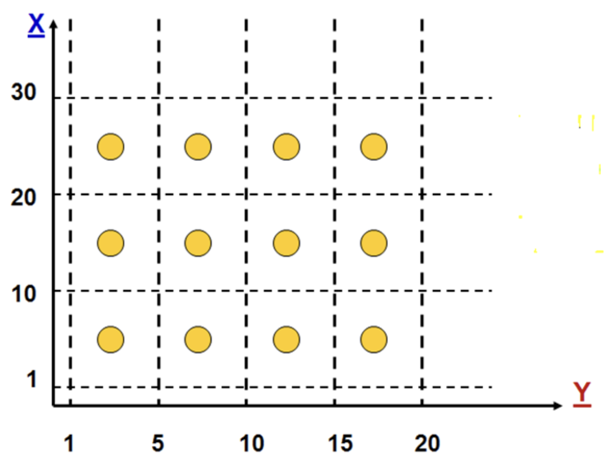

# Lecture 5: equivalence class testing

## Another form of testing?

- Where boundary value testing falls short
  - Offers a systematic way to come up with test cases
  - Only one of the test case is a "normal value"
  - Rest are around the boundaries of the input domain
- Failures not around the boundaries
  - Hard to say if they will occur
  - Boundary value has given one normal value to test
  - Is there a need to cover other normal value areas

### Idea

- Divide the input domain into several areas
- Some problems have input areas consisting of several natural areas
- Place 1 (or more) test case(s) in each area

### Example

- Suppose an input domain has two variable: x and y
  - x can be separated into `[1-10]`, `[10-20]`, and `[20-30]` (3 separations)
  - y can be separated into `[1-5]`, `[5-10]`, `[10-15]`, `[15-20]` (4 separations)
- Plotting the input domain with the specified separations yields 12 partitions

## Conflicting goals

### Weak normal equivalence class testing

> Based on the input representation above

- Should place 1 test case in each partition and have 12 test cases 
  - Graph only contains 4 dots (4 test cases selected)
  - Instead of test completeness, use as few test cases as possible to reduce cost of testing
- Single fault assumption asserts that 4 cases are sufficient
  - Fault can be traced back to a single thing (in this case value for `y`)
  - 4 selected tests target each of the partitions along the `y` axis
  - The `x` variable is also covered since at least 1 test lands in each of the partitions along the `x` axis

### Strong normal equivalence class testing

- Rejecting the single fault assumption
- Place at least 1 test case in each possible partition combination
- Addresses multiple fault concerns

### Weak robust equivalence class testing

- Worried about areas outside the boundary of the partitions?

### Strong robust equivalence class testing

- Accepting the multiple fault assumption means

