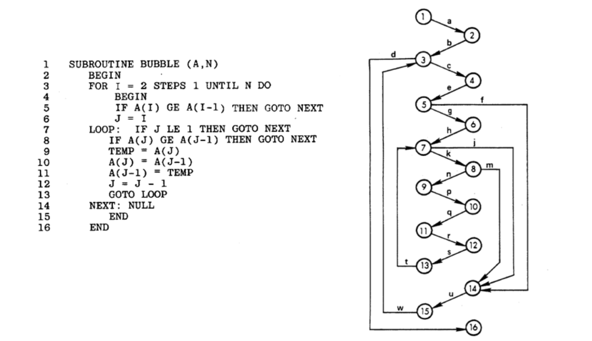
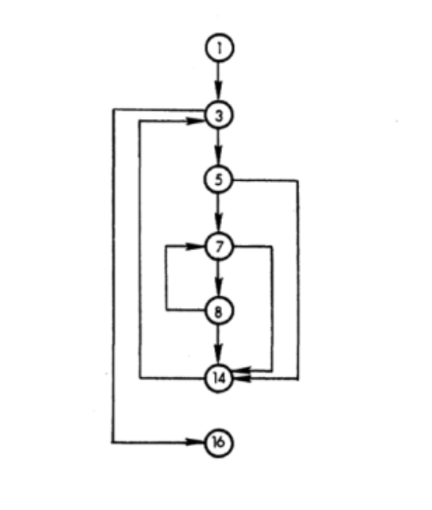

# Lecture 7: path testing (part 1)

## Bottom-up vs. Top-down

> These are the two main ways to "regurgitate" knowledge

### Bottom-up

- Give the reader the parts (definitions, theories, proofs)
- Come to conclusions/results later
- May lose interest before finishing parts and seeing a big picture

### Top-down

- Start with a motivation
- Follow up with an observation
- Reveal a common-sense solution
- While not rigorous, offers an intuitive, intimate, and holistic understanding of the issue

### Original research

- To ensure common-sense solutions stands in all situations
- Dig for first-hand research, not just second hand information from a textbook

### Abstraction

- Starting point of the top-down approach
- Imagine that you are...
- You want...
- This way is good... but sometime you really want it that way

## Example with code

### Abstraction (source code)

- Source code has a zoom in-and-out capability
- We call it an Abstraction

```
SUBROUTINE BUBBLE (A, N)
  BEGIN
  FOR I = 2 STEPS 1 UNTIL N DO
    BEGIN
    IF A(I) GE A(I-1) THEN GOTO NEXT
    J = I
  LOOP: IF J LE 1 THEN GOTO NEXT
    IF A(J) GE A(J-1) THEN GOTO NEXT
    TEMP = A(J)
    A(J) = A(J-1)
    A(J-1) = TEMP
    J = J - 1
    GOTO LOOP
  NEXT: NULL
    END
  END
```

### Observation

- Start with an example from an old research paper
- Can tell it is old because of the `GOTO` statement all over the place
- Consider each statement as a node

### Program graph

- If we consider each statement a node, we end up with the following program graph



| Label | Edge |
| ----- | ---- |
| a | (1, 2) |
| b | (2, 3) |
| c | (3, 4) |
| d | (3, 16) |
| e | (4, 5) |
| f | (5, 14) |
| g | (5, 6) |
| h | (6, 7) |
| j | (7, 14) |
| k | (7, 8) |
| m | (8, 14) |
| n | (8, 9) |
| p | (9, 10) |
| q | (10, 11) |
| r | (11, 12) |
| s | (12, 13) |
| t | (13, 7) |
| u | (14, 15) |
| w | (15, 3) |

### Idea

- How to reduce complexity of program graph?
- Identify segments of consecutively executed statements with 1 entry node and 1 exit node
- Any statement within a particulate segment is executed if and only if all statements within that segment are executed
- Each statement is found in one and only one segment

### Segment graph

- Applying the idea to the program graph above yields this segment graph


