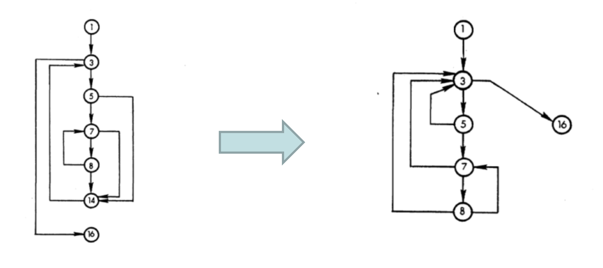

# Lecture 8: path testing (part 2)

## Decision graphs



### From the segment graph

- Some nodes are decision nodes that relate to decision making
  - Node 3 offers 2 outward edges
  - One going to node 5
  - Another going to node 16
- Inspecting the segment graph reveals nodes 3, 5, 7, 8 as decision nodes
- Entry and exit nodes can also be considered decision nodes
  - May not have multiple outward edges
  - Represent and entry or exit decision
- Decision nodes are now 1, 3, 5, 7, 8, 16
- Node 14 is the only non-decision node
- Hiding the non-decision nodes in the segment graph reveals the decision graph

### Search algorithm example

```C
void Search(int arr[], int key, int *found, int *index) {
  int i = 0;
  int b;

  *found = 0;

  while (i < N) {
    if (b = isabsequal(arr[i], key)) {
      *found = b;
      *index = i;
      return;
    }

    i++;
  }
}
```

- The segment graph for this function looks like


- Abstract further and obtain the decision graph by
  - 1) Identifying decision nodes
  - 2) Hiding non-decision nodes


- The search function contains a subroutine
- We can analyze it as follows

```C
int isabsequal(int x, int y) {
  if (x == y) {
    return 1;
  }
  else if (x == -y) {
    return -1;
  }
  else {
    return 0;
  }
}
```


- Simple cases help us understand how to reduce a program to a segment graph and then a decision graph
- Not sure if the simple common case applies to all possible cases
- Task at hand is to understand the benefits of the abstracted graph, not prove something

## Careful observations

> Say we test a program $p$ that consists of the functions `Search` and `isabsequal`

**Test case 1**

- Inputs
  - `arr = {1, 2, 3, 4}`
  - `key = -3`
- Covers decision graph edges
  - 1 -> 2 -> 3 -> 2 -> 3 -> 2 -> 5
  - 6 -> 8 -> 10
  - 6 -> 8 -> 9

**Test case 2**

- Inputs
  - `arr = {1, 2, 3, 4}`
  - `key = 3`
- Covers decision graph edges
  - 6 -> 7

**Test case 3**

- Inputs
  - `arr = {1, 2, 3, 4}`
  - `key = 0`
- Covers decision graph edges
  - 1 -> 2 -> 3 -> 2 -> 3 -> 2 -> 3 -> 2 -> 3 -> 4
  - At this point, all edges of the decision graph are covered

### Interesting insights

- Test cases covering all edges of a decision graph means you've tested all the branches of the program
- Realize that an edge of a decision node (NOT the node itself) represents a branch of the program

### Tricky questions

- Does covering all branches of a program mean you cover all statements of the program?
  - No 
  - Excluding test case 2 from above still covers all nodes in the *decision graph*
  - Without test case 2, node 12 in the *program graph* is not covered
- As a test manager, do I prefer (if I have a chance) 100% statement coverage or 100% branch coverage?

### Conclusions

1) Given a program graph, you can find its decision graph
2) When you run a test case through a program's decision graph, you know what edges of the decision graph have been traversed
3) If your test cases collectively traverse all edges of the decision graph, you can say your tests produce 100% branch coverage
