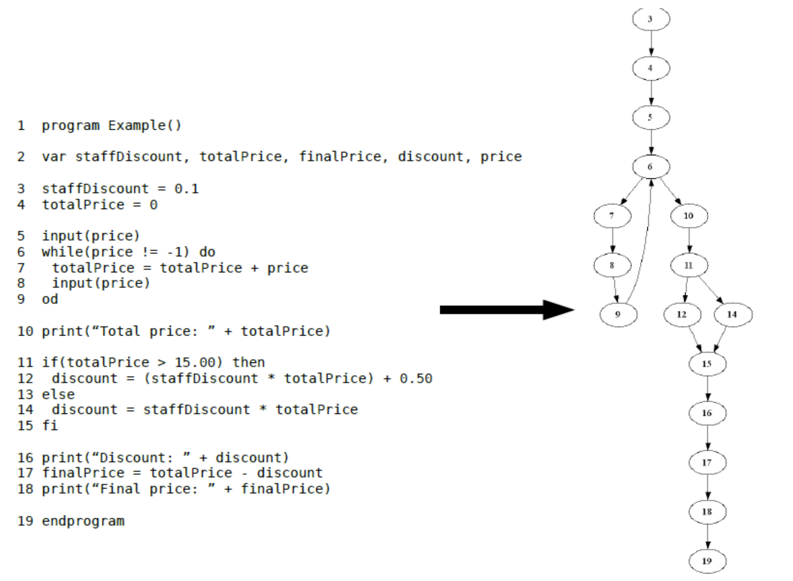

# Lecture 10: data flow testing

## Data flow

- An opposite way of control flow testing
- Pay attention to data flowing through structure of the program

### Why?

- Program under test may be too big or too complicated
- Apply the divide-and-conquer strategy
  - Follow one part of the input data set through the program
  - Divide the whole program into smaller sub-programs
- Each sub-program in inherently easier to figure out how to test

### Research results

- Above ideas achieved the two following sub-approaches
  - 1) Define/use testing (DU testing)
  - 2) Slice-based testing

## Define/use testing (DU testing)

- How do you follow or monitor the flow of data?
- Build intuition first through observations, then touch formal definitions and theories

### Observations



### Pay attention to data

- The variable `price` is *defined* in node 5
- Node 6 show a *use* of this variable (`price != 1`)
- Node 7 shows another *use* of this variable (`totalPrice = totalPrice + price`)
- At node 8, the program *defines* the variable `price` again

### Summary of observations

- There are 2 *define* nodes
  - Node 5: `DEF(price, 5)`
  - Node 8: `DEF(price, 8)`
- There are 2 *use* nodes
  - Node 6: `USE(price, 6)`
  - Node 7: `USE(price, 7)`

## DU pairs

**From the 4 nodes, you can form 4 pairs:**

1) `Pair(DEF(price, 5), USE(price, 6))`
2) `Pair(DEF(price, 5), USE(price, 7))`
3) `Pair(DEF(price, 8), USE(price, 6))`
4) `Pair(DEF(price, 8), USE(price, 7))`

**Why?**

- Each pair reveals the beginning and ending of the data flow associated with a given variable
- Curious about what happens between the beginning and the end
  - Need to find paths that link the beginning and ending node, known as a DU path

### Finding DU pairs

- Given a variable, all of its DU pairs can be found
- Given a DU pair, you can find all DU paths

**For the `price` example**

```
5 -> 6
5 -> 6 -> 7
8 -> 9 -> 6
8 -> 9 -> 6 -> 7
```

### Utilizing DU paths

- Show all possible paths of a given variable flowing through the program
  - Testers can design test cases that traverse all DU paths
  - Passing gives confidence that the variable is handled correctly by the program 
- For other variables, repeat the same process
