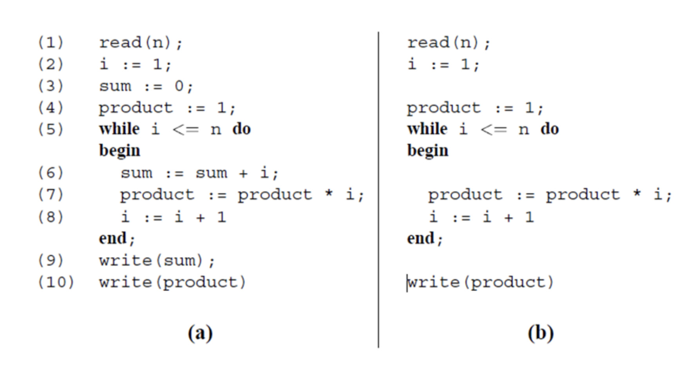

# Lecture 11: data flow testing (part 2)

## Slice based testing

- Another way to track data flows through a program

### Observation

- Program a is the typical program under test
- Program b is a slice of program a
  - Analyzes the flow of the `product` variable to line 10
  - Slices away all computations not relevant to the `product` variable
- Program b is a reduced, executable obtains from program a
  - Makes program a easier to debug
  - Each slice is smaller and simpler than the original
  - Just another form of "divide and conquer"

### Process

**Criterion**

1) Specified as $S(V, n)$ where
  - $V$ represents the variable or set of variable we are interested in
  - $n$ stands for the program line location where the investigation starts
2) $S$ represents the slice (or slices) that will meet the given criterion
  - Although possible to handle multiple variable at a time, it is preferred to do one at a time

**Backward slicing**

- Examine all statements starting from the line location
- Work backwards to the beginning of the program

**Forward slicing**

- Focuses on program statements affected by the variable *after* the line location
- Work towards the end of the program

## Static vs. dynamic

- Pre-defined input values were not considered makes this static slicing
- Considering pre-defined input values makes this dynamic slicing
- Methods based solely on observation are not scalable
  - Need a systemic way of turning programs into slices
  - Allows automatic software tools to do this for us (when we find it)
