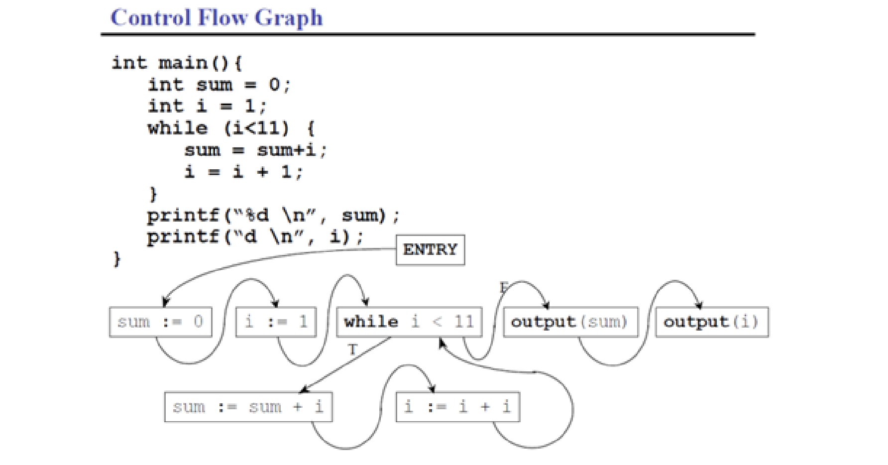
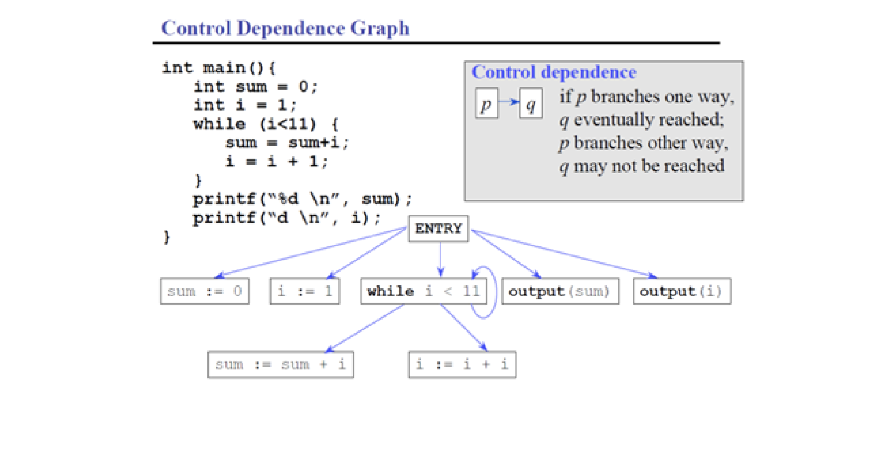
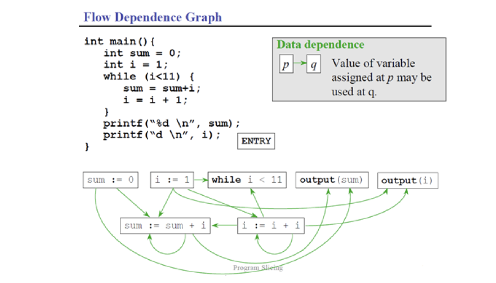
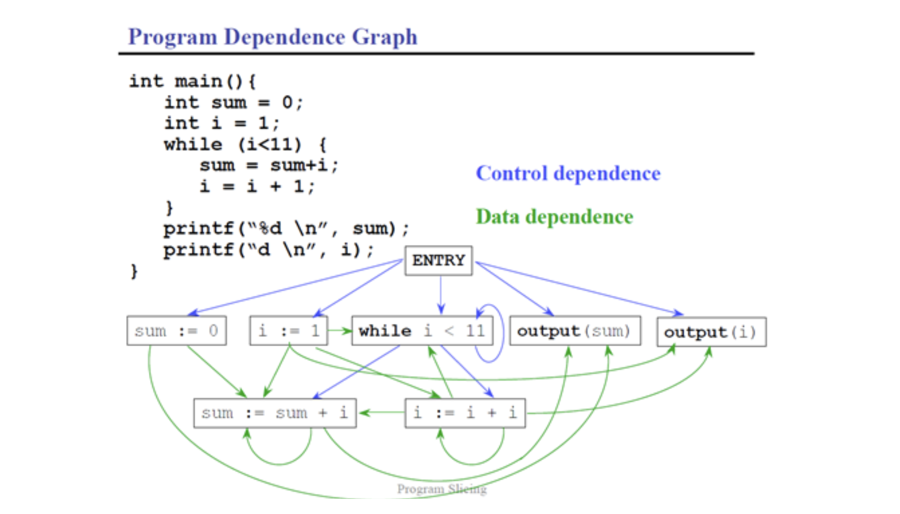
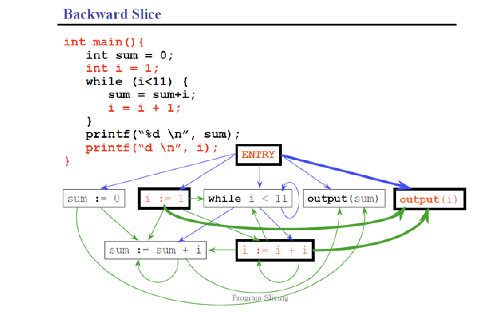
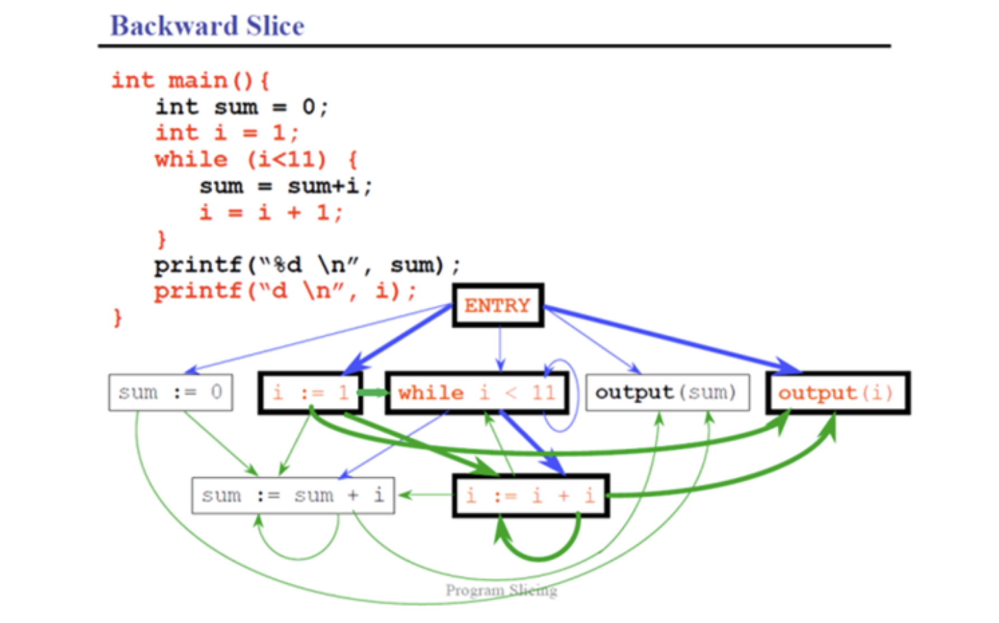
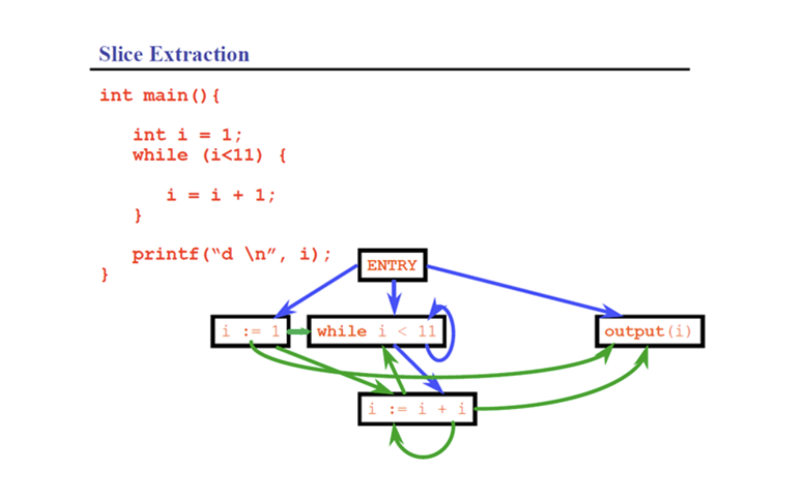
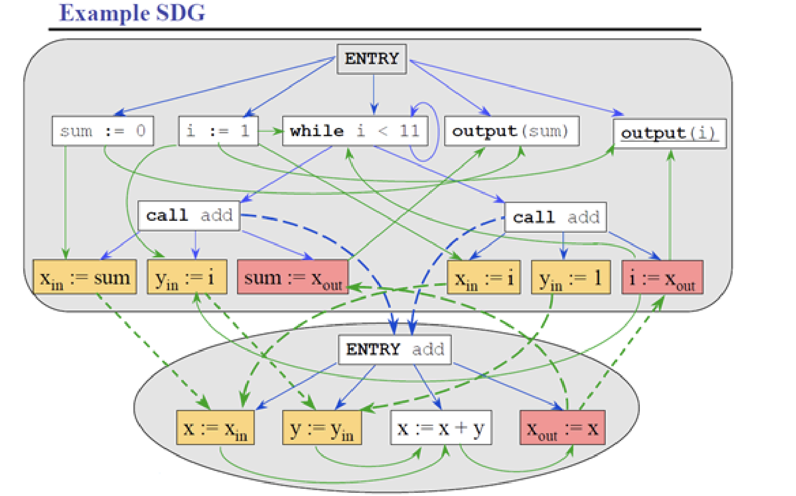
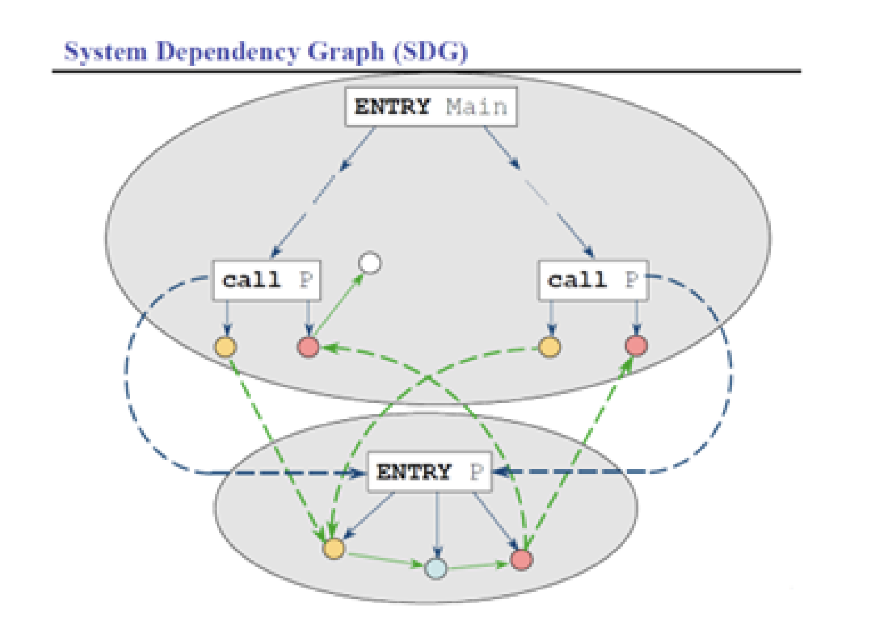
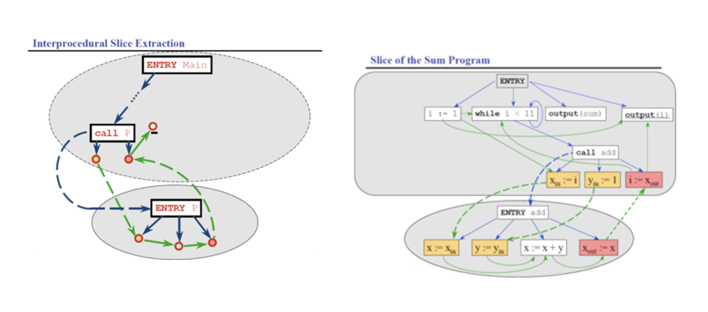

# Lecture 12: data flow testing (part 3)

## Program graphs

Lets consider the following code for the following analysis

```C
int main() {
  int sum = 0;
  int i = 1;
  while (i<11) {
    sum = sum + i;
    i = i + 1;
  }
  printf("%d \n", sum);
  printf("%d \n", i);
}
```

### Control flow graph



### Control dependence graph

From the control flow graph, we can derive the control dependence graph as follows:



- A program dependence graph of a program $P$ contains a control dependence edge $v1 \to v2$ if and only if:
  - Vertex $v1$ is the *entry vertex* and $v2$ is a component of program $P$ that is **not** nested within a loop or conditional
  - Vertex $v1$ represents a *control dependence* and $v2$ represents an component of program $P$ **immediately nested** within a loop or conditional statement

### Data dependence graph

A data dependence graph is obtained via the following mechanism:



- A program dependence graph of program $P$ contains a data dependence edge from $v1 \to v2$ if and only if:
  - Vertex $v1$ is a vertex defining a variable `x`
  - Vertex $v2$ is a vertex that uses variable `x`
  - Control can reach $v2$ after $v1$, via an execution path along which there is no other intervening definition of `x`

### Program dependence graph



## Backwards slicing

### Step 1

- Ensure both graphs have been obtained
- Slicing criterion is the variable `i` at the line `printf(%d \n, i)`
- Start working backwards from the line location (labeled as `Output(i)` for convenience)



### Step 2

- Notice that several vertexes reach `Output(i)` with just one incoming edge
- Shift attention to new vertexes connected by highlighted edges
  - Entry vertex
  - `i := 1`
  - `i := i + 1`



### Step 3

- Consider the step `while i < 11`
- Take out all untouched vertexes and edges
- The following graph and program is the slice meeting the slicing criterion

### Result



## Interprocedural slice

- The above analysis is restricted to a single function/procedure (called intraprocedural slicing)
- If more than 1 procedure is involved, we need to perform interprocedural slicing

```C
int add(int x, int y) {
  return x + y;
}

int main() {
  int sum = 0;
  int i = 1;
  while (i < 11) {
    add(sum, i);
    add(i, 1);
  }
  printf("%d \n", sum);
  printf("%d \n", i);
}
```

- The code now contains two procedures
- We still use the same slicing criterion

### System Mapping



This is a bit messy. Let's zoom out a bit



- Start at the target line (`printf("%d \n", i)`)
- Work backwards
- Extra rule: only highlight the edge from first `CALL P` box (even if there are 2)

### Slice Extraction



```C
int main() {
  int i = 1;
  while (i < 11) {
    add (i, 1);
  }
  printf("%d \n", i);
}

int add(int x, int y) {
  return x + y;
}
```
