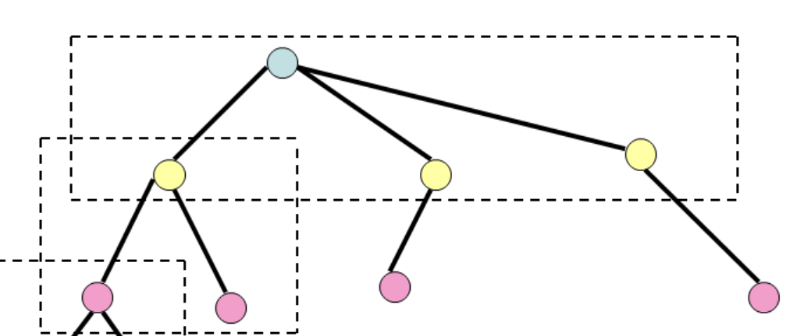
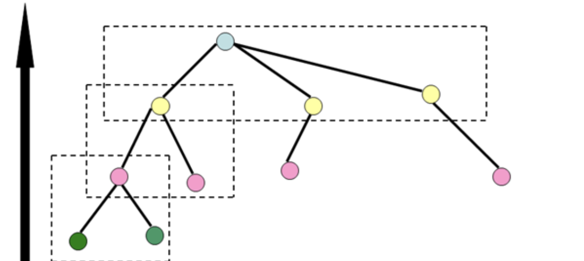
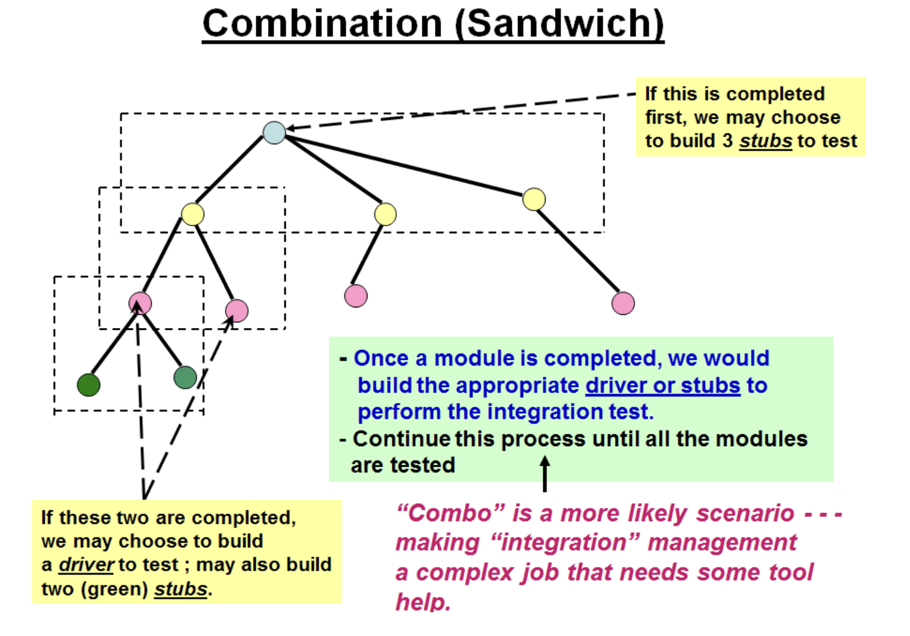
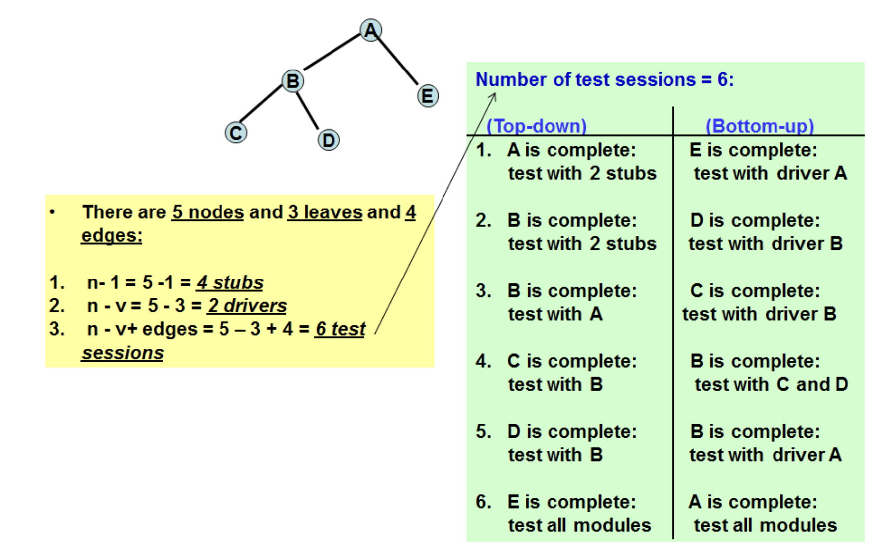
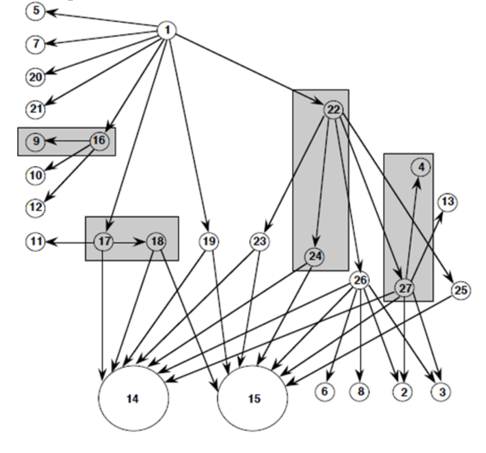
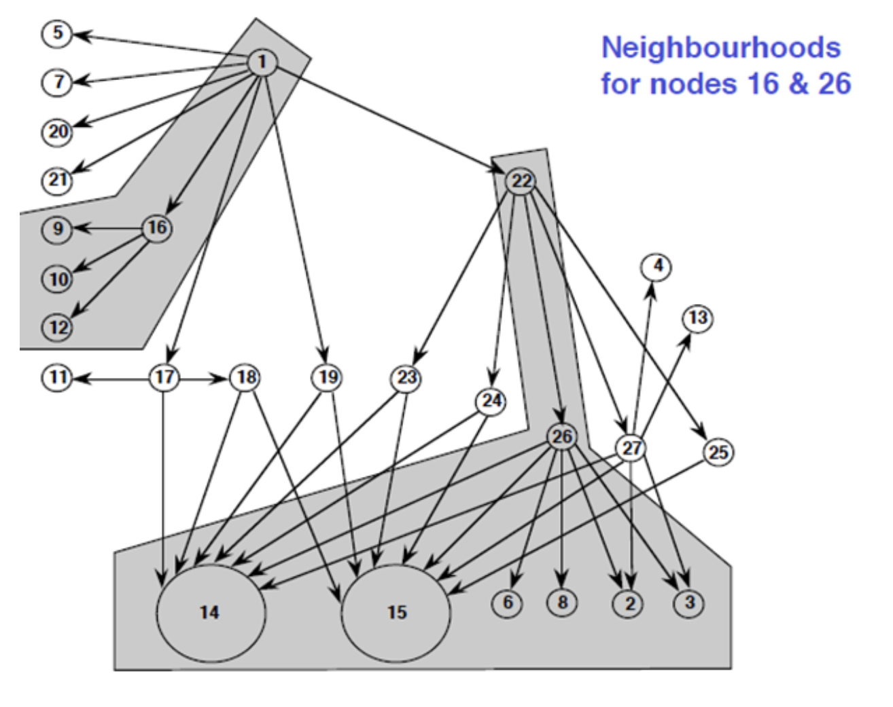
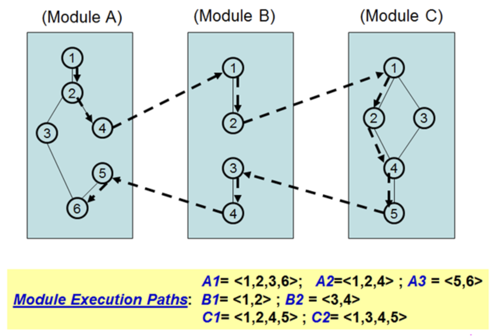
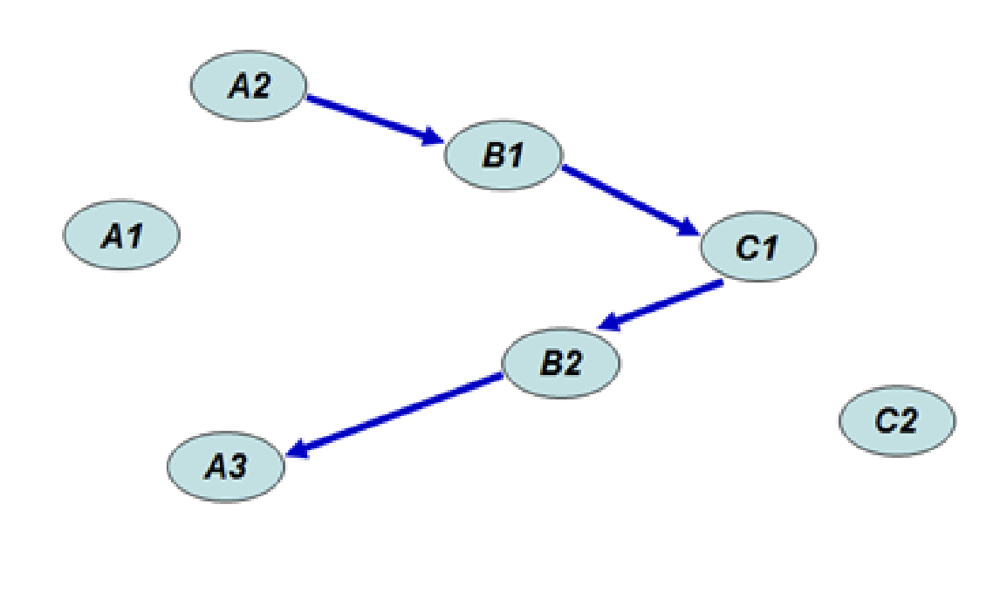

# Lecture 13: integration testing

## Motivation

- Levels of testing
  - Unit testing (testing individual code units)
  - Integration testing (testing at the component level)
- Make testing more efficient and detect problems earlier
- No need to wait for all testing units to finish

### Planning

- Several software units under unit testing with a couple ready for integration testing in the coming weeks
- May want to study interface requirements and figure out test cases
- Turns out not to be a top priority

### Priorities

- More important factor is the arrival timing of the software units
  - May affect testing time and budget
  - May need to figure out what to do

## Top-Down (Structural Decomposition-Based Integration Testing)

- Units arrive in a top-down fashion



- Once the root module is "completed", need 3 stubs to perform integration testing of root module
  - Completed here means unit tested
- As the next level module is completed, we build more stubs to perform the next level of integration testing
- Continue the process until all the completed modules are tested

### Test stub

- The root modules depends on 3 modules (that may not arrive completed at the same time as the root module)
- Need to build test stubs so that the root module can be tested immediately
- Stubs are programs that simulate the behavior of software components (modules) on which a module under test depends

### Decomposition-based

- Edges *may or may not* represent a calling relationship
- Units are linked because there is a logical hierarchy between the 2 modules
  - Second unit resides in a sub-directory of the first unit
  - First unit may not have any direct calls to the second unit

## Bottom-Up

- Units arrive in a bottom-up fashion



- Once a set of bottom modules are completed, we build a driver at the next higher level to run the integration tests
- Continue this process until all completed units are tested

### Combination/Sandwich



### Big bang

- Wait for all modules to be completed
- Perform one integration (one link-edit)
- Test the integrated modules all together

## Metrics

- Some metrics based on structural decomposition
  - A top-down approach with $n$ nodes may require up to $n-1$ stubs to be built
  - A bottom-up approach with $n$ nodes and $v$ leaves may need as many as $n - v$ drivers
  - In a sandwich scenario, there may be as many as $n - v + edges$ number of test sessions



## Call graphs

- A directed graph in which
  - Vertices are program units
  - Directed edges join the calling vertex with the called vertex
- Different from a structural graph since an edge *does* represent a calling relationship

### Pair-wise call graph based integration



- Shows the calling relationship among several program units
- Only perform integration testing on a pair of units with a calling edge (i.e. units 9 and 16)
- Motivation is that since unit 9 is available, test stub or driver is not necessary to test unit 16

### Neighborhood call graph based integration



- Highlights a neighborhood  of unit 16 and a neighborhood of unit 26
- A neighborhood of a given unit is the collection of all units one edge away from it and itself
- May want to conduct integration testing on each neighborhood at a time

### Conducting integration testing by following paths

- Call graphs provide a static calling relationship among given units
- If, at run-time, the call is under decision there is no guarantee of the call
- Opens the idea of path-based integration testing



- The example has 3 programs units
  - Each node in the units is a statement
  - Assume execution starts in module A, then calls module B, then calls module C
  - Return path starts from module C, passes through module B, and ends in module A
- Why pay attention to this long possible execution path?
  - Path may represent a major feature of the software
  - May want a test case that "walks" through this path
  - Certainly not the only path scenario to consider
- This kind of path that links modules along their messaging mechanism as MM-Path

### MM-Path based integration testing

- If we label all other possible ordinary paths in each module, we end up with the following paths

```plaintext
A1 = 1 -> 2 -> 3 -> 6
A2 = 1 -> 2 -> 4
A3 = 5 -> 6
B1 = 1 -> 2
B2 = 3 -> 4
C1 = 1 -> 2 -> 4 -> 5
C2 = 1 -> 3 -> 4 -> 5
```

- Using the possible paths notation, the original scenario may be redrawn as



**Claim/Rationale**

- Notice that paths A1 and C2 are not touched
- The MM-Path identified can be viewed as a slice of all possible paths in the combined modules
- If we find and test all MM-Paths, we will be in good shape in terms of integration testing

**Side Note**

- There is not path that goes through `1 -> 2 -> 4 -> 5 -> 6` in module A
  - There is no edge linking nodes 4 and 5 in the graph
  - Node 5 is still the next statement of node 4
- A typical program graph should draw an edge from node 4 to node 5 
  - Node 4 is a calling statement (calls node 1 in module B)
  - This detour contradicts the direct path argument from node 4 to node 5 in module A

**Compared to other methods**

| Strategy | Ability to test interfaces | Ability to test co-functionality | Fault isolation resolution |
| -------- | -------------------------- | -------------------------------- | -------------------------- |
| Functional decomposition | Acceptable, can be deceptive | Limited to pairs of units | Good to faulty unit |
| Call-graph | Acceptable | Limited to pairs of units | Good to faulty unit |
| MM-Path | Excellent | Complete | Excellent to unit path level |
