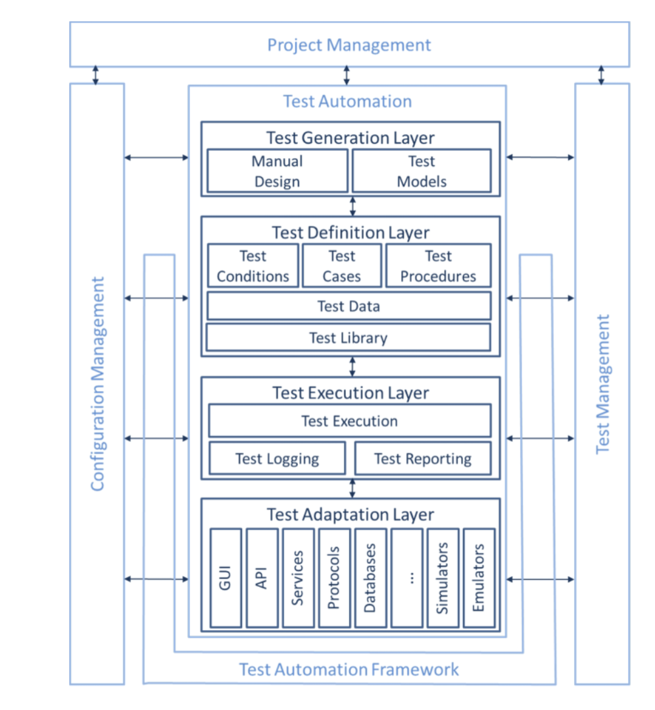
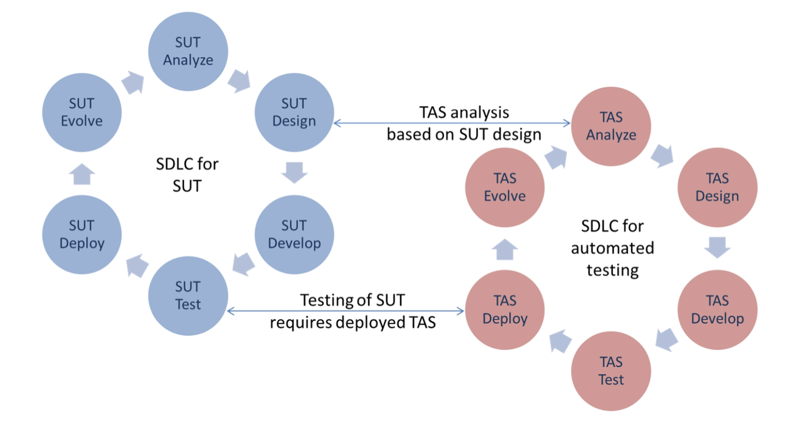

# Lecture 16: test automation

## Objectives for test automation

- Test automation is one or more of the following
  - Using purpose built software to control and set up test preconditions
  - Executing tests
  - Comparing actual outcomes to predicted outcomes
- More than a mechanism for running a test suite without human interaction
  - Help run test cases consistently and repeatedly
  - Test different versions of the SUT (system under test) and/or environments
  - Involves a process of designing the testware
- Objectives of test automation include:
  - Improving test efficiency
  - Providing wider function coverage
  - Reducing total test costs
  - Performing tests that manual testers cannot
  - Shortening the test execution period
  - Increase the test frequency/reduce time required for test cycles

### Advantages

- More tests can be run per build
- Possible to create tests that cannot be done manually
  - Real-time
  - Remote
  - Parallel tests
- Tests can be more complex
- Tests can run faster
- Less subject to operator error
- More effective and efficient use of testing resources
- Quicker feedback regarding software quality
- Improved system reliability
- Improved consistency of tests

### Disadvantages

- Additional costs involved
- Initial investment to setup TAS (test automation solution)
- Requires additional technologies
- Team needs to have development and automation skills
- Ongoing TAS maintenance required
- Can distract from testing objectives
- Tests can be more complex
- Additional errors may be introduced by automation

### Limitations

- Not all manual tests can be automated
- Automation can only check machine-interpretable results
- Automation can only check actual results that can be verified by an automated test oracle
- Not a replacement for exploratory testing

## Test automation preparation

### Acronyms

| Shorthand | Expanded |
| --------- | -------- |
| gTAA | generic test auatomation architecture |
| GUI | graphical user interace |
| SUT | system under test |
| TAA | test automation architecture |
| TAE | test automation engineer |
| TAF | test automation framework |
| TAM | test automation manager |
| TAS | test automation solution |

### SUT factors influencing test automation

- SUT interfaces
- Third party software
- Levels of intrusion
  - Different automation approaches have different levels of intrusion
  - More changes made to SUT specifically for automated testing indicates a higher level of intrusion
- Different SUT architectures
- Size and complexity of SUT

### Tool evaluation and selection

- Primary responsibility of the test automation engineer (TAE)
- Conducts many of the evaluation and selection activities
- Supplies information to the test automation manager (TAM)
- In particular, TAE will
  - Assess organizational maturity and identify opportunities for test tool support
  - Assess appropriate objectives for test tool support
  - Identify and collect information on potentially suitable tools
  - Analyze tool information against objectives and project constraints
  - Estimate a cost-benefit ratio based on a solid business case
  - Make recommendations on the appropriate tool
  - Identify compatibility of the tool with SUT components

### Designing for testability and automation

- Testability relies on availability of software interfaces that support testing
- Should be designed and implemented in parallel with the design and implementation of other features
- Often one of the non-functional requirements of the system
- Can be done by system architect, but is often done by or with the involvement of a test automation engineer

## Test automation architecture

- The generic TAA presents layers, components, and interfaces and refines them into concrete TAA for a particular TAS
- Allows for a structured and modular approach to building a TAS by
  - Defining concept space, layers, services, and interfaces of a TAS to enable realization
  - TASs by in-house as well as by externally developed components
  - Support simplified components for effective and efficient development of test automation
  - Re-using test automation components for different or evolving TASs for software product lines and families
  - Easing maintenance and evolution of TAS
  - Defining essential features for a user of a TAS
- The gTAA is structured into horizontal layers for the following
  - Test generation
  - Test definition
  - Test execution
  - Test adaptation

### Design activities

- Capture requirements needed to define an appropriate TAA
- Compare and contrast different design/architecture approaches
- Identify areas where abstraction can deliver benefits
- Understand SUT technologies and how these interconnect with the TAS
- Understand the SUT environment
- Time and complexity for a given testware architecture implementation
- Ease of use for a given testware architecture implementation

### Approaches to automating test cases

- Capture/playback approach
- Structured scripting approach
- Data driven approach
- Keyword driven (action word) approach
- Model-based testing (including process driven approach)

### TAS development

- Comparable to other software development projects
- Can follow same procedures and processes
- Specific to a TAS  are its compatibility and synchronization with the SUT

### Synchronizing of SUT and TAS evolution

- Both can evolve to accommodate new features or disable features
- Correct defects
- Address changes to their environment

## Continuous improvement

- Undertaken to achieve a range of benefits
  - Greater efficiency
  - Better ease of use
  - Additional capabilities and improved support for testing activities

### Scripting

- Varied
- Simple structure approaches
- Data driven approaches
- More sophisticated keyword driven approaches

### Test execution

- Regression test suite does not finish executing overnight
  - May be necessary to test concurrently on different systems
  - Split regression suite into multiple parts, each executing in a defined period of time
- Analysis of automated test coverage can reveal duplication
  - Removing duplication can reduce execution time and yield further efficiencies

### Verification

- Before creating new verification functions, adopt a set of standard verification methods
- Avoids re-implementation of verification actions across multiple tests
- When verification methods are not identical but similar, use parameterization to aid in allowing function to be used across multiple types of objects

### Architecture

- May be necessary to change architecture to support improvements of the testability of the SUT

### Pre- and post-processing

- Provide standard setup and teardown tasks
- Saves the task from being implemented repeatedly for each automated tests
  - Reduces maintenance costs
  - Reduce effort required to implement new automated tests

### Documentation

- Covers all forms of documentation from
  - Scripting (what the script does/how they should be used)
  - User documentation for the TAS
  - Reports and logs produced by the TAS

### Updates and upgrades

- Makes new functions available to test cases (or corrects failures)
- Risk with updating the framework (upgrading existing tool or introducing a new one)
  - May have negative impact on existing test cases
  - Should test new version on sample tests before rolling it out
- Sample test cases should be representative of
  - Automated tests of different applications
  - Different test types
  - Different environments (where appropriate)
