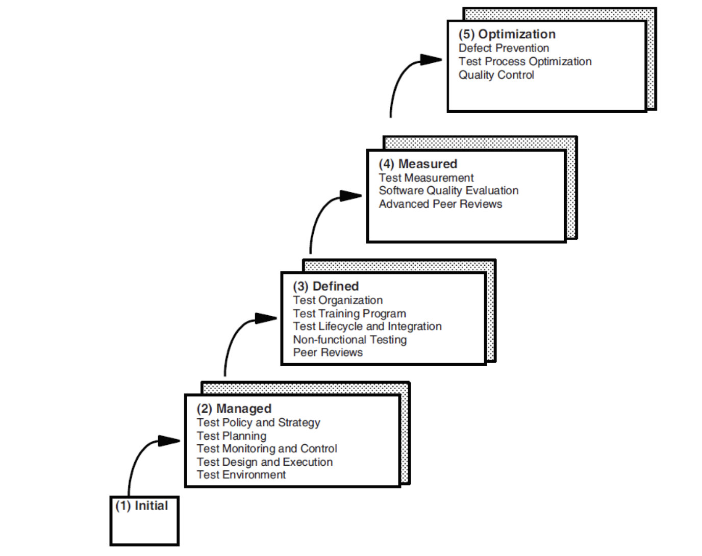

# Lecture 17: test maturity model integration

## Motivation

- A logical question: "why do we, as software test professionals, need to learn/know TMMi?"
- TMMi's own answer: "The TMMi foundation is a non-profit organization dedicated to improving software quality management and test processes/practices"
- Another possible answer: If you need to know CMMi, you may ned to know TMMi?

## What is TMMi

- It is a model (as given in its name "Test Maturity Model Integration")
- The integration part is part of the history of CMMi (since TMMi is a mirror)

### Why integration?

- Before CMMi, there was CMM and other models
  - People integrated CMM and other models together and called the new one CMM integration
  - TMMi came along to mirror the CMMi name, it has NO significant meaning otherwise

### What do you mean "model"?

- A toy model car isn't a real car, but gives the idea of a real car
- Toy model car can help build a real car (tells us it at least needs 4 wheels)
- Studying TMMi can help build great software, but won't tell every part we need

### What do you mean "maturity"?

- TMMi offers several different "maturity" level models

**What are those maturity levels?**

**Do they make sense?**

- Initial -> chaotic/ad-hoc
- Managed -> finally some adults in the house
- Defined -> finally have some house rules
- Measured -> have bookkeeping in place
- Optimizing -> We figure a secret formula that makes us money all the time

## References

**Level 2: Managed**

- Test policy and strategy
- Test planning
- Test monitoring and control
- Test design and execution
- Test environment

**Level 3: Defined**

- Test organization
- Test training program
- Test life-cycle and integration
- Non-functional testing
- Peer reviews

**Level 4: Measured**

- Test measurement
- Product quality evaluations
- Advanced reviews

**Level 5: Optimizing**

- Defect prevention
- Quality control
- Test process optimization
