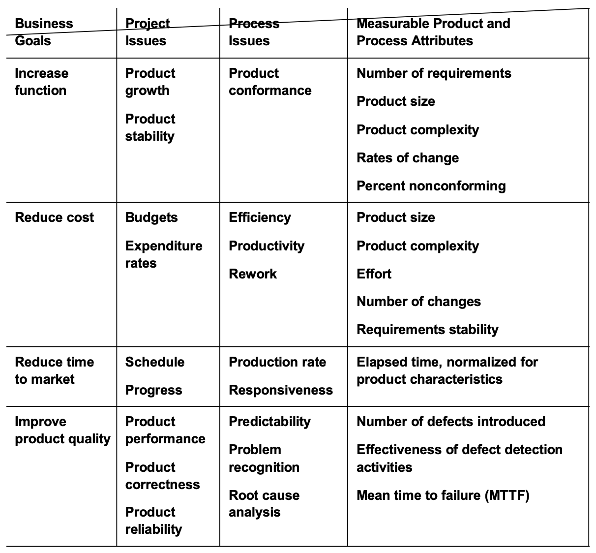

# Lecture 1: measuring the software process

## Defining process (again)

- A sequence of repeatable steps that lead to some desired end or output
- Task of building a product or providing a service becomes a series of integrated and interconnected processes

### Process thinking principles

- Focus on the process that generate the products and services to improve quality and productivity
- Ensure that the processes are properly supported
- Manage poorly behaving processes by fixing them and not blaming people
- Recognize that variation is present in all processes and the existence of variation is an opportunity for improvement
- Take variation into account in the decision making process by using data from the process to guide detection

### Process management and statistical process control

- A process is *under statistical control*, if the process yields predictable results by establishing and sustaining a stable level of variability
- Through use of past experience, we can predict (within limits) how the process may vary in the future

## Responsibilities of process management

### Define the process

- Design processes to meet or support business and technical objectives
- Identify and define the issues, models, and measures that relate to the performance of the process
- Provide the infrastructure needed to support software activities
- Ensure that the organization has the ability to execute and sustain the process

### Measure the process

- Measurements are the basis for detecting deviations from acceptable performance and identifying opportunities for process improvement
  - 1) Collect data that measure the performance of each process
  - 2) Analyze the performance of each process
  - 3) Retain and use the data
- Understand the past, control the present, predict the future
  - 1) To assess process stability and capability
  - 2) To interpret the results of observations and analysis
  - 3) To predict future cost and performance
  - 4) To provide baselines and benchmarks
  - 5) To plot trends
  - 6) To identify opportunities for improvement

### Control the process

- Keeping the process within its normal performance boundaries: measure-detect-correct
- Three actions are needed to establish and maintain control of a process
  - 1) Determine whether or not a process is under control
  - 2) Identify performance variations that are caused by process anomalies
  - 3) Eliminate the source of assignable causes to stabilize the process

### Improve the process

- Understand the characteristics of existing processes and the factors that affect process capabilities
- Plan, justify, and implement actions that will modify the processes to better meet business needs
- Assess the impacts and benefits gained, and compare these to the costs of changes made to the processes

## Process X

- **Performance**: what is the process producing now with respect to measurable attributes of quality, quantity, cost and time?
- **Stability**: is the process that we are managing behaving predictably?
- **Compliance**: 
  - are the processes sufficiently supported?
  - are they faithfully executed?
  - Is the organization fit to execute the process?
- **Capability**:
  - is the process capable of delivering products that meet requirements?
  - does the performance of the process meet the business needs of the organization?
- **Improvement**:
  - what can we do to improve the performance of the process?
  - what would enable us to reduce variability?
  - what would let us move the mean to a more profitable level?
  - how do we know what the changes we have introduced are working?

## Measurement issues

- What should be measured?
- How should the characteristics be measured?
- What is the data telling us?
- How is our process behaving?
- What are the signals that we should be reacting to?
- How do we know something is a signal?
- What should we do when we recognize a signal?

## Measuring process behavior

## Two fundamental measurement principles

1) The measurements must be reproducible. That is, there must be a standard shared
2) The attributes being measured must be valid. The must yield true insights into your process
