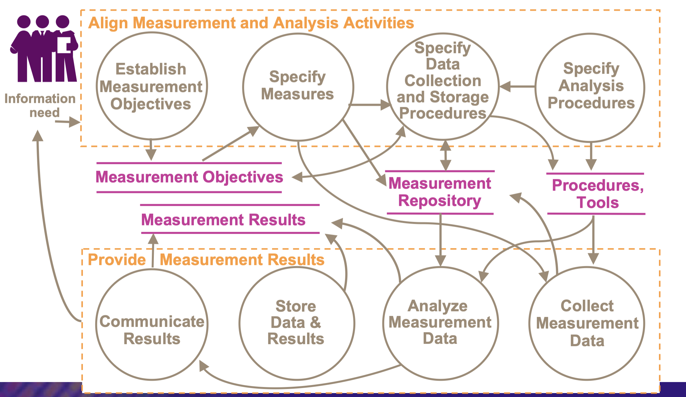

# Lecture 2: planning for measurement

## Measurement and analysis

> Develop and sustain a measurement capability that is used to support management information needs

### When it isn't done well

**Symptoms**

- Measurements unknowingly used inappropriately or out of context
- Management is achieved by perception/judgement rather than by fact
- Measurement presentations may confuse rather than enlightened
- Useless measures are being collected

**Why we should care**

- Poor decisions that cannot be justified reduce customer and staff confidence
- Inappropriate measures can cause inappropriate behavior
- Collected measures don't allow you to quantify how close you are to meeting your business goals
- Having no valid basis for prioritizing improvements could lead you to significant wasted overhead (time, effort, money)

### Goals

- SG1: align measurement and analysis activities
  - Measurement objectives and activities are aligned with identified information needs and objectives
- SG2: provide measurement results
  - Measurement results that address identified information needs and objectives are provided
  - The process area also has generic goals to support institutionalization

### Relevant terminology

- Base measure: a distinct property or characteristic of an entity and the method for quantifying it
- Derived measure: data resulting from the mathematical function of two or more base measures

### Context

## Planning stages

1. Identifying process management issues
2. Selecting and defining the corresponding product and process measures
3. Integrating the resulting measurement activities into the organization's existing processes

### Identifying process issues

1. Understand how your business goals or objectives relate to your software processes
2. Identify the critical processes
3. List the objectives for each critical process
4. List the potential problem areas associated with the processes
5. Group the list of potential problems into common areas or topics

### Measurable entities in a software process

**Things received**

- Products from other processes
- Resources
- Ideas
- Guidelines
- Directions

**Activities and elements**

- Processes of subprocesses
- Flow paths

**Things consumed**

- Resources
- Effort
- Raw materials
- Money + time

**Things held**

- People
- Facilities
- Tools
- Data
- Work in progress
- Knowledge and experience

**Things produced**

- Products 
  - Software specs
  - Tested docs
  - Defect reports
- By-products
  - Knowledge and experience
  - Intellectual property
  - Satisfied customers

### Measurable attributes of software process entities

**Things received**

- Changes (type, data, size, # received)
- Requirements
  - Stability
  - \# identified
  - % traced to design
  - % traced to code
- Problem reports (type, data, size, origin, severity, # received)

**Activities**

- Flow paths (processing times, delays, backlogs)

**Things consumed**

- Effort
  - Development hours
  - Rework hours
  - Support hours
  - Preparation hours
  - Testing hours
- Time
  - Start time
  - Ending time
  - Duration
  - Wait time
- Money
  - Cost to date
  - Cost variance
  - Cost of rework

**Things produced**

- Status of work units (# designed, # coded, # tested)
- Size of work units
  - \# of requirements
  - \# of function points
  - Lines of code (modules and objects)
- Output quantity
  - Action items
  - Approvals
  - Defects found
- Test results
  - Test cases passed
  - % test coverage
- Problems and defects
  - \# of reports
  - Defect density
  - Type and origin
  - Distribution by type and origin
  - \# opened or closed

### Criteria for measures used to characterize process performance

- Closely relate the issue under study
- Contain high info content - sensitive to as many facets of process results as possible
- Really reflect the degree to which the process achieves results as possible
- Really reflect the degree to which the process achieves results that are important
- Permit easy and economical collection of data
- Show measurable variation
- Have diagnostic value

### Barriers to successful measurement

- Different users of measurement data have different needs
- Different organizations have different established practices
- Unambiguous communication of measurement results is inherently difficult
- Structured methods for communicating measurement results seldom exist
- Very little guidance was provided in SW-CMM
- Instead of building a metrics program to meet its own needs, some organizations do it to meet CMM or CMMI (level 4) requirements

### Criteria for well-defined measures and operational definition

- Communication
- Repeatability
- Traceability

### Contextual information

- What do the individual values represent? What are those numbers?
- How are the values obtained?
  - Who obtains them?
  - How often?
  - At which location?
  - By what methods?
  - With what instrumentation?
- What sources of variation are present in these data?
- How are these data organized into subgroups?
  - Which sources of variation occur within the subgroup?
  - Which source of variation occur between the subgroup
- How should such data behave? Are there natural barriers within range of observed values?
