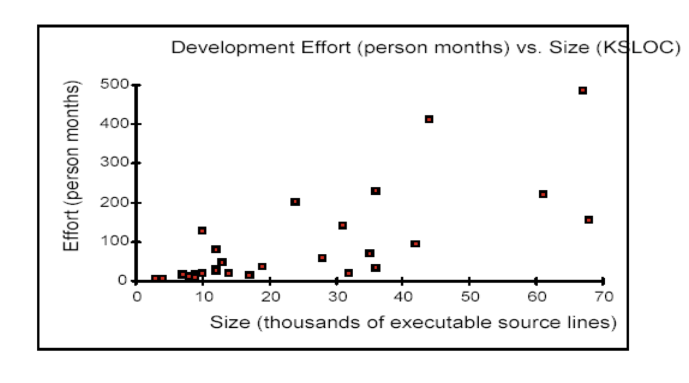
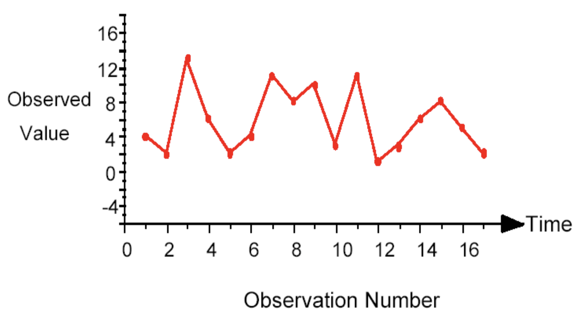
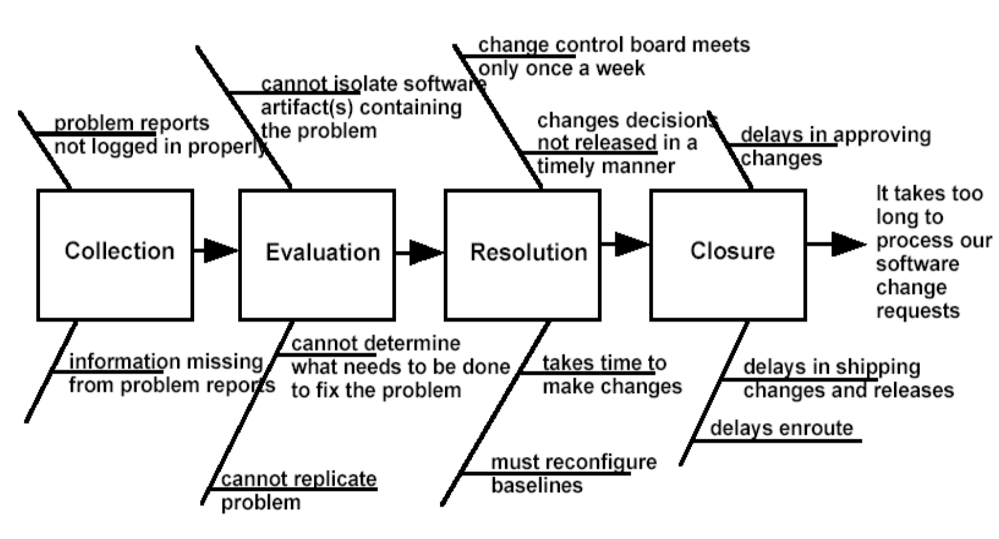
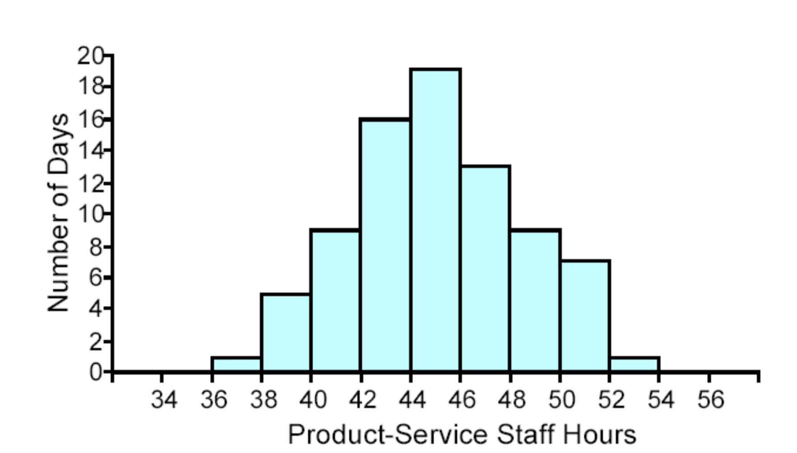
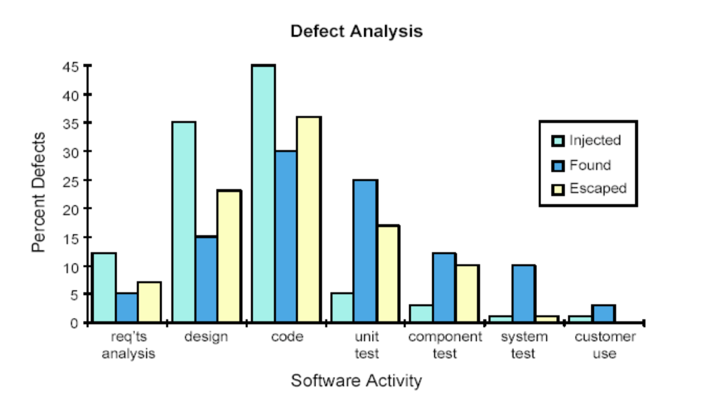
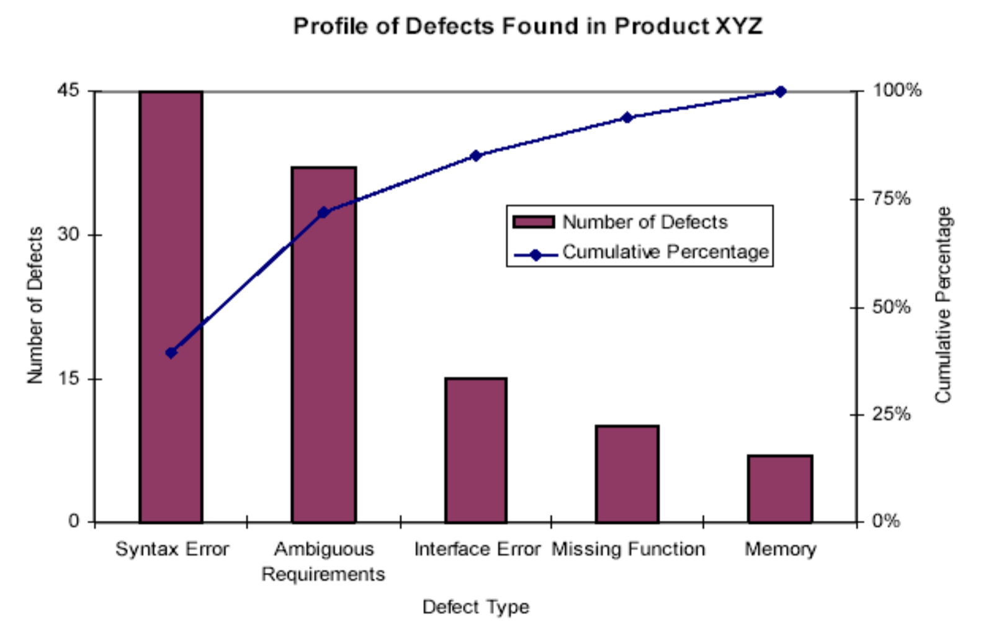
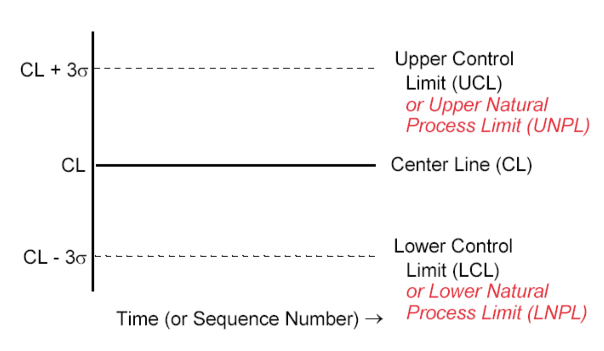

# Lecture 5: statistics for software engineers (part 1)

## Statistical process control (SPC)

- Use of *statistical* tools to analyze a process or its outputs
- To control, manage, and improve the quality of the output or the capability of the process
- Statistical process control can be considered effective use of statistical tools

## Basic SPC tools

### Scatter diagrams

- Displays emprirically observed relationships between 2 measures
- A pattern in the plotted points may suggest that the 2 measures are associated
- When the conditions warrant, scatter diagrams are natural precursors to regression analysis
- Scatter diagrams are rarely used as the only means of characterizing the relationship between 2 measures

### Run charts

- Specialized, time-sequenced form of a scatter diagram that can be used to examine data quickly and informally for trends or other patterns that occur over time
- Similar to control charts, but without the control limits and center line

### Cause-and-effect diagrams

- Sometimes called fishbone diagrams or Ishikawa diagrams, after the person credited for their popularization
- Allow you to probe for, map, and prioritize a set of factors that are thought to affect a particular process, problem, or outcome
- They are especially helpful in eliciting and organizing information form people who work within a process and know what might be causing it to perform the way it does

### Histograms

- Display the emprirically observed distribution for values of a meaaure
- Show the frequency of each value and the range of values observed
- Their use is inappropriate unless the measure can be treated as a continuous scale

### Bar charts

- Similar in many ways to histograms
- Do not require that the measure be treated as a continuous variable
- Bar chart are much more frequently used than histograms

### Pareto charts

- A special form of a bar chart
- Interpretation based on the "80/20" rule
- Helps focus investigations by ranking problems, causes, or actions in terms of
  - Their amounts
  - Their frequency of occurrence
  - Economic consequences

### Control charts

