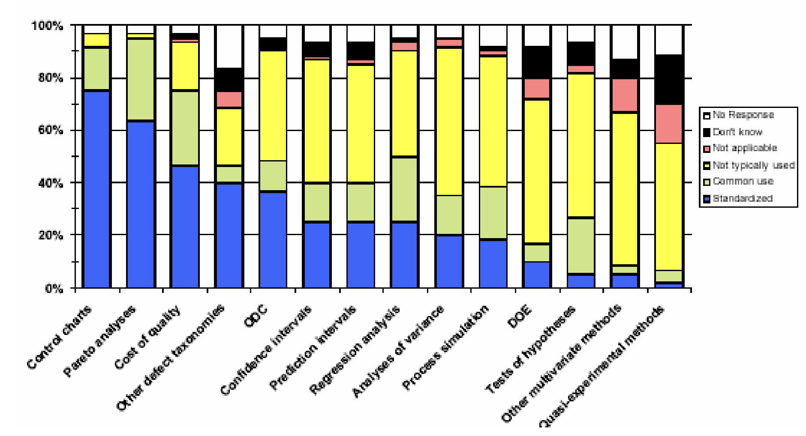

# Lecture 6: statistics for software engineers (part 2)

## SPC implies

- Control charts (part 1)
- Use of a broad range of quantitative and statistical techniques
- Simple graphics
- Brainstorming techniques
- Causal analysis tools
- Classical statistical techniques
  - Regression analysis
  - ANOVA

## Rigorous statistics

- Used by highly mature organizations
  - Control charts
  - Prediction intervals
  - Confidence intervals
  - Analysis of variance
- When appropriate for answering questions and providing business value
- Field of statistics cannot adequately be discussed in a handful of slides

### Statical thinking

- All work is a series of interconnected processes
- All processes are variable
- Understanding variance is the basis for management by fact and systematic improvement
- Quantitative
  - Understand the past
  - Control the present
  - Predict the future

### Useful definitions

- *Statistics*: the mathematics of the collection, organization, and interpretation of numerical data, especially the analysis of population characteristics by inference from sampling
- *Parameter*: a measurable characteristic about an entire population
- *Statistic*: a measurable characteristic about a sample of a population

### Central tendency and dispersion

**Central tendency implies location**

- Middle of a group of values
- Balance point
- Examples include mean and median

**Dispersion implies spread**

- Distance between values
- How much the values tend to differ from one another
- Examples include range and standard deviation

> Used together to understand the likelihood of a particular value

### Measurement scales

- Derived from rules that we use for assigning values to attributes
- Admissible transformations limit the ways we can validly use the measurement results
- Scale types are not fundamental attributes of data

### Appropriate statistical uses

| Scale | Applies to | Measures of central tendency | Measures of dispersion |
| ----- | ---------- | ---------------------------- | ---------------------- |
| Nominal | Classify entities | Mode | Information |
| Ordinal | Rank entities (distance has no meaning) | Median | Percentiles |
| Interval | Concept of distance (no origin) | Arithmetic mean | Standard and average deviation |
| Ratio | Has origin of meaningful, nonarbitrary zero-value | Geometice and harmonic means | Percent variation |

## Fundamental statistical concepts

- *Independent event*: events whose probabilities are unaffected by the (non)concurrence of each other ($P\left( A \vert B \right) = P(A)$) or ($P(A \cap B) = P(A) \cdot P(B)$)
- *Random sample*: a sample (subset of observations) selected such that each event has an equal opportunity to be selected
- *Homogeneity*: when data values are grouped together, the measurements are taken under essentially the same conditions

### Disaggregating processes and measures

- Aggregation results from mixing and stratification of data from multiple, overlapping processes that are lumped together
- Begin by "informally stabilizing" the process
  - Understand the data before trying to control it
- Disaggregation is a data-driven refinement of operational definitions
  - Are all inspections the same process? Design? Code?
  - Are all defects the same measure? Priority?

### Product knowledge management

- Highly mature organizations systematically attack organizational learning about the application domain and the product
- Process data is meaningless without satisfactory product context
  - Process control occurs within a product, project, and business environment
  - Process is a prerequisite for building a product or providing a service, not an end in itself
- Empirically, product and domain attributes are crucial to correct process analysis and control

## Distributions

- Populations of data are characterized as distributions in most statistical procedures
  - Expressed as an assumption for the procedure
  - Can be represented using an equation

### The normal distribution

- Statistical techniques frequently use distributions to characterize the probability of observations
- For normal distributions, 68% of the values will fall within 1 standard deviation
- A sample comprised only of values beyond 2 standard deviations is not very likely in this case
- This likelihood can be quantified using statistics

$$
  P(X = x) = \frac{1}{\sigma \sqrt{2\pi}} \, e^{ -\frac{1}{2} \left( \frac{x - \mu}{\sigma} \right)^2 }
$$

### Poisson distribution

- Resulting data reflects a count of events
- The events are rare
- The events are independent of each other
- The likelihood of a given event is related to the number of opportunities there are for its occurrence
- Limit of the binomial probability when $\lim_{n \to \infty}$ and $\lim_{p \to 0}$ such that $np = \lambda$
- $\mu = \sigma^{2} = \lambda$

## Classical questions and techniques

- How confident can I be that this sample captures some "truth" about the larger population?
- Is this set of data significantly different from that set of data?
- Where is the next point in this series likely to be?
- What are the odds?

### Confidence intervals

- Where is the mean $\mu$ (or some other estimated parameter of interest)
- Typically estimate mean $\mu$ with average $\bar{x}$
- Small same size (<30), two-sided, variance unknown
  - $s$ is the sample standard deviation
  - $n$ is the sample size
  - $t$ is the student's t distribution

$$
  \bar{x} \pm t\left( \frac{\alpha}{2}; n - 1 \right)\left( \frac{s}{\sqrt{n}} \right)
$$

### Regression analysis

- Fitting a line (which may be non-linear) to a set of data
- $R^{2}$ (the coefficient of determination) is frequently used to identify how good a fit the line has with the data (ranges between 0 and 1)

### Quantitative analysis

