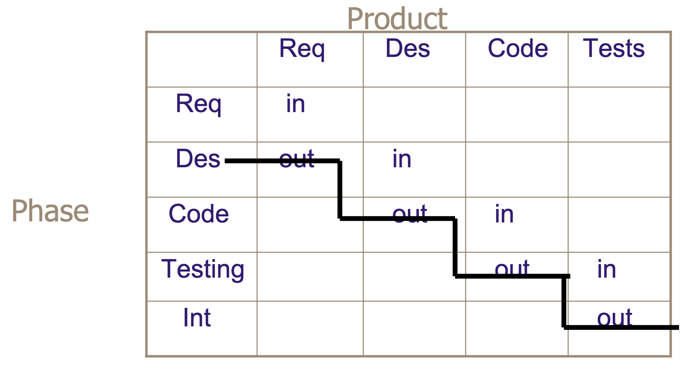

# Lecture 7: evolution of measures in CMMI

## High maturity

- Understanding variation
- Predictability
- Process characterization
- Linking business objectives to project behaviors
- Causes of variation (assignable and common)
- Simplified process definition
- Accurate data, above all
- Management summarization instead of obfuscation

**Maturity level 4: quantitatively managed**

- Quantitative goals and product & processes
- Understanding process performance variation
- Process is stable and measured

**Maturity level 5: optimizing**

- Defects prevented
- Proactive process improvement
- Eliminating common causes of variation

### Cultural maturity vs. model maturity

- Model maturity: meeting all practices in CMMI required to achieve a level 4 or 5 maturity level rating
- Cultural maturity
  - Using *some* of the concepts of level 5 to become level 3 and/or 4
  - Innovative and usable applications for metrics
  - Simplified and usable process definition
    - Highly customized for the organized
    - Defined process efficiently occupies the spaces of templates, procedures, tools and has little redundancy
    - General population are more concerned with following the process than meeting CMMI
  - Fully embracing product quality
  - Will not **hear** from the sponsor of a culturally high maturity organization (passed the test, but don't live the stuff)

### Phase containment

## Evolution of measures

### Maturity level 1

- Perhaps a budget and a schedule

### Maturity level 2

- Some processes are planned, performed, measured, and controlled
- Measures are linked to measurement objectives
- The data resulting from level 2 is "young"
- Data usage is comparing planned to actual
- When to take action is based on "feel"

### Maturity level 3

- Processes are fully defined, and the likelihood of adherence to them is greater
- The data resulting for level 3 is more mature and consistent
- Process needs and objectives for the organization are established
- Data usage is still limited to comparing to actual (but graphs, tools, and presentation formats may be more sophisticated)
- When to take action is still based on "feel"
- Project planning is enhanced to "tried out" templates, tools, and processes

### Maturity level 4

- Processes are fully defined, and likelihood of adherence is greater
- Data resulting from level 4 is more mature, consistent, and there is a history of data to work with
- Quantitative objectives for quality and process performance are established for the organization
- When to take action is based on statistical indicators for some metrics, moving beyond management by feel
- Project planning is enhanced by the organization supplying projects with succinct process capability measures and models

### Maturity level 5

- Projects take advantage of the organization's active search and testing of tools, processes, and measures for their use
- Projects and the organization have the ability to find the root cause of defects and take action
- The organization must be able to measure the effects of deployed processes and technology improvements
- As well as evaluate the effects of changes on process performance
- Some processes are improved, after they are brought under control

## Understanding measurement

> measurement is a sampling process designed to tell us something about the universe in which we live that will enable us to predict the future in terms of past thought and establishment of principles or natural laws.

### Maturity level 4

**Process performance**

- Characteristic values seen when measuring attributes of products or services that come form a process
  - Product attributes: function, size, execution speed
  - Process attributes: effort expended, processor time, number/type/source of defects detected/repaired/reported
- Measure appropriate product and process attributes at several points in time to obtain sequential records of process behavior

**Organizational process performance**

- Baselines and models that characterize expected process performance of the organization's set of standard processes are established and maintained
- Select the processes or process elements from the standard set of processes to include in the process performance analysis
- Establish and maintain definitions of measures to be included in the process performance analysis
- Establish and maintain quantitative objectives for quality and process performance for the organization
- Establish and maintain the organization's process performance baselines
- Establish and maintain the process performance models for the organization's set of standard processes

**Quantitative project management**

- Project is quantitatively managed using quality and process-performance objectives
  - Establish and maintain the project's quality and process performance objectives
  - Select the subprocesses that compose the project's defined process based on historical stability and capability data
  - Select the subprocesses of the project's defined process that will be statistically managed
  - Monitor the project to determine whether the project's objectives for quality and process performance will be satisfied, and identify corrective action as appropriate
- Performance of selected subprocesses within the project's defined process is statistically managed
  - Select the measures and analytic techniques to be used in statistically managing the selected subprocesses
  - Establish and maintain an understanding of the variation of the selected subprocesses using the selected measures and analytic techniques
  - Monitor the performance of the selected subprocesses to determine their capability to satisfy their quality and process performance objectives, and identify corrective action as necessary
  - Record statistical and quality management data in the organization's measurement repository

### Maturity level 5

**Organizational innovation and deployment**

- Process and technology improvements that contribute to meeting quality and process performance objectives are selected
  - Collect and analyze process and technology improvement proposals
  - Identify and analyze innovative improvements that could increase the organization's quality and process performance
  - Pilot process and technology improvements to select which ones to implement
  - Select process and technology improvement proposals for deployment across the organization
- Measurable improvements to the organization's processes and technologies are continually and systematically deployed
  - Establish and maintain the plans for deploying the selected process and technology improvements
  - Manage the deployment of the selected process and technology improvements
  - Measure the effect of the deployed process and technology improvements

**Cause analysis and resolution**

- Root causes of defects and other problems are systematically determined
  - Select the defects and other problems for analysis
  - Perform causal analysis of selected defects and other problems and propose actions to address them
- Root causes of defects and other problems are systematically addressed to prevent their future recurrence
  - Implement the selected action proposals that were developed in causal analysis
  - Evaluate the effect of changes on process performance
  - Record causal analysis and resolution data for use across the project and organization
