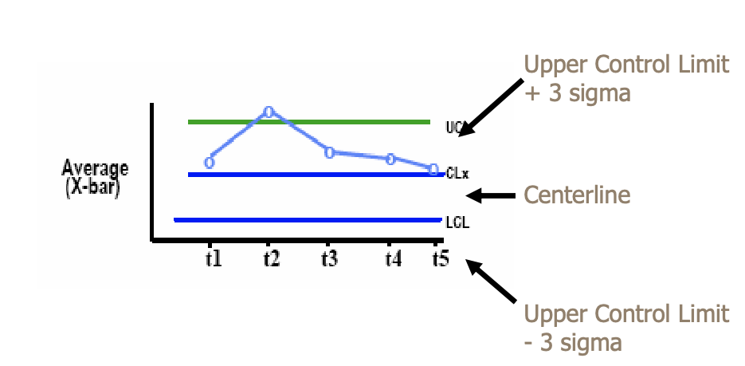
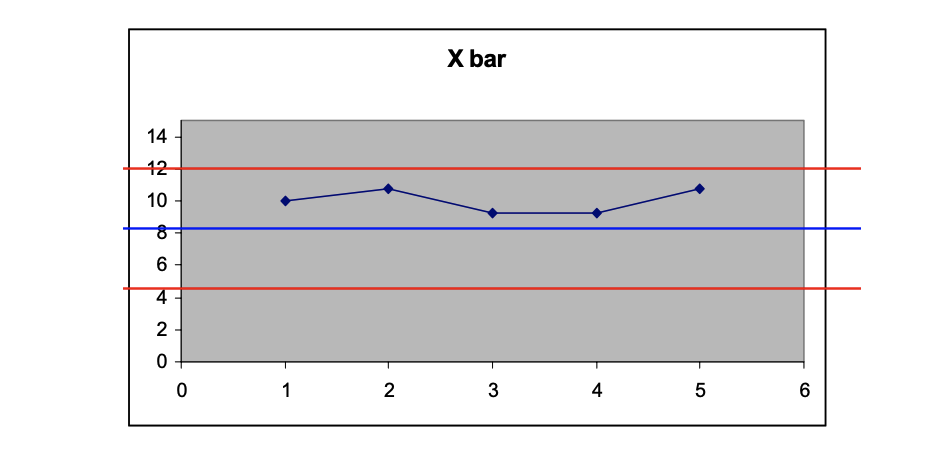
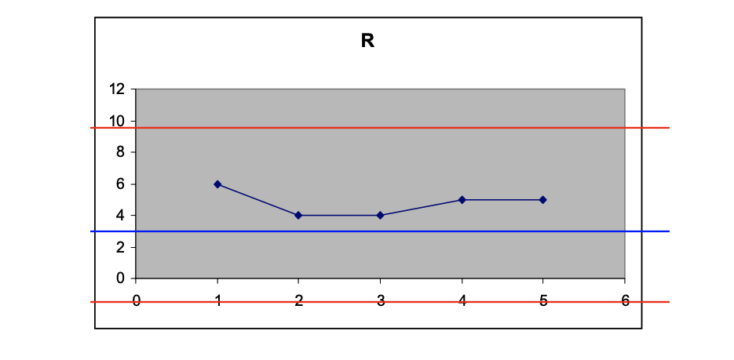
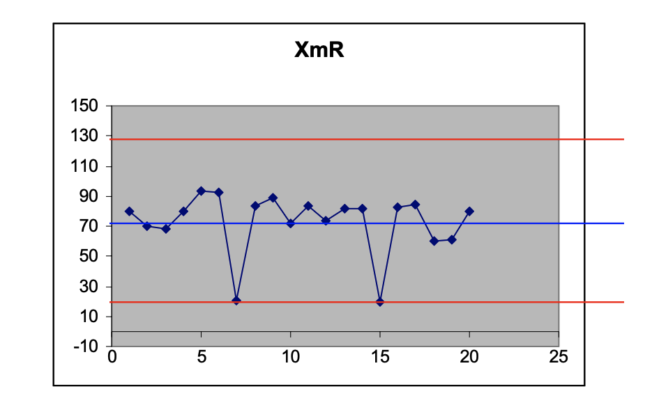
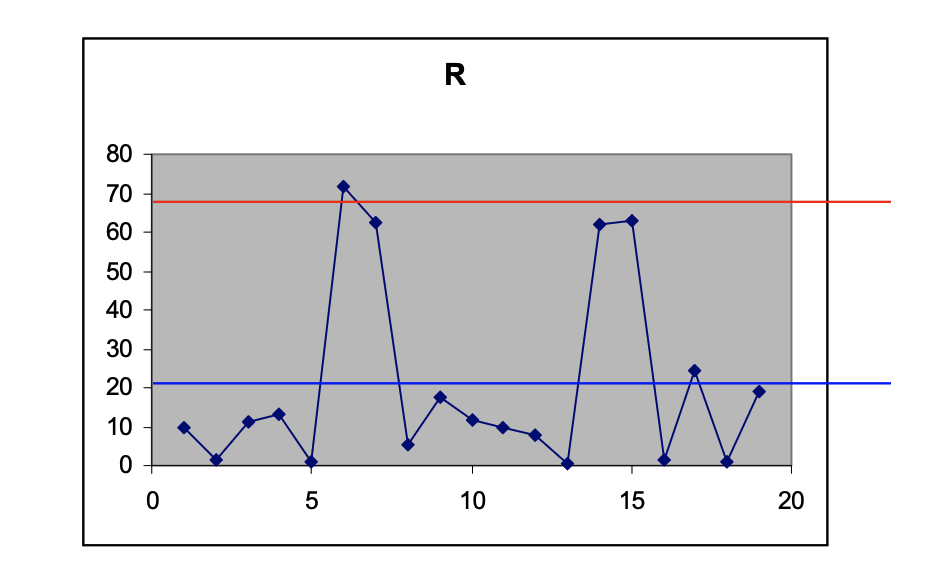

# Lecture 8: analyzing process behavior with control charts

## Analyzing process behavior

> A phenomenon is said to be controlled when, through the use of past experience, we can predict, at least within limits, how the phenomenon may be expected to vary in the future

- Culturally, this is a movement to statistically based decision making
- Data are generally collected as basis for action
- Variation exists in all data and consists both
  - Noise: common cause of variation
  - Signal: assignable cause of variation
- Total variation is the sum of common cause variation and assignable cause variation
  - Want to draw inference that can be used to guide decisions and actions
  - One needs simple and effective ways to detect assignable cause surrounded by common causes

### Understanding variation

- When a process is stable
  - Variation in process performance is predictable
  - Variation is attributable to common cause
  - Predictable being synonymous with *in control*
- Assignable causes of variation arise from events that are not part of the normal  process
- One of the techniques that is often used to establish operational limits for acceptable variation is the use of **control charts**
- Control charts are techniques for quantifying process behavior

### Fantasy vs. reality

| Fantasy | Reality |
| ------- | ------- |
| All data in work environment is presented in graphics |  All data in work environment is presented at data tables |

## Control charts to the rescue

- Separate signal from noise, so that you can recognize a process change when it occurs
  - Identifies usual events
  - Point out fixable problems (assignable causes)
  - Hint at potential process improvements

### Anatomy of a control chart

### Building X-bar and R charts

Lets build an X-bar and R chart from the following dataset to determine if the process is stable

|   | Sample1 | Sample2 | Sample3 | Sample4 |
| - | ------- | ------- | ------- | ------- |
| T1 | 13 | 11 | 9 | 7 |
| T2 | 12 | 12 |11 | 8 |
| T3 | 12 | 9 | 8 | 8 |
| T4 | 12 | 9 | 9 | 7 |
| T5 | 13 | 11 | 11 | 8 |

**The tools**

1) Compute the average $\bar{X}$ and range $R$ for ech subgroup of size $n$, for each of the $k$ subgroups

$$
    \bar{X}_i = \frac{X_{1} + X_{2} + \dots + X_{n}}{n}
$$

$$
    R_{k} = \vert X_{MAX} - X_{MIN} \vert
$$

2) Compute the grand average $\bar{\bar{X}} by averaging each of the $k$ subgroup averages

$$
    \bar{\bar{X}} = \frac{\bar{X_{1}} + \bar{X_{2}} + \dots + \bar{X_{k}}}{k}
$$

3) Compute the average range $\bar{R}$ by averaging each off the $k$ subgroup ranges

$$
    \bar{R} = \frac{R_{1} + R_{2} + \dots + R_{k}}{k}
$$

**Average X-bar limits**

- The upper control limit is given by: $UCL_{\bar{X}} = \bar{\bar{X}} + A_{2}\bar{R}$
- The grand average gives the centerline
- The lower control limit is given by: $LCL_{\bar{X}} = \bar{\bar{X}} - A_{2}\bar{R}$

**Average range limits**

- The upper control limit is given by: $D_{4}\bar{R}$
- The average range gives the centerline
- The lower control limit is given by: $D_{3}\bar{R}$

**The data**

| Solution | Xbar | R |
| -------- | ---- | - |
| T1 | 10 | 6 |
| T2 | 10.75 | 4 |
| T3 | 9.25 | 4 |
| T4 | 9.25 | 5 |
| T5 | 10.75 | 5 |

- Averages
  - $\bar{\bar{X}} = 10$
  - $\bar{R} = 4.8$
- Xbar limits
  - $UCL = 13.4992$
  - $CL = 10$
  - $LCL = 6.5008$
- R limits
  - $UCL = 10.9536$
  - $CL = 4.8$
  - $LCL = 0$

**The charts**

### Stability and capability

**Stability**

- Is the process we are managing behaving predictably?
- Foundation for estimating (predicting) and making commitments
- Operating within natural boundaries UCL and LCL

**Capability**

- Is the process capable of delivering products that meet requirements?
- Does the performance of the process meet the business needs of the organization?
- Foundation for making commitments
- Operating within business goals or objectives

**Detection rules**

1) A single point falls outside the 3-sigma control limits
2) At least two of three successive values fall on the same side of, and more than two sigma units away from the center line
3) At least four out of five successive values fall on the same side of, and more than one sigma unit away from the center line
4) At least eight succesive values fall on the same side of the center line

### XbarR and XmR charts

- $\bar{X}$ is average of rational (homogenous) subgroups, usually with 4-6 items sampled
- For most software processes, individual data are preferred, leading to the other basic control chart, the XmR chart

**Individual chart limits**

- Upper natural process limit is given by: $UNPL_{x} = \bar{X} = \frac{3\bar{mR}}{d_{2}}$
- Centerline is given by: $CL_{X} = \bar{X} = \frac{1}{k}\sum_{i=1}^{i=k} X_{i}$
- Lower natural process limit is given by: $LNPL_{X} = \bar{X} - \frac{3\bar{mR}}{d_{2}}$

**Moving range chart limits**

- Upper control limit for moving range is given by: $UCL_{R} = D_{4}\bar{mR}$
- Center line or average moving range is given by: $CL_{R} = \bar{mR}$
- Lower control limit for moving range is given by: $LCL_{R} = D_{3}\bar{mR}$

**The charts**

## Applying process behavior

- Many organizations focus on the analysis of the peer review process behavior
  - What are the product attributes from a peer review
  - What are the process attributes that come from a peer review process
- Taking a closer look at peer review process, data collection, storage, and usage
  - SP 2.1: prepare for peer reviews of selected work products
  - SP 2.2: conduct peer reviews on selected work products and identify issues resulting from the peer review
  - SP 2.3: analyze data about preparation, conduct, and results of the peer reviews
