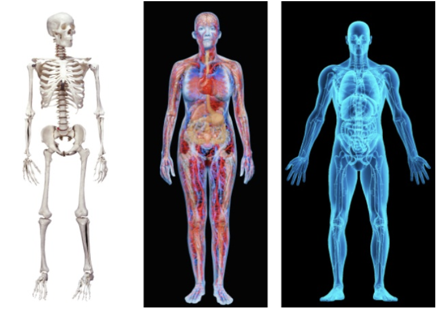

# Lecture 1: what is software architecture?

## Defining software architecture

- Software systems are constructed to satisfy an organization's business goals
- Architecture bridges business goals to the resulting system
  - Path from abstract goals to concrete systems is complex
  - There are known techniques to tame it and make it traceable
- Software architecture covers
  - Design, analysis, documentation and implementation of architectures
  - Influences, which inform these activities
    - A software engineering point of view (how and what)
    - A business and organizational perspective (value brought to project)
  - The set of structures needed to reason about the system (software elements, relations, and properties)

## What software architecture is and isn't

- Many architecture decisions are made early on (but not all of them)
- Early decisions do not constitute and architectural
  - Difficult to tell if a decision is major
  - Time will give the answer
  - Writing down the architecture is one of the architect's most important obligations

### A set of software structures

- The first and most obvious implication of our definition
- A structure is a set of elements held together by a relation
  - Software systems are composed of many structures
  - No single structure claims being the architecture
- Three categories of architecture structures play and important role in designing, documenting, and analyzing architectures
  - Static: partition the system into implementation units (modules)
  - Dynamic: the way elements interact at runtime to carry out functionality
  - Allocation: describes the mapping from software structures to system's organizational, development, install, and execution environments
- A structure is architectural if it helps reason about the system and its properties
  - Reasoning should be about an attribute that is important to some stakeholder
  - Includes quality attributes that may be important to a stakeholder
- The set is not limited or fixed
- If it is useful in your context for your system, it is architectural

### An abstraction

- Architectures comprise of software elements and how they interact with each other
  - Certain information that does not assist with reasoning about the system is omitted
- Architecture is concerned with the public side of software elements
  - Details dealing with internal implementation are not architectural
  - Goes beyond just interfaces to let us examine arrangements, interactions, compositions and properties
  - An essential part to tame system complexity

### Present in every software system

- Every system can be shown to comprise of some set of elements and the relation amongst them to support some type of reasoning
- It is not necessarily true that the architecture of a system is known to anyone
- There can even be differences between the actual architecture of the system and how it is represented

### Includes behavior

- If behavior helps reason about the system, it is part of the architecture
  - Embodies how elements interact with each other
  - Influences other elements or the system (behavior must be considered and documented)
- Box and line drawing are not architectures at all

### Not all of them are good

- Trial and error is an unacceptable method to choosing an architecture
- Picking an architecture at random and hoping for the best

### System and enterprise architectures

- Affect software architecture through establishment of constraints which a software system must live
- Software architect should provide input into decisions on system or enterprise architecture

**System architecture**

- Representation of a system in which
  - A mapping from functionality to hardware and software components exists
  - A mapping of the software architecture onto hardware architecture exists
  - A concern for human interaction with these components exists
- Concerns itself with the entire system (hardware +  software + humans)

**Enterprise architecture**

- Describes the structure and behavior of
  - An organization's processes
  - Flow of information
  - Personnel and organizational subunits
- Aligned by the organization's core goals and strategic direction
- Concerned with how an enterprise's software system supports business processes and goals of the enterprise

**Connection to software architectures**

- Can be designed, evaluated, and documented
- Answers to requirements
- Intended to satisfy stakeholders
- Consists of structures (which consist of elements and relations)
- Have a repertoire of patterns and styles at their architect's disposal

## Architectural structures and views

- The pictured above depict different views of the human body
- Each present a different set of properties, but all are inherently related
- Together, they describe the architecture of the human body

**Software views**

- Modern software is frequently too complex to grasp all at once
- Restrict attention to one (or a small number) of software system's structures

**Structures and views**

- A view represents a coherent set of architectural elements
- A single structure is a set of elements itself
- A view represents a structure
- Architects design structure and document views of those structures

### Three kinds of structures

**Module structures**

- Depict how system is to be structured as a set of code or data units (to be constructed or procured)
- A static way of considering the system
- Modules are assigned areas of functional responsibility
- An excellent way to reason about a system's modifiability
- Module structures answer the following questions
  - What is the primary functional responsibility assigned to each module?
  - What other software elements is a module allowed to use?
  - What other software does it actually use and depend on?
  - What modules are related to other modules by generalization or specialization relationships?
- Useful module structures
  - Decomposition structure
  - Uses structure
  - Layer structure
  - Class (or generalization) structure
  - Data model

**Component-and-connector structures**

- Depict how the system is structured as a set of elements with runtime behavior and interactions
  - Runtime components: principal units of computation
  - Connectors: communication vehicles among components
- Component-and-connector views answer the following questions
  - What are the major executing components and how do they interact at runtime?
  - What are major shared data stores?
  - Which parts of the system are replicated?
  - How does data progress through the system?
  - What parts of the system can run in parallel?
  - Can the system's structure change as it executes and, if so, how?
- Useful C&C structures
  - Service structure
  - Concurrency structure

**Allocation structures**

- Depict how the system will relate to non-software structures in its environment
- Show the relationship between software elements and elements in one or more external environment
- Allocation views answer the following questions
  - What processor does each software element execute on?
  - In what directories or files is each element stored during development, testing, and system building?
  - What is the assignment of each software elements to development teams?
- Useful allocation structures
  - Deployment structure
  - Implementation structure
  - Work assignment structure

### Structures provide insight

- Structures play an important role in perspective on software architecture
  - Each structure provides insight into the design
  - Each structure can be analyzed for its ability to deliver a quality attribute
  - Each structure presents the architect with an engineering leverage point
  - Appropriately designed structures allow desired quality attributes to emerge

### Relating structures to each other

- Each structure provides a different perspective and design handle on a system
- Although structures give different perspective, they are not independent
- Elements of one structure will relate to elements of other structures

### Fewer is better

- Not all systems warrant consideration of many architectural structures
- Larger systems involve more dramatic differences between structures
- Small systems often get by with fewer
- Document structure only if there is a positive return (usually in terms of decreased development or maintenance cost)

### Which to choose?

- Think about various structures available
- Choose the ones the provide the most insight and leverage into the system's most important quality attributes

## Architectural patterns

- Architectural elements can be composed in such a way to solve particular problems
  - Such compositions have been found useful over time
  - These compositions are known as architectural patterns
  - Patterns delineate element types and their forms of interaction
- Common patterns by element type
  - The layered pattern for modules
  - Shared-data (repository) pattern of client-server pattern for C&C
  - Multi-tier pattern and competence pattern for allocation elements
- An architectural pattern is defined by
  - A set of element types
  - A topological layout of the elements indicating their interrelationships
  - A set of semantic constraints
  - A set of interaction mechanisms that determine how elements coordinate through the allowed topology

## What makes a "good" architecture?

- No such thing as an inherently good or bad architecture
- Architectures either more or less are fit for a purpose
  - They can be evaluated for this
  - But only in the context of specifically stated goals
- There are "rules of thumb" to follow when designing architectures
  - Not applying these does not mean the architecture will be flawed
  - It should serve as a warning sign of investigation that is needed

**Process recommendations**

1) The architecture should be the product of a single architect or a small group of architects
2) The architect (or architecture team) should base the architecture on a prioritized list of well specified quality attribute requirements
3) The architecture should be documented using views that address the concerns of the most important stakeholder
4) The architecture should be evaluated for its ability to deliver the system's important quality attributes early and often
5) The architecture should lend itself it incremental implementation

**Product recommendations**

1) The architecture should feature well-defined modules whose functional responsibilities are assigned on the principles of information hiding and separation of concerns
2) Quality attributes are typically achievable using well-known architectural patterns and tactics
3) The architecture should never depend on a particular version of a commercial product or tool
4) Modules that produce data should be separate from modules that consume data
5) Don't expect a one-to-one correspondence between modules and components
6) Every process should be written so that its assignment to a specific processor can be easily changed
7) The architecture should feature a small number of ways for components to interact
8) The architecture should contain a specific and small set of resource contention areas
