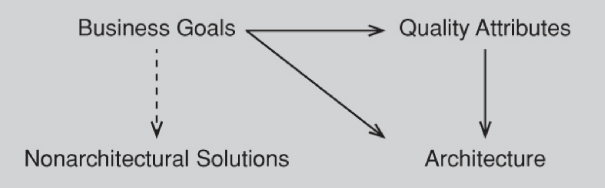
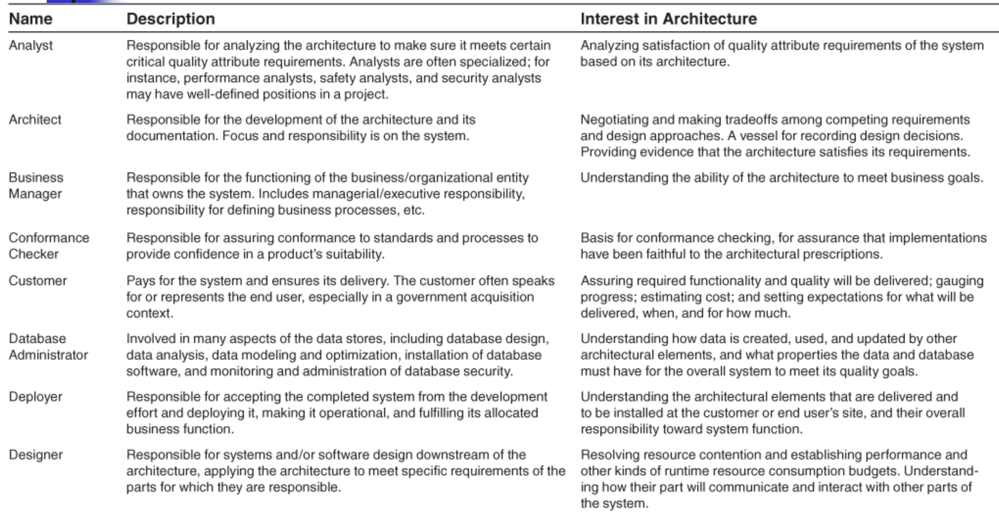
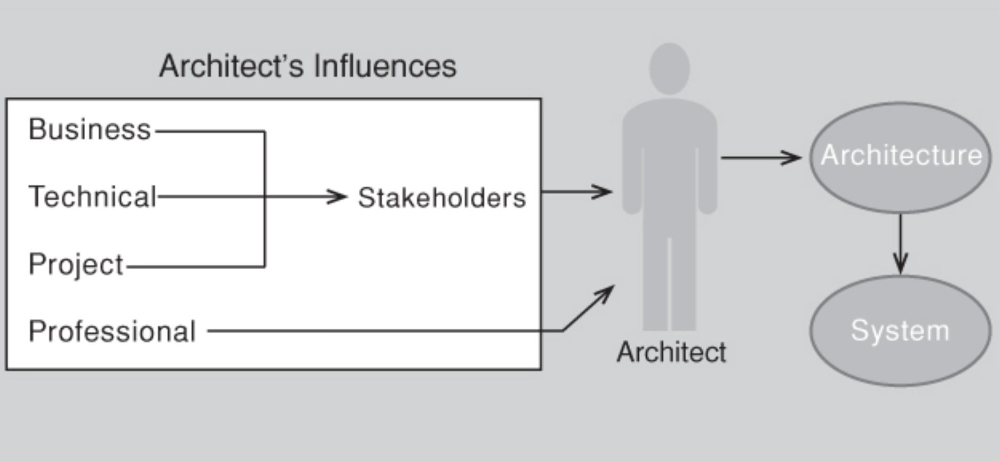
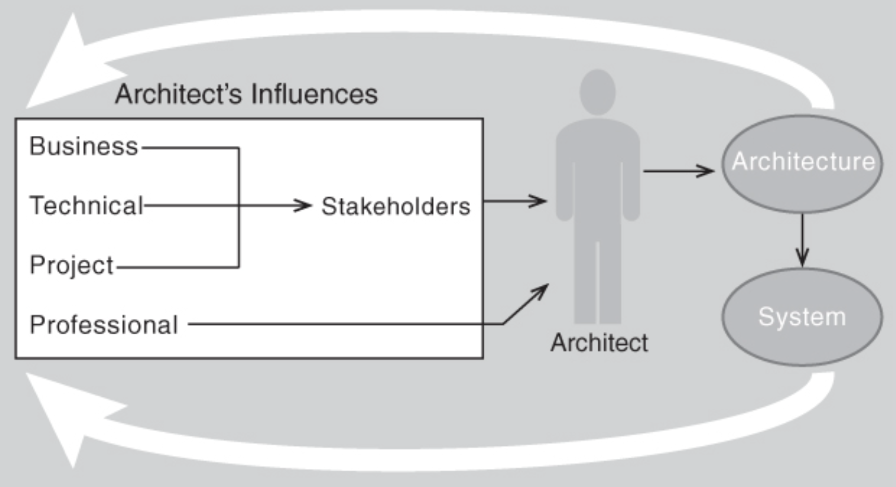

# Lecture 3: the many contexts of software architecture

## Architecture in a technical context

- Architecture inhibits or enables the achievement of quality attributes
- Supports reasoning about the consequences of change

### Inhibit or enable the achievement of quality attributes

**A few more quality attributes and the points of concern**

- If you care about your system's availability
  - Concern yourself with how components take over for each other in the event of failure
  - Concern yourself with how the system responds to faults
- If you care about usability
  - Isolate UI details and elements responsible for UX
  - Allows these elements to be tailored and improved over time
- If safety is a concern
  - Be aware of the behavioral envelope of elements
  - Be alert of emergent behavior of elements working in concert
- If you care about interoperability between your system and another
  - Take concern with elements responsible for external interactions
  - Control those interactions

> If you __care about this quality attribute__ you have to __be concerned with these decisions__

**What about functionality?**

- Architecture primarily provides containers which the architect places functionality
- Functionality is not so much a driver for architecture as it is a consequence of it

### Architectures and the technical environment

A technical environment that is __current__ when an architecture is designed will __influence__ that architecture

- Standard industry practices or software engineering techniques prevalent in architects' professional community
- Brave architects consider other designs for information systems that are not
  - Web-based
  - Object oriented
  - Service oriented
  - Mobility aware
  - Cloud based
  - Social networking friendly
- Wasn't always like this (and won't always be like this) when new technological trends emerge

## Architecture in the project life-cycle context

### Waterfall

- This model organizes the life-cycle into a series of connected sequential activities
  - Each with entry and exit conditions
  - Formalized relationships with upstream and downstream neighbors
- Process follows a linear flow
  1. Requirements specification
  2. Followed by design
  3. Then implementation
  4. Then integration
  5. Then testing
  6. Then installation
  7. All followed by maintenance
- Feedback paths from later to earlier steps
  - Allow for revision of artifacts
  - Are used on an as-needed basis based on knowledge acquired at a later stage

### Iterative

- Became clear to treat software development as a series of short cycles through the steps
- Such cycles are called iterations
  - Each iterations should deliver something working and useful
  - Trick is to uncover early requirements that have the most far-reaching effect on the design
  - Danger is to overlook requirements that will capsize design decisions make so far
- A well known iterative process is the **unified process**
  - Includes 4 phases: inception -> elaboration -> construction -> transition
  - A set of chosen use case defines the goals of the iteration
  - Iterations are ordered to address the greatest risks first

### Agile

- Refers to the group of software methodologies known to include Scrum, Extreme Programming, and Crystal
- These methodologies are incremental and iterative
- Agile practices are distinguished with
  - Early and frequent delivery of working software
  - Close collaboration between developers and customers
  - Self organizing teams
  - A focus on adaptation to changing circumstances
- All agile methodologies focus on 
  - Teamwork
  - Adaptability
  - Close collaboration
- Agile methodologies eschew substantial upfront work
  - Assumes that requirements always change
  - Will continue to change throughout a project's life-cycle
- May seem that agile methodologies and architecture cannot coexist
  - Will be shown that this is **not** so

### Model-driven development

- Based on the idea that
  - Humans should **not** write code in programming languages
  - Should create models of the domain (from which code is automatically generated)
- Human create a __platform-independent model__ (PIM) and combine it with a __platform-definition model (PDM) to create running code 
  - PIM is a __pure realization__ of the functional requirements
  - PDM addresses platform specifics and quality attributes

### Shared activities

- No matter which life-cycle model you use
  - There are a number of activities involved in creating a software architecture
  - Use that architecture to realize a complete design
  - Implement or manage the evolution of the target system or application
- The process determines how often you revisit and elaborate each of these activities

**Making a business case**

- A business case justifies an organizational investment
  - A tool that helps make business decisions by predicting how they will affect your organization
  - Initially, the decision will be a go/no-go to pursue a business opportunity
  - Afterward, case is reviewed for accuracy of initial estimates and updated to examine new or alternative angles to the opportunity
- Serves as a repository of business and marketing data
  - Documents expected costs, benefits, and risks
  - More broad than simply assessing the market for need
  - An important step for shaping and constraining any future requirements
- System's architect has specialized knowledge and must contribute to answers
  - Cannot be solely decided by the architect
  - Not consulting the architect may make it difficult for the organization to achieve business goals

**Understanding the architecturally significant requirements**

- Object oriented analysis: use cases and scenarios embody requirements
- Safety critical systems: more rigorous approaches like finite-state machines or formal specification language
- Quality attributes scenarios: aid in brainstorming, discussion, and capture of quality attribute requirements
- Software product lines: similar systems' characteristics
- Prototypes: model and explore desired behavior, design UI, analyze resource utilization

**Creating or selecting the architecture**

- Fred brooks argues in *The Mythical Man Month*
  - Conceptual integrity is key to sound system design
  - Conceptual integrity can only be had by a small number of minds
- Good architecture almost never results as an emergent phenomenon
- There are practical techniques to create an architecture that will achieve behavioral and quality requirements

**Documenting and communicating the architecture**

- Effect architectures are communicated clearly and unambiguously to all of the stakeholders
- Documentation should be informative, unambiguous, and readable to people of varied backgrounds
- It should also be minimal and aimed at stakeholders that will use it

**Analyzing or evaluating the architecture**

- Any design process will yield multiple candidate designs to consider
  - An architect's greatest challenge: choose among the competing designs in a rational way
- Evaluating architecture for qualities it supports
  - Ensures the system is constructed from that architecture
  - Satisfies  the stakeholders' needs

**Implementing and testing the system based on the architecture**

- Keep developers faithful to the structures and interaction protocols constrained by the architecture
- Having an explicit and well-communicated architecture is the first step to conformance
- Having an environment or infrastructure that actively assists developers to create and maintain that architecture is even better

**Ensuring that the implementation conforms to the architecture**

- Be vigilant to ensure actual architecture and its representation remain faithful to each other
- If out of sync: either fix implementation or update architectural documentation

## Architecture in a business context

### Architectures and business goals

- Systems are created to satisfy the business goals or one or more organizations
  - Development organization want to make a profit/stay in business
  - Customers usually want to make lives easier or more productive
  - Other organizations have their own goals dealing with the system
- Architects need to understand who the vested organizations are and what their goals are
  - Many business goals manifest as quality attribute requirements
  - Some business goals will not show up in the form of requirements
  - Other business goals have no effect on the architecture whatsoever

### Architectures and the development organization

- Contributes many of the business goals that influence architecture
  - An organization with programmers familiar with peer-to-peer communication
  - May be the favored approach by management, implicitly supporting the goal to
    - Not invest significantly in retraining of existing staff
  - May not be supported by management, implicitly supporting the goal to
    - Not wanting to hire new staff
    - Lay off existing staff

## Architecture in a professional context

### What do architects do?

- Need more than just technical skills
- Need to be able to explain to stakeholders (perhaps nontechnical)
  - Chosen priorities of different properties
  - Why expectations and not all fulfilled
- To be effective, an architect needs
  - Diplomatic skills
  - Negotiation skills
  - Communication skills
- Perform many activities beyond producing an architecture
  - Duty: backbone of individual architecture competence
  - Communicate ideas clearly
  - Need up-to-date knowledge of patterns
- Duties, skills, and knowledge form a triad on which architecture competence rests
  - Need to be involved in supporting management and dealing with customers
  - Manage diverse workloads and be able to switch contexts frequently
  - Need to know business considerations
  - Need to be a leader in the eyes of developers and management

### Architects' background and experience

- Architects are products of their experiences
  - Good results give confidence to try the same approach
  - Bad experiences make one reluctant to try it again
- Choices also come form education and training
  - You and your organization must be aware of this influence
  - Allows you to manage it to the best of your abilities

## Stakeholders

- A stakeholder is anyone who has a stake in the success of the system
  - Stakeholders typically have different specific concerns they wish the system to guarantee or optimize
  - One of the best pieces of advice for architects: know your stakeholders
- Identify and activity engage stakeholder
  - Solicit their needs and expectations
  - Early engagement allows you to
    - Understand constraints of a task
    - Manage expectations
    - Negotiate priorities
    - Make trade-offs
- Architecture evaluation and iterative prototyping are two means to achieve stakeholder management
  - Problem is that each stakeholder has different concerns and goals (which may contradict)
  - Rare that requirements document are good at capturing all system quality requirements in testable detail
  - Architect often how to fill in the blanks and mediate conflicts that emerge

## How is architecture influenced?

- Software designers taught to build systems based on technical requirements
- Requirements only make some of the properties of the final system explicit
- Suppose two different architects are given the same specification
  - Would they produce the same or different architectures?
  - Answer: they would likely product very different architectures
  - This belies the notion that requirements determine architecture
- Architecture is also a result of business and social influences
  - Existence of an architecture affects business, social, and technical environments
  - This influence future architectures
  - Each context plays a role in influencing an architect and their architecture

- Architect with a deadline to meet may make one decision that an architect with an easy to satisfy deadline may not
- An architect designing a real-time system may make different choice to one that is not
- Even with same requirements, hardware, support software, and human resources available, an architect designing a system today is likely to design a different system that might have been designed 5 years ago

## What do architectures influence?

- Architectures have an influence on the very factors that influence them
- The existence of an architecture affects all the contexts and subsequently future architectures

**Technical context**

- Stakeholder requirements for the next system
- Giving the customer the opportunity to receive a system in a more reliable, timely, and economic manner
- Product lines have the same effect on customers who cannot be flexible with their requirements

**Project context**

- Architecture prescribes units of software to implement and integrate into the system
- Schedules and budgets allocate resources in chunks corresponding to units
- Groups have a strong voice in the system's decomposition
- They pressure for the continued existence of the portions they control

**Business context**

- Can affect the business goals of a development organization
- A successful system can enable a company to establish a foothold in a particular market segment
- Architectures provide opportunities for efficient production and deployment of similar systems
- Organization may adjust goals to take advantage of newfound expertise and plumb the market

**Professional context**

- Affects architect's experience with subsequent systems
- A system built successfully using a particular approach will make the architect more inclined to use it again
- Architectures that fail are less likely to be chosen for future projects

