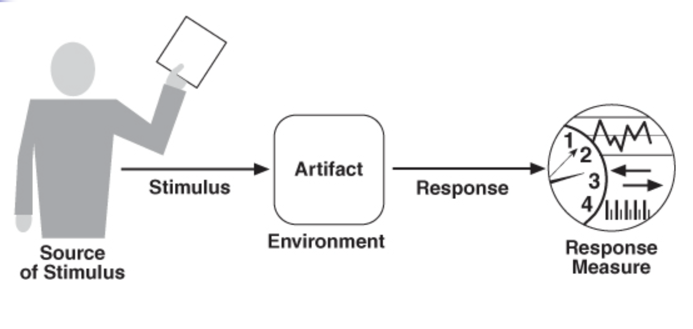

# Lecture 4: understanding quality attributes

## Quality attributes

**Seven quality attributes**

1) Availability
2) Interoperability
3) Modifiability
4) Performance
5) Security
6) Testability
7) Usability

> Chapters 5-11 will cover each of these quality attributes in detail

**Specifying a quality attribute**

- Design techniques called tactics enable the achievement of a particular quality attribute requirement
- Architectural patterns provide known solutions to common problems in architectural design
- Being able to analyze a design for a particular quality attribute is a key skill for an architect

**Seven categories of design decisions**

1) Allocation of responsibilities
2) Coordination model
3) Data model
4) Mapping among architectural elements
5) Resource management
6) Binding time
7) Choice of technology

> Categories develop a checklist to help focus on aspects associated with a quality attribute and ensure completeness of the design and analysis process

## Understanding them

**Functionality versus quality**

- Although closely related, functionality takes the front seat in the development scheme
- Preference for functionality is a shortsighted one
- System redesigns can occur frequently
  - Not because they are functionally deficient (replacements are typically functionally identical)
  - Because they are difficult to maintain, port, scale
  - Or because they are too slow or have been compromised by hackers

**What are they?**

- The first place to address them is during the architecture design phase
- The mapping of functionality onto software structures determines support for quality requirements
  - Ch.5 - 11 will discuss various qualities and their supporting architectural decisions
  - Ch. 17 will show how to integrate all quality attribute decisions into a single one
- A quality attribute is measurable or testable property of a system
  - Indicates how well a system satisfies the needs of its stakeholders
  - Think of it as measuring the "goodness" of a product along some dimension of interest to a stakeholder
- Right now, we focus on understanding the following
  - How to express the qualities we want our architecture to provide to the system or systems
  - How to achieve those qualities
  - How to determine the design decisions we might make with respect to those qualities

## Architecture and requirements

- Requirements for a system come in a variety of forms
  - Textual requirements
  - Mockups
  - Existing systems
  - Use cases or user stories
  - Architecturally significant requirement
- No matter the source, all requirements encompass the following categories
  - Functional requirements
  - Quality attribute requirements
  - Constraints

**Functional requirements**

- States what the system must do
- Describes how it behaves or reacts to runtime stimuli

**Quality attribute requirements**

- Qualifications of a functional requirement or the overall system
- Qualification of a functional requirement is an item like
  - How fast the function must be performed
  - How resilient it is to erroneous input
- Qualification of the overall product is an item like
  - Time to deploy the product
  - Limitation of operational costs

**Constraints**

- A design decision with zero degrees of freedom
- It is a decision that has already been made
  - Required to use a certain programming language
  - Reuse a certain existing module
  - A management fiat to make the system service oriented
- Choices are arguably in the purview of the architect
  - External factors lead those in power to dictate design outcomes

**The architect's response**

| Requirement Type | Architect's Response |
| ---------------- | -------------------- |
| Functional requirement | Assign appropriate sequence of responsibilities to architectural elements throughout the design |
| Quality attribute requirement | Select structures and define appropriate behaviors and interactions for the elements populating the structures |
| Constraints | Accept the design decision and reconcile it with other affected design decisions |

## Functionality

- Functionality is the ability of the system to do the work for which it was intended
- Functionality has the strangest relationship to architecture
  - It does **not** determine the architecture
  - Given a set of required functionality, there is no end architecture that could satisfy it
  - Instead, functionality is divided up into pieces and each is assigned to different architectural elements
- If functionality was the only thing that mattered, dividing the system into pieces would not be required at all
- Systems are designed as structured sets of cooperating architectural elements
  - Makes them understandable and supports a variety of other purposes
  - Those "other purposes" are other quality attributes
- Functionality is achieved by assigning responsibilities to architectural elements
  - Cannot be arbitrarily allocated to any module
  - Allocation is constrained when other quality attributes are important

## Quality attribute considerations

- Quality attributes do not stand on their own; they pertain to the functions of the system
  - A functional requirement could be: "When a user presses the green button, the Options dialog appears"
  - A performance annotation might describe how quickly the dialog will appear
  - An availability annotation might describe how often this function will fail and how quickly it can be repaired
  - A usability annotation might describe how easy it is to learn this function
- Functionality describes *what* the system does and quality describes *how well* the system does the function
  - Non-functional requirements include other requirements than functional
  - Some engineer prefer the word "responsibility" to describe computations that a system must perform
- From an architect's perspective, there are 3 problems with the previous discussion of system quality atributes
  - 1) The definitions provided for an attribute are not testable
  - 2) Discussion focuses on which quality a particular concern belongs to
  - 3) Each attribute community has developed its own vocabulary

## Specifying quality attribute requirements

- A quality attribute requirement should be unambiguous and testable
- A common form can be used to specify all quality attribute requirements
  - Emphasizes the commonalities among all quality attributes
  - Can occasionally be a forced fit for some aspects of quality attributes

**Common form**

The common form for quality attribute expression has these 4 basic Parts

1) Stimulus: to describe an event arriving at the system
2) Stimulus source: the source of the stimulus may affect how it is treated by the system
3) Response: how the system should respond to the stimulus
4) Response measure: determining whether a response is satisfactory (does it satisfy the requirement?)

But there are two more characteristics that are important

1) Environment: the set of circumstances in which the scenario takes place
2) Artifact: the portion of the system to which the requirement applies

**Six-part scenarios**

| Part Name | Part Description |
| --------- |:---------------- |
| Source of stimulus | Some entity (human, computer system, other actuator) that generates the stimulus |
| Stimulus | A condition that requires a response when it arrives at a system |
| Environment | The stimulus occurs under certain conditions
| Artifact | Some artifact is stimulated |
| Response | The activity undertaken as the result of the arrival of the stimulus |
| Response measure | When the response occurs, it should be measurable in some fashion so that the requirement can be tested |

**General and concrete scenarios**

- General quality attribute scenarios are those that are system independent and can potentially pertain to any system
- Concrete quality attributes scenarios are specific to the particular system under consideration
- Quality attributes can be characterized as a collection of general scenarios
- They can be translated to requirements for a particular system

**Parts of a quality attribute scenario**

> A general scenario for availability

| Part Name | Scenario Description |
| --------- |:---------------- |
| Source of stimulus | Internal/external people, hardware, software, physical infrastructure, physical environment |
| Stimulus | Fault: ommision, crash, incorrect timing, incorrect response |
| Environment | Normal operation, strartup, shutdown, repair mode, degraded operation, overloaded operation |
| Artifact | Processors, communication channeals, persistent storage, processes |
| Response | Prevent fault from becoming failure: disable event source, be unavailable, fix/mask, degraded mode |
| Response measure | Time or time interval system must be available |

## Achieving quality attributes through tactics

**What is a tactic?**

- A design decision that influences the achievement of a quality attribute response
  - Directly affect the system's response to some stimulus
  - Impart portability to one design, high performance to another, integrability to a third
- A tactic focuses on a single quality attribute response
  - No consideration for trade-offs
  - Trade-offs must be explicitly considered and controlled by the designer
- Tactics differ from architectural patterns, where trade-offs are built into the pattern
- A system design consists of a collection of decisions
  - Some decisions help control quality attribute responses, other ensure achievement of system functionality
  - Tactics, like design patterns, are design techniques that architects have been using for years

**Why tactics?**

1) By understanding the role of tactics, an architect can more easily assess the options for augmenting an existing pattern to achieve a quality attribute goal
2) If no pattern exists to realize the architect's design goal, tactics allow the architect to construct a design fragment from "first principles"
3) By cataloging tactics, we provide a way of making design more systematic within some limitations

## Guiding quality design decisions 

The seven categories of design decisions are

1) Allocation of responsibilities
2) Coordination model
3) Data model
4) Mapping among architectural elements
5) Resource management
6) Binding time
7) Choice of technology

Categories are not the only way to classify architectural design decisions, but provide a rational division of concerns

- Overlap is okay if a particular decision exists in two different categories
- Concern of the architect is to ensure every important decision is considered

### Allocation of responsibilities

- Decisions involving allocation of responsibilities include
  - Identifying the most important responsibilities
  - Determining how these responsibilities are allocated to non-runtime and runtime elements
- Strategies for making theses decisions include
  - Functional decomposition
  - Modeling real-world objects
  - Grouping based on the major modes of system operation
  - Grouping based on similar quality requirements
    - Processing frame rate
    - Security level
    - Expected changes

### Coordination model

- Software works by having elements interact with each other through designed mechanisms, collectively called the coordination model
- Decisions about the coordination model include
  - Identify elements of the system that must coordinate or are prohibited from coordinating
  - Determine properties of the coordination
    - Timeliness
    - Currency
    - Completeness
    - Correctness
    - Consistency
  - Choose the communication mechanisms that realize those properties
    - Stateful versus stateless
    - Synchronous versus asynchronous
    - Guaranteed versus non-guaranteed delivery
    - Other performance related properties

### Data model

- Every system must represent artifacts of system-wide interest (data) in some internal fashion
- The collection of those representations and how to interpret them is called the data model
- Decisions about the data model include
  - Choosing major abstractions, their operations, and their properties
    - How to create and initialize
    - How they are accessed, persisted, manipulated, and translated
    - How they are destroyed
  - Compiling metadata needed for consistent interpretation of data
  - Organizing the data
    - Keep data in a relational database or a collection of object or both
    - If both, how to map?

### Management of resources

- An architect may need to arbitrate the use of shared resources
  - Includes hardware resources
  - Includes software resources
- Decisions for management of resources include
  - Identifying the resources that must be managed and determining the limits for each
  - Determining which system element(s) manage each resources
  - Determining how resources are shared and the arbitration strategies employed when there is contention
  - Determining the impact of saturation on different resources

### Mapping among architectural elements

- An architecture must provide two types of mapping
  - 1) Mapping between elements in different types of architecture structures
  - 2) Mapping between software elements and environment elements
- Useful mapping include
  - Mapping of modules and runtime elements to each other
  - Assignment of runtime elements to processors
  - Assignment of items in the data model to data stores
  - Mapping of modules and runtime elements to units of delivery

### Binding time decisions

- Binding time decisions introduce allowable ranges of variation
  - Variation can be bound at different times in the software life cycle
  - A binding time decision establishes scope, point in life-cycle, and mechanism for achieving the variation
- Examples of binding time decisions include
  - For allocation of responsibilities: build-time selection of modules
  - For coordination model: design runtime negotiation of protocols
  - For resource management: design a system to accept new peripheral devices plugged in at runtime
- When making binding time decisions, consider:
  - Cost to implement the decision
  - Cost to make a modification after implementing the decision

### Choice of technology

- Every architecture must eventually be realized using a specific technology
  - Sometimes, technology is selected by others
  - This constrains decisions on our seven categories
- Architect may also choose a suitable technology to realize a decision
- Choice of technology decisions include
  - Which technologies are available
  - Whether available tools to support this technology choice are adequate
  - Determining extent of internal familiarity as well as the degree of external support available
  - Determining side effects of choosing a technology
  - Determining whether a new technology is compatible with an existing technology stack
