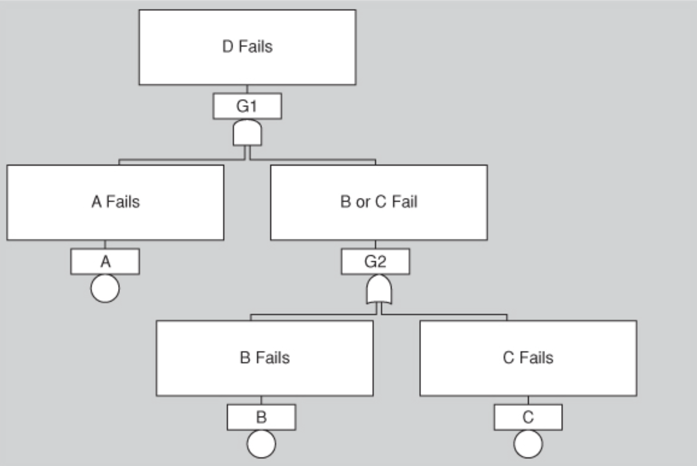
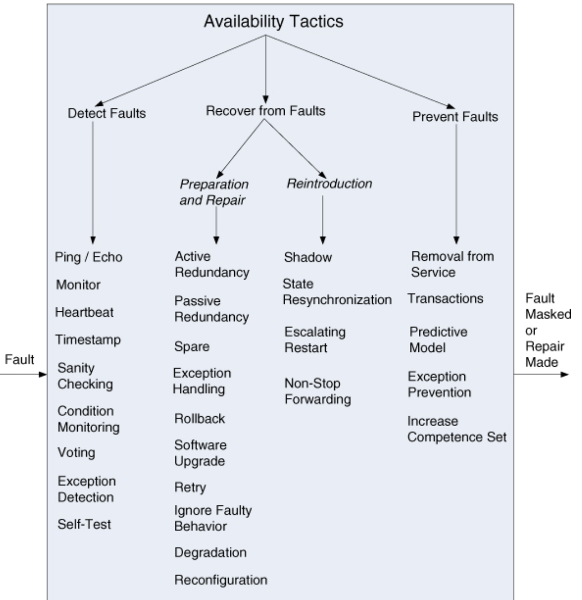

# Lecture 5: availability

## What is availability?

- Availability refers to a property of a software system that it is there and ready to carry out its task when you need it
  - Reliability: ability of an item to perform a required function under stated conditions for a stated period of time
  - Dependability: the ability to avoid failures that are more frequent and more severe than is acceptable
  - Availability is given by reliability and recovery (when the system breaks it repairs itself)
- Availability refers to the ability to mask or repair faults such that cumulative service outage does not exceed a specified time interval
  - Failure is subject to judgement of an external agent (possibly human)
  - Subsumes the concepts of reliability, confidentiality, integrity, and other quality attributes involving a concept of unacceptable failure
- Availability is closely related to:
  - Security: a denial of service attack designed to make a system fail (make it unavailable)
  - Performance: may be difficult to differ failure and slow responses
  - Safety: concerns keeping the system out of a hazardous state and limiting/recovering the damage when it does
- A fault (failure's cause) can be internal or external to the system under consideration
  - Faults can be prevented, tolerated, removed, or forecasted to make the system resilient to faults
  - We are concerned:
    - How system faults are detected
    - How frequently system faults may occur
    - What happens when a fault occurs
    - How long a system is allowed to be out of operation
    - When faults or failures may occur safely
    - How faults or failures can be prevented
    - What kinds of notifications are required when a failure occurs
  - When referring to hardware, $\frac{\text{MTBF}}{\text{MTBF} + \text{MTTR}}$ derives steady-state availability
    - $\text{MTBF}$ is the mean time between failures
    - $\text{MTTR}$ is the mean time to repair
    - In software, think about:
      - What can make the system fail
      - How likely it is to occur
      - Will there be some time required to repair
    - Scheduled downtime does not count against availability requirements
  - In operational systems
    - Faults are detected and correlated *prior* to being reported and repaired
    - Fault correlation logic categorizes faults according to
      - Severity (critical, major, minor)
      - Service impact (affecting or non-affecting)
    - This helps system operators
      - Provide a timely and accurate system status
      - Allow for an appropriate repair strategy to be employed (may be automated or require manual intervention)

### System availability requirements

| Availability | Downtime/90 days | Downtime/year |
| ------------ | ---------------- | ------------- |
| 99.0% | 21 hours, 36 minutes | 3 days, 15.6 hours |
| 99.9% | 2 hours, 10 minuts | 8 hours, 0 minutes, 46 seconds |
| 99.99% | 12 minutes, 58 seconds | 52 minutes, 34 seconds |
| 99.999% | 1 minute, 18 seconds | 5 minutes, 15 seconds |
| 99.9999% | 8 seconds | 32 seconds |

- Examples of availability requirements associate threshold values for acceptable system downtime
- The term "high availability" typically refers to designs targeting availability of 99.999% (5 nines) or greater
- Only unscheduled outages contribute to system downtime

### Planning for failure

- Failure is not only an option, it is inevitable
- Make your system safe and available by planning for the occurrences of failure and handling them aplomb
  - Understand what kind of failures your system in prone to
  - Know the consequences of each failure
  - Use well-known techniques to get an handle on each failure

### Hazard analysis

- A technique that attempts to catalog the hazards that can occur during operation of a system
  - Categorizes each hazard according to severity
  - Assesses the probability of each hazard occurring
- Hazards for which the product of cost and probability exceed some threshold are subjected to mitigation activities

### Fault tree analysis

> Fault tree analysis is an analytical technique the specifies a state of a system that negatively impacts safety or reliability, and then analyzes the system's context and operation to find all the ways that the undesired state could occur

- Technique employs a graphic construct (the fault tree) to identify all sequential and parallel faults that will result in an undesired state (the top event)
- Contributing faults can be
  - Hardware failures
  - Human errors
  - Software errors
  - Any other pertinent events that can lead to an undesired state
- Symbols connecting events are gate symbols, taken from boolean logic diagrams
- Fault trees aid in system design and can be used to diagnose failures at runtime
  - If top event occurs, then one or more contributing failures has occurred
  - A complete fault tree can be used to track it down and initiate repairs

### Failure mode, effects, and criticality analysis (FMECA)

- Catalogs the kinds of failures a given type of system is prone to and the severity of their effects
- Relies on the history of failures of similar system in the past

## Tactics for availability

- A failure occurs when the system no longer provides a service consistent with its specification
- Failures are observable by the system's actors
- Availability tactics are designed to enable a system to endure system faults
- These tactics keep faults from becoming failures or at least bound the effects of the fault and make repair possible
- Note that tactics are often provided to you by software infrastructure
- The architect's job is to choose and assess rather than implement the right availability tactics

### Detect faults

- Before taking action regarding a fault, the presence of the fault must be detected or anticipated
- Tactics in this category include:
  - Ping/echo
  - Monitor
  - Heartbeat
  - Time stamp
  - Sanity checking
  - Condition monitoring
  - Voting (replication, functional redundancy, analytic redundancy)
  - Exception detection (system exceptions, parameter fence, parameter typing)
  - Self-test

### Recover from faults

- These tactics fall into preparation-and-repair and reintroduction tactics
  - Preparation-and-repair: based on a variety of combinations of retrying a computation or introducing redundancy
  - Reintroduction: concerned with reintroducing a failed component back into normal operation
- Preparation-and-repair tactics include:
  - Active redundancy (hot spare)
  - Passive redundancy (warm spare)
  - Exception handling
  - Rollback
  - Software upgrade
  - Retry
  - Ignore faulty behavior
  - Degradation
  - Reconfiguration
- Reintroduction tactics include:
  - Shadow
  - State resynchronization
  - Escalating restart
  - Non-stop forwarding

### Prevent faults

- What if the system prevented faults from occurring in the first place?
- These tactics deal with runtime means to prevent faults from occurring
- Can be done by means of
  - Code inspection
  - Pair programming
  - Solid requirements review
  - Other good engineering practices
- Tactics for fault prevention include
  - Removal from service
  - Transactions
  - Predictive model
  - Exception prevention
  - Increase competence set

## A design checklist for availability

> This design checklist supports the design and analysis process for availability

### Allocation of responsibilities

Determine the system responsibilities that need to be highly available. Within those responsibilities, ensure that additional responsibilities have been allocated to detect an omission, crash, incorrect timing, or incorrect response. Additionally, ensure that there are responsibilities to do the following:

- Log the fault
- Notify appropriate entities (people or systems)
- Disable the source of events causing the fault
- Be temporarily unavailable
- Fix or mask the fault/failure
- Operate in degraded mode

### Coordination model

Determine the system responsibilities that need to be highly available. With respect to those responsibilities, do the following:

- Ensure that coordination mechanisms can detect an omission, crash, incorrect timing, or incorrect response. Consider, for example, whether guaranteed delivery is necessary. Will the coordination work under conditions of degraded communication?
- Ensure that coordination mechanisms enable the logging of the fault, notification of appropriate entities, disabling of the source of event causing the fault, fixing or masking the fault, or operating in a degraded mode
- Ensure that the coordination model supports the replacement of the artifacts used (processors, communication channels, persistent storage, and processes). For example, does replacement of a server allow the system to continue to operate?
- Determine if the coordination will work under conditions of degraded communication, at startup/shutdown, in repair mode, or under overloaded operation. For example, how much lost information can the coordination model withstand and with what consequences?

### Data model

- Determine which portions of the system need to be highly available. Within those portions, determines which data abstractions, along with their operations and their properties could cause a fault of omission, a crash, incorrect timing behavior, or an incorrect response
- For those data abstractions, operations, and properties, ensure that they can be disabled, be temporarily unavailable, or be fixed or masked in the event of a fault
- For example, ensure the write requests are cached if a server is temporarily unavailable and performed when the server is returned to service

### Mapping amongst architectural elements

Determine which artifacts (processors, communication channels, persistent storage, or processes) may product a fault. Ensure the mapping (or remapping) of architectural elements is flexible enough to permit the recovery from the fault. This may involve a consideration of the following:

- Which processes on failed processors need to be reassigned at runtime?
- Which processors, data stores, or communication channels can be activated or reassigned at runtime?
- How data on failed processors or storage can be served by replacement units?
- How quickly the system can be reinstalled based on the units of delivery provided?
- How to (re)assign runtime elements to processors, communication channels, and data stores
- When employing tactics that depend on redundancy of functionality, the mapping from modules to redundant components is important. For example, it is possible to write one module that contains code appropriate for both the active component and backup component in a protection group

### Resource management

- Determine what critical resources are necessary to continue operating in the presence of a fault. Ensure there are sufficient remaining resources in the event of a fault to log the fault; notify appropriate entities; disable the source of event causing the fault; be temporarily unavailable; fix or mask the fault/failure; operate normally in startup, shutdown, repair mode, degraded mode, and overloaded operation
- Determine the availability time for critical resources, what critical resources must be available during specified time intervals, time intervals during which the critical resources may be in degraded mode, and repair time for critical resources. Ensure that the critical resources are available during these time intervals
- For example, ensure that input queues are large enough to buffer anticipated messages if a server fails so that the messages are not permanently lost

### Binding time

Determine how and when architectural elements are bound. If late binding is used to alternate between components that can themselves be sources of faults, ensure the chosen availability strategy is sufficient to cover faults introduced by all sources

- If late binding is used to switch between artifacts such as processors that will receive of be subject of faults, will the chosen fault detection and recovery mechanisms work for all possible binding?
- If late binding is used to change the definition or tolerance of what constitutes a fault, is the recovery strategy chosen sufficient to handle all cases? For example, if a fault is flagged after 0.1 milliseconds, but the recovery mechanisms takes 1.5 seconds to work, that might be an unacceptable mismatch
- What are the availability characteristics of the later binding mechanism itself? Can it fail?

### Choice of technology

- Determine the available technologies that can help detect faults, recover from faults, or reintroduce failed components
- Determine what technologies are available that help the response to a fault
- Determine the availability characteristics of chosen technologies themselves. What faults can they recover from? What faults might they introduce into the system?
