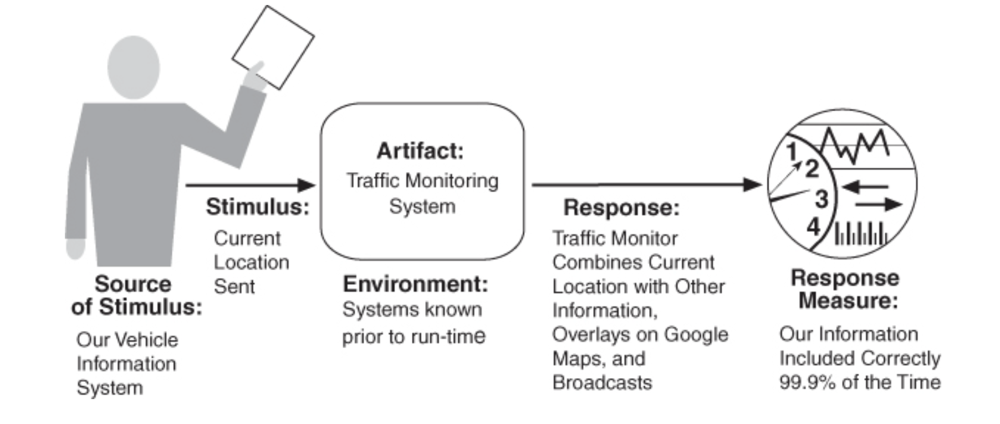

# Lecture 6: interoperability

## What is interoperability?

- Interoperability is about the degree to which two or more systems can exchange meaningful information
  - Syntactic interoperability: the ability to exchange data
  - Semantic interoperability: the ability to correctly interpret data being exchanged
  - Any discussion of system interoperability needs to identify
    - With whom
    - With what
    - Under what circumstances
- Interoperability is affected by the systems expected to interoperate
  - If external interfaces are known, knowledge can be incorporated into design of our system
  - Our system can also be designed to interoperate in a generic fashion, so that identities and services can be bound
    - Later in the life-cycle
    - At build time
    - At runtime
  - There are several characterizing frameworks for interoperability
    - Lowest level signals that systems do not share data at all, or do not do so with any success
    - Highest level signifies systems work together seamlessly, with no interpretation mistakes and share the same underlying semantic model
- Reasons to interoperate
  - Your system provides a service used by a collection of unknown systems
  - You are constructing capabilities from existing systems
  - Consumer of the service must discover (possibly at runtime) the location, identity, and interface of the service
  - Your system must handle the response, in one of three ways
    - Service reports back to the requester with the response
    - Service sends its response to another system
    - Service broadcasts its response to any interested parties

### System of systems

- If you have a group of systems interoperating to achieve a joint purpose, you have a system of systems
- A system of systems (SoS) results from the arrangement of independent and useful systems are integrated into a larger system to deliver unique capabilities

| Taxonomy Name | Taxonomy Description |
| ------------- |:-------------------- |
| Directed | Centralized management, funding, and authority for the overall SoS are in place. Systems are subordinated to the SoS |
| Acknowledged | Centralized management, funding, and authority are in place. However, systems retain their own management, funding, and authority in parallel with the SoS |
| Collaborative | No overall objectives, centralized management, authority, responsibility, or funding at the SoS level. Systems voluntarily work together to address shared or common interests |
| Virtual | Like collaborative, but systems don't know about each other |

## Interoperability general scenario

- **Source of stimulus**: A system initiates a request to interoperate with another system.
- **Stimulus**: A request to exchange information among system(s).
- **Artifacts**: The systems that wish to interoperate.
- **Environment**: The systems that wish to interoperate are discovered at runtime or are known prior to runtime.
- **Response**: The request to interoperate results in the exchange of information. The information is understood by the receiving party both syntactically and semantically. Alternatively, the request is rejected and appropriate entities are notified. In either case, the request may be logged.
- **Response measure**: The percentage of information exchanges correctly processed or the percentage of information exchanges correctly rejected.

- For web-based applications to interoperate, there are two major technology options
  - WS* and SOAP (Simple Object Access Protocol)
  - REST (Representation State Transfer)
- SOAP offers completeness, REST offers simplicity

## Tactics for interoperability

### Locate

- There is only 1 tactic in this category: discover service
- Used when systems that must interoperate must be discovered at runtime
  - Locate a service by searching a known directory service
  - May be multiple levels of indirection in the location process
    - A known location points to another location that can be searched
    - Service can be located by type, name, location, or some other attribute

### Manage interfaces

- Consists of 2 tactics

**Orchestrate**

- Use a control mechanism to coordinate and manage the sequence of invocation of a particular service
- Interoperating systems must interact in a complex fashion to accomplish a complex task
- Orchestration "scripts" the interaction
- The mediator pattern can orchestrate in simple orchestrations

**Tailor interface**

- Adds or removes capabilities to an interface
  - Capabilities such as translation, adding buffering, or smoothing data can be added
  - Capabilities can be removed as well
- Removals can be used to hide particular functions from untrusted users
- The decorator pattern is an example of the tailor interface tactic

## Design checklist for interoperability

### Allocation of responsibilities

- Determine which of your system responsibilities will need to interoperate with other systems
- Ensure that responsibilities have been allocated to detect a request to interoperate with known or unknown external systems
- Ensure that responsibilities have been allocated to carry out the following tasks
  - Accept the request
  - Exchange information
  - Reject the request
  - Notify appropriate entities (people or systems)
  - Log the request (for interoperability in an untrusted environment, logging for non-repudiation is essential)

### Coordination model

- Ensure that the coordination mechanisms can meet the critical quality attribute requirements. Considerations for performance include the following:
  - Volume of traffic on the network both created by the system under your control and generated by systems not under your control
  - Timeliness of the messages being sent by your systems
  - Currency of the messages being sent by your systems
  - Jitter of the messages' arrival time
  - Ensure that all of the systems under your control make assumptions about protocols and underlying that are consistent with the systems not under your control

### Data model

- Determine the syntax and semantics of the major data abstractions that may be exchanged among interoperating systems
- Ensure that these major data abstractions are consistent with data from interoperating systems. (If your system's data model is confidential and must not be made public, you may have to apply transformations to and from the data abstractions of systems with which yours operates)

### Mapping amongst architectural elements

- For interoperability, the critical mapping is that of components to processors
- Beyond the necessity of making sure components that communicate externally are hosted on processors that can reach the network
- Primary considerations deal with meeting security, availability, and performance requirements for the communication

### Resource management

- Ensure that interoperation with another system can never exhaust critical system resources
- Ensure that the resource load imposed by the communication requirements of interoperation is acceptable
- Ensure that if interoperation requires that resources be shared among participating systems, an adequate arbitration policy is in place

### Binding time

- Determine the systems that may interoperate, and when they become known to each other.
- For each system over which you have control:
  - Ensure that it has a policy for dealing with binding to both known and unknown external systems
  - Ensure that it has mechanisms in place to reject unacceptable bindings and to log such requests
  - In the case of late binding, ensure that mechanisms will support the discovery of relevant new services or protocols, or the sending of information using chosen protocols

### Choice of technology

- For any of your chosen technologies, are they "visible" at the interface boundary of a system?
  - If so, what interoperability effects do they have?
  - Do they support, undercut, or have no effect on the interoperability scenarios that apply to your system?
- Consider technologies that are designed to support interoperability, such as web services
  - Can they be used to satisfy the interoperability requirements for the system under your control?
