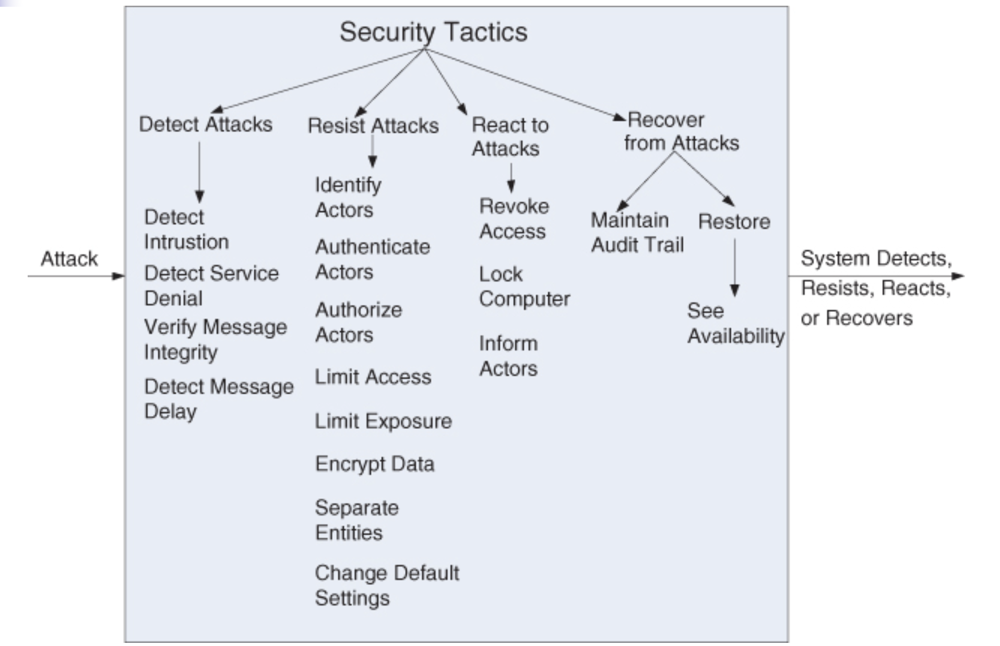

# Lecture 9: security

## What is security?

- A measure of the system's ability to protect data an information from unauthorized access
  - Still provides access to people and systems that are authorized
  - Action taken against a computer system with the intent of doing harm is called an attack
    - May be an unauthorized attempt to access data or services or modify data
    - Intended to deny services to legitimate users
- The simplest approach to characterizing security has three characteristics
  - Confidentiality: data and services are protected from unauthorized access
  - Integrity: data and services are not subject to unauthorized manipulation
  - Availability: system will be available for legitimate use (resist denial of service attacks)
- Other characteristics that support security are
  - Authentication: verifies the identities of the parties to a transaction
  - Non-repudiation: guarantees message authors cannot deny having sent the message and message recipients cannot deny having received them
  - Authorization: grants a user the privileges to perform a task
- Approaches to achieving security can be characterized as those that
  - Detect attacks
  - Resist attacks
  - React to attacks
  - Recover from successful attacks
- The objects being protected from attacks are
  - Data at rest
  - Data in transit
  - Computational processes

## Security general scenario

**Threat modeling**

- An "attack tree" (similar to a fault tree discussed [here](./lecture-05_availability.md)) is used to determine possible threats
  - The root is a successful attack
  - Nodes are possible direct causes of that successful attack
  - Children nodes decompose direct causes and so forth
- An attack is an attempt to break system security
  - Attack trees are the stimulus of the scenario
  - Response to the attack is to preserve security or deter attackers through monitoring of activities

**Scenario parts**

- Source of stimulus: source of the attack
  - May be human or another system
  - May have been previously identified (correctly or incorrectly) or may be currently unknown
  - Human attackers may be from outside or inside the organization
- Stimulus: the attack, characterized as an unauthorized attempt to
  - Display data
  - Change or delete data
  - Access system services
  - Change system's behavior
  - Reduce system's availability
- Artifact: target of the attack
  - Services of the system
  - Data within the system
  - Data produced or consumed by the system
  - Particular components of the system known to be vulnerable
- Environment: when the attack comes
  - System is either online or offline
  - Connected to or disconnected from a network
  - Behind a firewall or open to a network
  - Fully operational, partially operational, or not operational
- Response: how the system protects from unauthorized access
  - Data or services are not being manipulated without authorization
  - Parties to transactions are identified with assurance
  - Parties to transactions cannot repudiate their involvements
  - Data, resources, and system services will be available for legitimate use
  - System should track activities within it and notify appropriate entities if an apparent attack is occuring
- Response measure: how system performed under attack
  - How much of the system was compromised?
  - How much time passed before an attack was detected?
  - How many attacks were resisted?
  - How long it took to recover from a successful attack?
  - How much data was vulnerable to a particular attack?

## Tactics for security

- Secure installation have
  - Limited access
  - Means of detecting intruders
  - Have deterrence mechanisms (such as armed guards)
  - Have reaction mechanisms (such as automatic locking of doors)
  - Have recovery mechanisms (such of off-site backup)
- These lead to 4 categories of tactics: detect, resist, react, and recover

### Detect attacks

**Detect intrusion**

- Comparison of network traffic or service request patterns with a system with
  - A set of signatures
  - Known patterns of malicious behavior
- Signatures can be based on
  - Protocol
  - TCP flags
  - Payload sizes
  - Applications
  - Source or destination address
  - Port number

**Detect service denial**

- Comparison of pattern or signature of network traffic coming in to historic profiles of known denial-of-service attacks

**Verify message integrity**

- Employs techniques like checksums or hash values to verify the integrity of
  - Messages
  - Resource files
  - Deployment files
  - Configuration files
- A checksum is a validation mechanism wherein the system
  - Maintains redundant information for configuration files and messages
  - Uses this redundant information to verify the configuration file or message when it is used
- A hash value is a unique string generated by a hashing function
  - Its input can be configuration files or messages
  - Even slight changes on the input can significantly change the hash value

**Detect message delay**

- Intended to detect man-in-the-middle attacks, where a malicious party is intercepting (possibly modifying) messages
- By checking the time it takes to deliver a message
  - It is possible to detect suspicious timings
  - Where time it takes is highly variable

### Resist attacks

**Identify actors**

- Identify the source of any external input to the system
  - Users are typically identified through user IDs
  - Systems may be identified through access codes, IP addresses, protocols, ports, and so on

**Authenticate actors**

- Ensure that an actor is actually who or what it purports to be
- Means for authentication include
  - Passwords
  - One-time passwords
  - Digital certificates
  - Biometric identification

**Authorize actors**

- Ensure that an authenticated actor has the rights to access of modify either data or services
  - Usually enabled by providing some access control mechanisms within a system
  - Access control can be done by an actor or actor class
  - Classes of actors can be defined by actor groups, actor roles, by lists of individuals

**Limit access**

- Involves limiting access to resources such as
  - Memory
  - Network connections
  - Access points
- Achievable  by using memory protection, blocking a host, closing a port, or rejecting a protocol
- A demilitarized zone (DMZ) is used when an organization wants to let external users access certain services and not access other services
  - Sits between the internet and a firewall in front of the internal intranet
  - Firewall is a single point of access to the intranet (limited exposure)
  - Restricts access using a variety of techniques to authorize users

**Limit exposure**

- Minimizes the attack surface of a system
  - Focuses on reducing the probability of and minimizing the effects of damage caused by a hostile action
  - A passive defense because it does not proactively prevent attackers from doing harm
  - Usually realized by having the least possible number of access points

**Encrypt data**

- Data should be protected from unauthorized access, usually achieved by applying some form of encryption to data and communication
  - Provides extra protection to persistently maintained data beyond that available from authorization
  - Communication links may not have authorization controls
  - Encryption is the only protection for passing data over publicly accessible links
  - Encryption can be symmetric or asymmetric

**Separate entities**

- Separate different entities by physical separation on different servers attached to different networks
- The use of virtual machines, an "air gap" gives no connection between portions of a system
  - Sensitive data is frequently separated from not sensitive data
  - Reduces attack possibilities from those who have access to nonsensitive data

**Change default settings**

- Many systems have default setting assigned when delivered
- Forcing the user to change them will prevent attackers from gaining access to the system through settings that are, generally, publicly available

### React to attacks

**Revoke access**

- If an attack is underway, access can be severely limited to sensitive resources
- A computer compromised by a virus may only have certain resources available until virus is removed

**Lock computers**

- Repeatedly failed login attempts may indicate a potential attack
- Systems may limit access from a particular computer if there are repeated failed attempts to access an account from that computer
  - Legitimate users may make mistakes in attempting to log in
  - Limited access may only be for a certain time period

**Inform actors**

- Ongoing attacks may require action by operators, otter personnel or cooperating systems
- Such personnel or systems must be notified when the system has detected an attack

### Recover from attacks

- Once a system has detected and attempted to resist an attack, it needs to recover
  - Recovery is part of restoration of services
  - A successful attack can be considered a type of failure
  - Availability tactics dealing with recovering from a failure can be brought to bear for this aspect of security
- In addition to availability tactics that permit restoration of services, we must also maintain an audit trail
  - Keep a record of user and system actions and their side effects
  - Helps trace the actions of and to identify an attacker
  - May analyze audit trails to attempt to prosecute attackers or create better defenses in the future

## A design checklist for security

### Allocation of responsibilities

- Determine which system responsibilities need to be secure
- For each of these responsibilities, ensure that additional responsibilities have been allocated to do the following
  - Identify the actor
  - Authenticate the actor
  - Authorize actors
  - Grant or deny access to data or services
  - Record attempts to access or modify data or services
  - Encrypt data
  - Recognize reduced availability for resources or services and inform appropriate personnel and restrict access
  - Recover from an attack
  - Verify checksums and hash values

### Coordination model

- Determine mechanisms required to communicate and coordinate with other systems and individuals
- For these communications, ensure that the following are in place
  - Mechanisms for authenticating and authorizing the actor or system
  - Encrypting data for transmission across the connection
  - Mechanisms for monitoring and recognizing unexpectedly high demands
  - Mechanisms for restricting or terminating the connection

### Data model

- Determine the sensitivity of different data fields
- For each data abstraction
  - Ensure that data of different sensitivity is separated
  - Ensure that data of different sensitivity has different access rights and that access rights are checked prior to access
  - Ensure that access to sensitive data is logged and that the log file is suitably protected
  - Ensure that data is suitably encrypted and that keys are separated from the encrypted data
  - Ensure that data can be restored if it is inappropriately modified

### Mapping among architectural elements

- Determine how alternative mappings of architectural elements that are under consideration may change
  - How an individual or system may read, write, or modify data
  - Access system services or resources
  - Reduce availability to system services or resources
- Determine how alternative mappings may affect the recording of
  - Access to data
  - Services or resources
  - The recognition of unexpectedly high demands for resources
- For each mapping, ensure that there are responsibilities to do the following
  - Identify an actor
  - Authenticate an actor
  - Authorize actors
  - Grant or deny access to data or services
  - Record attempts to access or modify data or services
  - Encrypt data
  - Recognize reduced availability for resources or services, inform appropriate personnel, and restrict access
  - Recover from an attack

### Resource management

- Determine the system resources required to identify and monitor a system or an individual who
  - Is internal or external
  - Authorized or not authorized
  - With access to specified resources or all resources
- Determine the resources required to 
  - Authenticate the actor
  - Grant or deny access to data or resources
  - Notify appropriate entities
  - Record attempts to access data or resources
  - Encrypt data
  - Recognize inexplicably high demand for resources
  - Inform users or systems
  - Restrict access
- For these resources, consider whether and external entity can
  - Access a critical resource or exhaust a critical resource
  - Monitor the resource
  - Manage resource utilization
  - Log resource utilization
  - Ensure there are sufficient resources to perform the necessary security operations
- Ensure that a contaminated element can be prevented from contaminating other elements
- Ensure that shared resources are not used for passing sensitive data from an actor with access rights to that data to an actor without access rights to that data

### Binding time

- Determine cases where an instance of a late-bound component may be untrusted
- For such cases, ensure that late-bound components can be qualified
  - Ownership certificates for late-bound components are required
  - Appropriate mechanisms in place to manage and validate them
  - Access to late-bound data and services can be managed
  - Access by late-bound components to data and services can be blocked
  - Mechanisms in place to record access, modification, and attempts to access by late-bound components
  - System data is encrypted where the keys are intentionally withheld for late-bound components

### Choice of technology

- Determine which technologies are available to help users
  - Authenticate
  - Data access rights
  - Resource protection
  - Data encryption
- Ensure that your chosen technology supports the tactics relevant for your security needs
